# Study: `.github/workflows`

Study tour of this folder. Distinct from the official README.

**Aligned with:** KYC-060 (`angular-ci`) + KYC-070 (`react-ci`) + KYC-080 (`vue-ci`) + KYC-110 (`angular-e2e` / `react-e2e` / `vue-e2e`).

## Purpose

This folder is **automated proof on GitHub**, not local DX. Workflows answer: “Did this PR break the API, Angular admin, React customer, or Vue reports app?”

They do **not** deploy and do not run Compose from `infrastructure/`. Playwright smokes (`*-e2e`) start Postgres + the Development API (KYC-101 seed) and serve **one** UI — they do not replace `test:ci`.

## Why these files exist

GitHub Actions looks for YAML under `.github/workflows/`. Path filters mean a README-only docs PR does **not** burn a build (unless it also touches the filtered app paths or the workflow file). Three e2e workflows (not one matrix) so an Angular-only PR does not pay for React/Vue Playwright.

| File | Job |
|---|---|
| `api-ci.yml` | On PR + push to `main` (path-filtered): restore, vuln list (warn), build, test (+ Postgres slice) |
| `angular-ci.yml` | On PR + push to `main` (path-filtered): `npm ci`, `npm run build`, `npm run test:ci` |
| `react-ci.yml` | On PR + push to `main` (path-filtered on `apps/react-customer` + design-tokens): same npm pipeline |
| `vue-ci.yml` | On PR + push to `main` (path-filtered on `apps/vue-reports` + design-tokens): lint, `vue-tsc`/build, `test:ci` |
| `e2e-app.yml` | Reusable: Postgres → migrate → Development API + seed (`InMemory` storage) → `npm run test:e2e` |
| `angular-e2e.yml` | Path-filtered caller for Angular Playwright Chromium |
| `react-e2e.yml` | Path-filtered caller for React Playwright Chromium |
| `vue-e2e.yml` | Path-filtered caller for Vue Playwright Chromium |

## UI CI analog

`api-ci` ≈ `dotnet test` + real Postgres service. `angular-ci` / `react-ci` / `vue-ci` ≈ install → lint → build → `test:ci` with Node from each app’s `.nvmrc`. SHA-pinned actions (`actions/checkout@11d59…`, `actions/setup-node@49933…`) match “pin your npm dependencies” — supply-chain hygiene (same idea as KYC-108). `permissions: contents: read` is least privilege so the job cannot push.
## What each job does

```mermaid
flowchart TB
  subgraph api [api-ci]
    T1[Path filter apps/api]
    PG[Service: postgres:18-alpine]
    SDK["setup-dotnet from global.json"]
    R[dotnet restore]
    V["dotnet list --vulnerable"]
    B1[dotnet build Release]
    X1["dotnet test with KYC_TEST_POSTGRES"]
    T1 --> PG
    T1 --> SDK --> R --> V --> B1 --> X1
    PG --> X1
  end

  subgraph ang [angular-ci]
    T2[Path filter apps/angular-admin]
    N["setup-node from .nvmrc"]
    CI[npm ci]
    B2[npm run build]
    X2[npm run test:ci]
    T2 --> N --> CI --> B2 --> X2
  end

  subgraph vue [vue-ci]
    T4[Path filter apps/vue-reports]
    N4["setup-node from .nvmrc"]
    CI4[npm ci]
    L4[npm run lint]
    B4[npm run build]
    X4[npm run test:ci]
    T4 --> N4 --> CI4 --> L4 --> B4 --> X4
  end
```

`KYC_TEST_POSTGRES` is set only in `api-ci`, so `[PostgresFact]` tests **run** there and **skip** on a laptop without that variable.

Concurrency: `cancel-in-progress: true` — a new push to the same PR cancels the old run.

## What CI does *not* prove (so you do not over-claim)

- Full UI matrix (Playwright is one happy path per app — [KYC-110](https://github.com/SDS37/kyc-multi-frontend/issues/98))
- Redis (Compose-only, unused by the API)
- MinIO against a real bucket in CI (unit tests and e2e use InMemory object storage)
- Production Docker image
- Rate limits / CORS browser matrix
- That migrations were applied to a long-lived shared DB (`api-ci` migrates a **fresh** `kyc_test` database; e2e uses `kyc_e2e`)

Local `dotnet test` without Compose still proves SQLite isolation tests. CI adds jsonb + `MigrateAsync`.

**“Stop containers” looks red but is not a failed job** (api-ci Postgres teardown). GitHub always dumps service logs on teardown. The job result is the **Test** step, not this dump.

## Today vs target

Playwright smokes landed with KYC-110. Keep API isolation tests in `api-ci` — do not move tenant proof to e2e only.

## What to skip

- Re-reading SHA pins — know *why* they are pinned.
- Vulnerable package list on api-ci — step runs without `continue-on-error` (treat non-zero as fail when the tool reports vulns).

## Links

- [api-ci.yml](api-ci.yml)
- [angular-ci.yml](angular-ci.yml)
- [angular-e2e.yml](angular-e2e.yml)
- [react-e2e.yml](react-e2e.yml)
- [vue-ci.yml](vue-ci.yml)
- [vue-e2e.yml](vue-e2e.yml)
- [e2e-app.yml](e2e-app.yml)
- [Vue reports README](../../apps/vue-reports/README.md)
- [Tests STUDY](../../apps/api/Kyc.Api.Tests/README.STUDY.md)
- [Angular admin README](../../apps/angular-admin/README.md)
- [React customer README](../../apps/react-customer/README.md)
- [global.json](../../global.json) SDK pin
- [GitHub Actions](https://docs.github.com/en/actions)
- [Pinning actions](https://docs.github.com/en/actions/security-guides/security-hardening-for-github-actions#using-third-party-actions)
