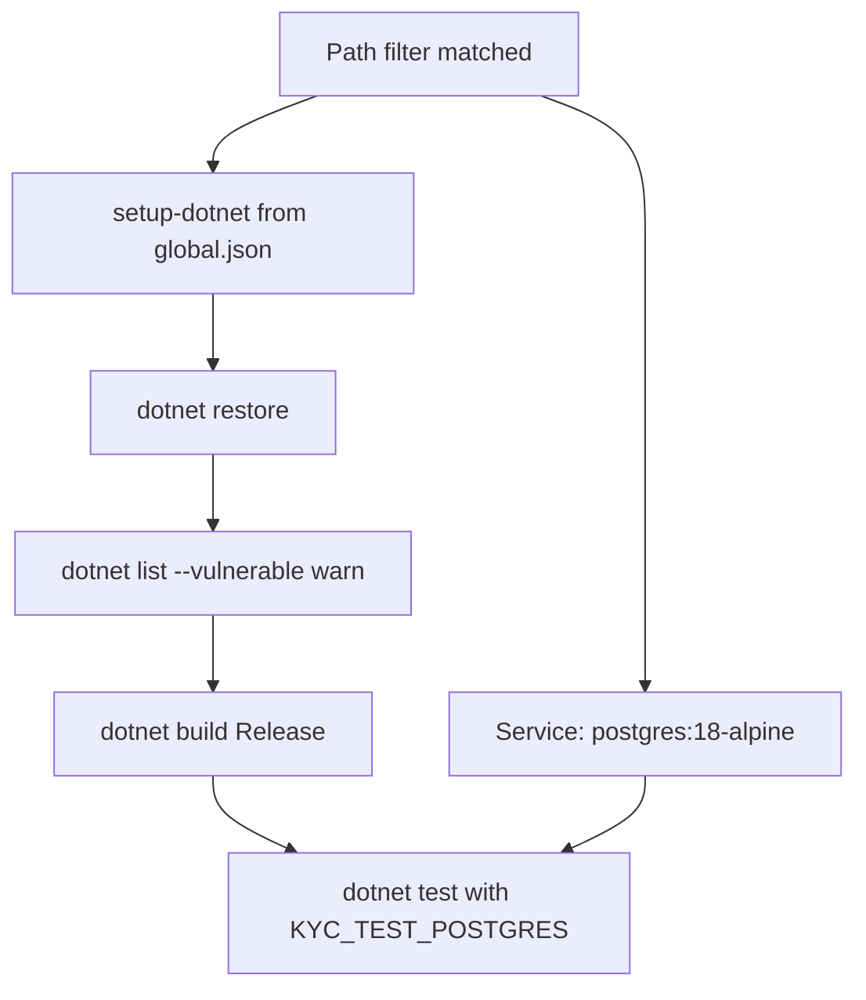

# Study: `.github/workflows`

Study tour of this folder. Distinct from the official README.

**Aligned with:** `main` after KYC-108.

## Purpose

This folder is **automated proof on GitHub**, not local DX. There is one workflow: `api-ci.yml`. It answers: “Did this PR break the API build, tests, or tenant/Postgres slice?”

It does **not** deploy, does not lint Angular (there is no Angular yet), and does not run the Compose stack from `infrastructure/`.

## Why this folder exists

GitHub Actions looks for YAML under `.github/workflows/`. Path filters mean a README-only docs PR does **not** burn a .NET build (unless it also touches `apps/api/**`, this workflow file, or `global.json`).

| File | Job |
|---|---|
| `api-ci.yml` | On PR + push to `main` (path-filtered): restore, vuln list (warn), build, test |

## Angular analog

This is `ng test --watch=false` + `ng build` on GitHub, plus a **real Postgres service container** for a thin integration slice. SHA-pinned actions (`actions/checkout@11d59…` not `@v4` floating) match “pin your npm dependencies” — supply-chain hygiene (KYC-108). `permissions: contents: read` is least privilege so the job cannot push.

## What the job actually does

`KYC_TEST_POSTGRES` is set in the job env, so `[PostgresFact]` tests **run** here and **skip** on a laptop without that variable. That is how CI is stricter than default local `dotnet test` without being annoying.

Concurrency: `cancel-in-progress: true` — a new push to the same PR cancels the old run (like cancelling an outdated pipeline).

## What CI does *not* prove (so you do not over-claim)

- UI behavior
- Redis / MinIO
- Production Docker image
- Rate limits / CORS
- That migrations were applied to a long-lived shared DB (it migrates a **fresh** `kyc_test` database)

Local `dotnet test` without Compose still proves SQLite isolation tests. CI adds jsonb + `MigrateAsync`.

**“Stop containers” looks red but is not a failed job.** GitHub always dumps service logs on teardown. Typical lines:

| Log | Meaning |
|---|---|
| `sh: locale: not found` / no usable locales | Alpine `postgres:18` image; cosmetic |
| `relation "__EFMigrationsHistory" does not exist` | First `MigrateAsync` on a fresh DB — EF then creates the table |
| `FATAL: password authentication failed for user "x"` | Was `ApiFactory` `/ready` using dummy `Username=x` on default port 5432 (same port as the service). Dummy now uses `Port=1` so it does not hit CI Postgres |

The job result is the **Test** step, not this dump.

## Today vs target

When Angular exists, expect more workflows or jobs (lint, Chromatic, etc.). Keep API isolation tests in `api-ci` — do not move tenant proof to e2e only.

## What to skip

- Re-reading SHA pins — know *why* they are pinned.
- `continue-on-error` on vuln list — it **warns**, it does not fail the PR (yet).

## Links

- [api-ci.yml](api-ci.yml)
- [Tests STUDY](../../apps/api/Kyc.Api.Tests/README.STUDY.md)
- [global.json](../../global.json) SDK pin
- [GitHub Actions](https://docs.github.com/en/actions)
- [Workflow syntax](https://docs.github.com/en/actions/using-workflows/workflow-syntax-for-github-actions)
- [services containers](https://docs.github.com/en/actions/using-containerized-services/about-service-containers)
- [Pinning actions](https://docs.github.com/en/actions/security-guides/security-hardening-for-github-actions#using-third-party-actions)
