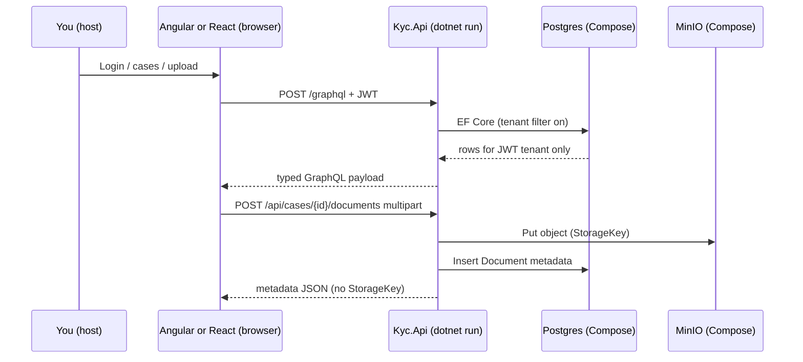

# Study: repository root

Study tour of this folder. Distinct from the official README.

**Aligned with:** `main` after **W5** — Angular admin (KYC-060–065) + React customer (KYC-070–074). Next: W6 Vue reports.

Tracked in git so they render on GitHub. They are a tour, not a contract — ADRs and official READMEs win if anything disagrees. Update these files when the code or architecture moves; they can be deleted from the repo later.

This file is the **map of the monorepo**. Open a folder’s `README.STUDY.md` when you want to speak about that layer in a design conversation. Commands, ports, and story checklists stay in the committed READMEs.

## Purpose

One repo holds three frontends (Vue still a placeholder), one .NET GraphQL API, local Docker dependencies, and the written architecture. ADR-001 chose a monorepo so tenant rules, GraphQL contract, and docs stay in one place.

## Why these folders exist

| Folder / file | Why it is here |
|---|---|
| `apps/` | Deployable products. One folder per app so Angular / React / Vue / .NET never share a bundler. |
| `packages/` | Shared **non-UI-framework** libs (e.g. `design-tokens` CSS). Not a second monorepo app. |
| `docs/` | Decisions and target architecture. Source of truth for “what we meant.” |
| `infrastructure/` | Postgres / Redis / MinIO via Compose. Not the API container (API still runs on the host). |
| `.github/workflows/` | `api-ci` + `angular-ci` + `react-ci` — automated proof API and UI apps still build/test. |
| `.config/` | Local .NET tools (`dotnet-ef`). Analogous to a repo-level `npx` binary pin. |
| `global.json` | Pins the .NET SDK, like an `.nvmrc` / Volta pin. |
| `.editorconfig` | Shared formatting. Not architecture. |

## Angular analog

This is an Nx-style workspace **without Nx**: apps are siblings, shared contract is GraphQL + JWT (not a shared UI library). `docs/` is the architecture board you would otherwise keep in Confluence. `infrastructure/` is the docker-compose you would run instead of installing Postgres on the laptop.

Java analog: a multi-module Maven reactor where `apps/api`, `apps/angular-admin`, and `apps/react-customer` are real modules; `apps/vue-reports` is still an empty stub.

## How a request touches the repo today

Redis is **up but unused**. MinIO holds document **bytes**; Postgres holds document **metadata** (KYC-040–042).

## Today vs target

| Target ([architecture](docs/architecture.md), [ADRs](docs/architecture-decision-records.md)) | Today on `main` |
|---|---|
| Three UIs + GraphQL API | API is real; **Angular admin** (KYC-060–065) and **React customer** (KYC-070–074); Vue still a placeholder (W6) |
| Modular monolith (Identity, Cases, Documents, Audit) | **Layer folders** inside one .NET project; Documents use-cases exist |
| CQRS + MediatR | Application **services** called from GraphQL / REST upload (MediatR is target only) |
| GraphQL as the only public API | Cases are GraphQL; **upload/download are dedicated REST**; login/register still have temporary REST twins |
| MinIO for KYC files | Compose + API `IObjectStorage` / MinIO (InMemory in tests) |

**What you can say with confidence:** “Weeks 1–5 delivered the API case/document/audit stack plus Angular admin review and React customer create → fill → upload → submit, all on fail-closed JWT tenant isolation. Vue reports and remaining security hardening are Week 6.”

## Suggested reading order

1. This file (you are here).
2. [docs/README.STUDY.md](docs/README.STUDY.md) — how committed docs relate; do not duplicate them.
3. [infrastructure/README.STUDY.md](infrastructure/README.STUDY.md) — why Postgres is on `127.0.0.1`.
4. [apps/api/README.STUDY.md](apps/api/README.STUDY.md) — solution vs project vs tests.
5. Follow **one mutation** through [Kyc.Api](apps/api/Kyc.Api/README.STUDY.md) → [GraphQL](apps/api/Kyc.Api/GraphQL/README.STUDY.md) → [Application](apps/api/Kyc.Api/Application/README.STUDY.md) → [Domain](apps/api/Kyc.Api/Domain/README.STUDY.md) → [Data](apps/api/Kyc.Api/Data/README.STUDY.md). Then skim [Documents](apps/api/Kyc.Api/Application/Documents/README.STUDY.md) for the REST upload path.
6. [Tests](apps/api/Kyc.Api.Tests/README.STUDY.md) — especially tenant isolation. This is the sentence isolation conversations hang on.
7. [Workflows](.github/workflows/README.STUDY.md) — what `api-ci` / `angular-ci` / `react-ci` prove.
8. Frontends: [angular-admin](apps/angular-admin/README.STUDY.md), [react-customer](apps/react-customer/README.STUDY.md), then placeholder [vue-reports](apps/vue-reports/README.STUDY.md).

## What to skip

- `bin/`, `obj/`, `node_modules/` if they appear later — build output.
- `.git/` — history, not design.
- Generated EF `*.Designer.cs` until you have read [Migrations/README.STUDY.md](apps/api/Kyc.Api/Data/Migrations/README.STUDY.md).

## Links

- Run the repo: [README.md](README.md)
- API runbook: [apps/api/README.md](apps/api/README.md)
- Frontend-oriented .NET map: [docs/guides/dotnet-api-for-frontend-engineers.md](docs/guides/dotnet-api-for-frontend-engineers.md)
- How to write C# here: [docs/dotnet-code-standards.md](docs/dotnet-code-standards.md)
- [Roadmap](docs/roadmap.md) (W1–W5 done; W6 next)
- [ADR-001 monorepo](docs/architecture-decision-records.md)
- [ADR-007 tenant from JWT](docs/architecture-decision-records.md)
- [.NET SDK / global.json](https://learn.microsoft.com/dotnet/core/tools/global-json)
- [Conventional Commits](https://www.conventionalcommits.org/) used by [docs/commits.md](docs/commits.md)
