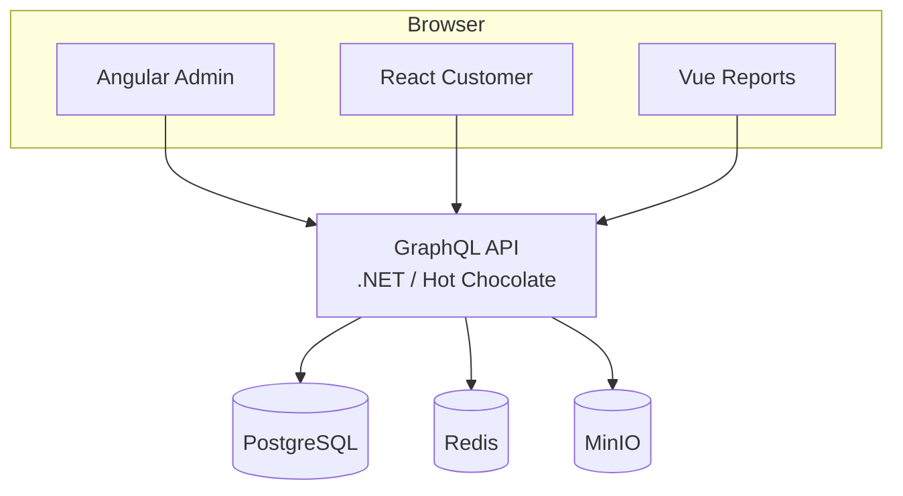

# KYC Multi-Frontend Platform

> Production-oriented multi-tenant KYC & Compliance platform.
> Target: Angular admin shell, React customer portal, Vue reports, and a .NET GraphQL API.

[](LICENSE)

This monorepo is a portfolio project. The **target** architecture is three frontends on one GraphQL API and auth contract (ADRs). Module Federation is a later spike (ADR-005), not a Week 1 requirement.

## Current status (what works today)

| Area | Status |
|---|---|
| Docker Compose (Postgres, Redis, MinIO) | Ready |
| .NET API host + EF Core | Ready (`apps/api`) |
| Tenant + User models | Ready |
| Public `POST /api/register-tenant` | Ready (anonymous allow-list; GraphQL `registerTenant` preferred) |
| Public `POST /api/login` (JWT) | Ready (anonymous allow-list; GraphQL `login` preferred) |
| Tenant isolation (JWT → EF filters) | Ready (KYC-014; Cases use `ITenantScoped`) |
| Case model | Ready (KYC-030) |
| Customer create draft case | Ready (KYC-031 GraphQL `createDraftCase`) |
| Customer update draft case | Ready (KYC-032 GraphQL `updateDraftCase`) |
| Customer submit case | Ready (KYC-033 GraphQL `submitCase`) |
| Reviewer start case review | Ready (KYC-034 GraphQL `startCaseReview`) |
| Reviewer approve / reject case | Ready (KYC-035 GraphQL `approveCase` / `rejectCase`) |
| List cases | Ready (KYC-036 GraphQL `cases`) |
| Case detail | Ready (KYC-037 GraphQL `case`) |
| Document upload | Ready (KYC-040 REST multipart → MinIO; metadata on `case` / `documents`) |
| Document list | Ready (KYC-041 GraphQL `documents(caseId)`; metadata only) |
| Document download | Ready (KYC-042 REST stream; same visibility as list; private bucket) |
| Audit trail (write) | Ready (KYC-050 append-only `audit_entries`; key case/document actions) |
| Case audit history | Ready (KYC-051 GraphQL `caseAuditEntries`; Reviewer/TenantAdmin; newest first) |
| GraphQL host (`/graphql`) + `/health` | Ready (KYC-020; IDE / introspection / SDL in Development — KYC-105) |
| API CI (`dotnet build` / `test`) | Ready (KYC-102; SHA pins + Postgres slice — KYC-108) |
| Postgres readiness (`/ready`) + EF retries / timeouts | Ready (KYC-103) |
| Structured logs + request id | Ready (KYC-104) |
| GraphQL auth (deny by default) | Ready (KYC-021; login dummy verify — KYC-107; login password max 128 — KYC-109) |
| GraphQL role authorization | Ready (KYC-022; Customer + Reviewer/TenantAdmin case mutations) |
| Case mutation hardening | Ready (KYC-106; non-owner → `NOT_FOUND`; FormData 64 KiB / depth 8) |
| Angular / React / Vue apps | Placeholders only |

Yes — the project is intended to reach the full target (GraphQL, CQRS modular monolith, three clients, JWT tenant isolation). Early weeks deliver identity and infrastructure first; later weeks add the rest per the [roadmap](docs/roadmap.md).

## Target tech stack

| Layer | Technology |
|---|---|
| Admin / Shell | Angular |
| Customer Portal | React |
| Reports | Vue |
| API | Hot Chocolate GraphQL on .NET |
| Backend | Modular monolith, CQRS, multi-tenancy |
| Data | PostgreSQL, Redis, MinIO |
| Local run | Docker Compose |

## Repository structure

```
kyc-multi-frontend/
├── apps/
│   ├── angular-admin/     # Angular shell + admin/reviewer (not scaffolded yet)
│   ├── react-customer/    # React customer portal (not scaffolded yet)
│   ├── vue-reports/       # Vue reports portal (not scaffolded yet)
│   └── api/               # .NET API + tests (EF Core + identity; GraphQL in KYC-020)
├── docs/
│   └── guides/            # Conceptual guides (e.g. .NET for frontend engineers)
├── infrastructure/
│   ├── docker-compose.yml
│   └── .env.example
├── .github/               # GitHub Actions (API CI)
├── .config/               # Local .NET tools (dotnet-ef)
├── global.json            # .NET SDK pin
├── .editorconfig
├── .gitignore
├── LICENSE
└── README.md
```

## Getting Started

**Prerequisites:** Docker Desktop and the .NET 10 SDK matching [`global.json`](global.json) (for the API).

### 1. Clone

```bash
git clone https://github.com/SDS37/kyc-multi-frontend.git
cd kyc-multi-frontend
```

### 2. Start PostgreSQL, Redis, and MinIO

Run these from the repository root (`kyc-multi-frontend/`):

```bash
cp infrastructure/.env.example infrastructure/.env
docker compose -f infrastructure/docker-compose.yml up -d
docker compose -f infrastructure/docker-compose.yml ps
```

| Command | What it does |
|---|---|
| `cp … .env.example … .env` | Creates a local env file with DB/Redis/MinIO credentials (gitignored; do not commit) |
| `docker compose … up -d` | Starts PostgreSQL, Redis, and MinIO in the background |
| `docker compose … ps` | Lists those containers and whether they are running / healthy |

| Service | Address | Default credentials |
|---|---|---|
| PostgreSQL | `127.0.0.1:5432` | user `kyc`, password `changeme`, database `kyc_db` |
| Redis | `127.0.0.1:6379` | password `changeme` |
| MinIO API | `127.0.0.1:9000` | user `minio`, password `changeme1` |
| MinIO console | `127.0.0.1:9001` | same as API |

These defaults are for local development only. Change them in `infrastructure/.env`. Data persists in Docker named volumes.

Stop with `docker compose -f infrastructure/docker-compose.yml down`.

### 3. Run the API

See [apps/api/README.md](apps/api/README.md) (config, restore, migrate, `dotnet run`, test). Local HTTP: `http://localhost:5295` (Development only; do not send real secrets over plain HTTP outside local use). PRs that touch the API run GitHub Actions `api-ci`.

## Architecture

Diagrams in [docs/architecture.md](docs/architecture.md) describe the **target end state**. Decisions and sequencing live in [ADRs](docs/architecture-decision-records.md).



- **Multi-tenancy:** tenant and role come from the JWT, never from client-supplied IDs (ADR-007).
- **CQRS:** commands and queries are separate in the application layer (target; applied as modules grow).
- **GraphQL:** one schema for all three clients (ADR-002; KYC-020).
- **Frontends:** independent apps for MVP; Module Federation is deferred (ADR-005).
- **Files:** KYC documents go to MinIO (ADR-006).

## Documentation

- [Business Requirements](docs/business-requirements.md)
- [Architecture](docs/architecture.md)
- [Roadmap](docs/roadmap.md)
- [Definition of Done](docs/DoD.md)
- [Architecture Decision Records](docs/architecture-decision-records.md)
- [Commit Convention](docs/commits.md)
- [.NET code standards](docs/dotnet-code-standards.md)
- [API runbook](apps/api/README.md)
- [.NET API for frontend engineers](docs/guides/dotnet-api-for-frontend-engineers.md)

## Commit convention

Use [Conventional Commits](docs/commits.md): `type(scope): message`.

Examples: `feat(api): add tenant login`, `docs: add architecture diagrams`.

## License

This project is licensed under the [MIT License](LICENSE).
