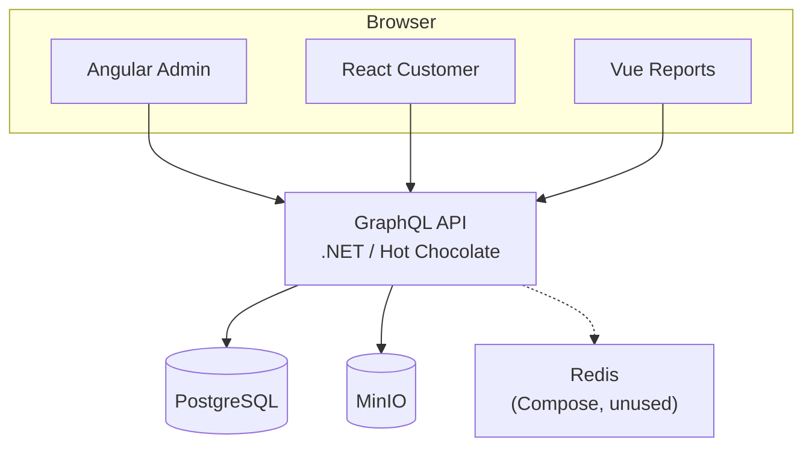

# KYC Multi-Frontend Platform

> Production-oriented multi-tenant KYC & Compliance platform.
> Target: Angular admin shell, React customer portal, Vue reports, and a .NET GraphQL API.

[](LICENSE)

This monorepo is a portfolio project. **Today:** three independent frontends on one GraphQL API (ADR-002). Module Federation is a **W7 spike** (ADR-005), not a requirement. Redis runs in Compose and is **unused** by the API. After DoD, see [beyond-mvp.md](docs/beyond-mvp.md).

## Current status (what works today)

| Area | Status |
|---|---|
| Docker Compose (Postgres, Redis, MinIO) | Ready — API uses Postgres + MinIO; Redis unused |
| .NET API host + EF Core | Ready (`apps/api`) |
| Tenant + User models | Ready |
| Public `POST /api/register-tenant` | Ready (anonymous allow-list; GraphQL `registerTenant` preferred) |
| Public `POST /api/login` (JWT) | Ready (anonymous allow-list; GraphQL `login` preferred) |
| Tenant isolation (JWT → EF filters) | Ready (KYC-014; Cases use `ITenantScoped`) |
| Case model | Ready (KYC-030) |
| Customer create draft case | Ready (KYC-031 GraphQL `createDraftCase`) |
| Customer update draft case | Ready (KYC-032 GraphQL `updateDraftCase`) |
| Customer submit case | Ready (KYC-033 GraphQL `submitCase`) |
| Reviewer start case review | Ready (KYC-034 GraphQL `startCaseReview`) |
| Reviewer approve / reject case | Ready (KYC-035 GraphQL `approveCase` / `rejectCase`) |
| List cases | Ready (KYC-036 GraphQL `cases`; `customerEmail` for W4 list) |
| Case detail | Ready (KYC-037 GraphQL `case`; `customerEmail`) |
| Document upload | Ready (KYC-040 REST multipart → MinIO; metadata on `case` / `documents`) |
| Document list | Ready (KYC-041 GraphQL `documents(caseId)`; metadata only) |
| Document download | Ready (KYC-042 REST stream; same visibility as list; private bucket) |
| Audit trail (write) | Ready (KYC-050 append-only `audit_entries`; key case/document actions) |
| Case audit history | Ready (KYC-051 GraphQL `caseAuditEntries`; Reviewer/TenantAdmin; newest first) |
| GraphQL host (`/graphql`) + `/health` | Ready (KYC-020; IDE / introspection / SDL in Development — KYC-105) |
| API CI (`dotnet build` / `test`) | Ready (KYC-102; SHA pins + Postgres slice — KYC-108) |
| Angular CI (`npm` build / test) | Ready (`angular-ci`; Node from `.nvmrc`; SHA-pinned actions) |
| Postgres readiness (`/ready`) + EF retries / timeouts | Ready (KYC-103) |
| Structured logs + request id | Ready (KYC-104) |
| GraphQL auth (deny by default) | Ready (KYC-021; login dummy verify — KYC-107; login password max 128 — KYC-109) |
| GraphQL role authorization | Ready (KYC-022; Customer + Reviewer/TenantAdmin case mutations) |
| Case mutation hardening | Ready (KYC-106; non-owner → `NOT_FOUND`; FormData 64 KiB / depth 8) |
| CORS + basic headers (local UIs) | Ready (KYC-091: `localhost:4200`, `5173`, `5174`; CSP/HTTPS → [issue #108](https://github.com/SDS37/kyc-multi-frontend/issues/108)) |
| Angular Admin foundation | Ready (KYC-060: Angular 22+, routing, GraphQL env, auth interceptor) |
| Shared UX design tokens | Ready (`packages/design-tokens`; Angular + React + Vue) |
| Angular Admin | Ready (KYC-060–065: login, shell, case list, review) |
| React Customer | Ready (KYC-070–074: login, shell, my cases, draft form, document upload) |
| React CI (`npm` build / test) | Ready (`react-ci`; Node from `.nvmrc`; SHA-pinned actions) |
| Vue Reports | Ready (KYC-080–081: login, shell, status counts, latest-10 table) |
| Vue CI (`npm` build / test) | Ready (`vue-ci`; Node from `.nvmrc`; SHA-pinned actions) |
| Demo seed (KYC-101) | Ready — Development `dotnet run` inserts Acme + Globex (all roles, cases in every status) |

**Weeks 1–5 are done** on `main` (API + Angular admin + React customer happy path). **KYC-080–081** (Vue login/shell + read-only reports overview) are also on `main`. Remaining Week 6: [KYC-095](https://github.com/SDS37/kyc-multi-frontend/issues/114), Playwright ([KYC-110](https://github.com/SDS37/kyc-multi-frontend/issues/98)), CSP/HTTPS ([#108](https://github.com/SDS37/kyc-multi-frontend/issues/108)). See the [roadmap](docs/roadmap.md).

## Tech stack (today)

| Layer | Technology |
|---|---|
| Admin / Reviewer | Angular (`localhost:4200`) |
| Customer portal | React (`localhost:5173`) |
| Reports | Vue (`localhost:5174`) |
| API | Hot Chocolate GraphQL on .NET (host `dotnet run`, not Compose) |
| Backend | Modular monolith, **application services**, JWT tenancy |
| Data | PostgreSQL + MinIO. Redis is Compose-only (no API client) — [beyond-mvp.md](docs/beyond-mvp.md) |
| Local run | Docker Compose for deps; API and UIs on the host |

## Repository structure

```
kyc-multi-frontend/
├── apps/
│   ├── angular-admin/     # Angular 22+ admin/reviewer (KYC-060–065)
│   ├── react-customer/    # React 19+ customer portal (KYC-070–074)
│   ├── vue-reports/       # Vue 3 reports portal (KYC-080–081)
│   └── api/               # .NET API + tests (GraphQL + document REST)
├── packages/
│   └── design-tokens/     # Shared CSS UX tokens (Angular / React / Vue)
├── docs/
│   └── guides/            # Conceptual guides (e.g. .NET for frontend engineers)
├── infrastructure/
│   ├── docker-compose.yml
│   └── .env.example
├── .github/               # GitHub Actions (api-ci, angular-ci, react-ci, vue-ci)
├── .config/               # Local .NET tools (dotnet-ef)
├── global.json            # .NET SDK pin
├── .editorconfig
├── .gitignore
├── LICENSE
└── README.md
```

## Colleague runbook

Copy-paste from the **repository root**. Local **HTTP** only — documented Compose passwords, not real secrets. App-specific detail: [API](apps/api/README.md) · [Angular](apps/angular-admin/README.md) · [React](apps/react-customer/README.md) · [Vue](apps/vue-reports/README.md) · [Compose](infrastructure/README.md).

### Prerequisites

| Tool | Why |
|---|---|
| [Docker Desktop](https://www.docker.com/products/docker-desktop/) | Postgres, Redis (unused by the API), MinIO |
| [.NET 10 SDK](https://dotnet.microsoft.com/download) matching [`global.json`](global.json) | API (`dotnet --version` should be `10.0.400` or an allowed roll-forward) |
| [Node.js](https://nodejs.org/) **20.19+** (22 recommended; each app has `.nvmrc`) | Three frontends |

### 1. Clone

```bash
git clone https://github.com/SDS37/kyc-multi-frontend.git
cd kyc-multi-frontend
```

### 2. Start Docker (Postgres, Redis, MinIO)

```bash
cp infrastructure/.env.example infrastructure/.env
docker compose -f infrastructure/docker-compose.yml up -d
docker compose -f infrastructure/docker-compose.yml ps
```

Wait until `kyc-postgres` is **healthy**. Defaults (local only — change in `infrastructure/.env`):

| Service | Address | Credentials |
|---|---|---|
| PostgreSQL | `127.0.0.1:5432` | user `kyc`, password `changeme`, database `kyc_db` |
| Redis | `127.0.0.1:6379` | password `changeme` |
| MinIO API | `127.0.0.1:9000` | user `minio`, password `changeme1` |
| MinIO console | `http://127.0.0.1:9001` | same as API |

Data persists in Docker named volumes. Stop later with `docker compose -f infrastructure/docker-compose.yml down`.

### 3. Start the API

```bash
cp apps/api/Kyc.Api/appsettings.Development.json.example apps/api/Kyc.Api/appsettings.Development.json
dotnet tool restore
dotnet restore apps/api/Kyc.Api.sln
cd apps/api/Kyc.Api
dotnet ef database update
dotnet run
```

Leave this terminal running. Check from another:

```bash
curl -sS -o /dev/null -w '%{http_code}\n' http://127.0.0.1:5295/health   # 200
curl -sS -o /dev/null -w '%{http_code}\n' http://127.0.0.1:5295/ready    # 200 when Postgres is up
```

- HTTP: `http://localhost:5295`
- GraphQL IDE (Development only): `http://localhost:5295/graphql`

Do not commit `appsettings.Development.json`. The example file turns **public** `registerTenant` on and **login captcha** off (Development). Tests and extra config: [apps/api/README.md](apps/api/README.md). PRs that touch the API run `api-ci`.

### 4. Demo accounts (seeded on API start)

Development `dotnet run` inserts **Acme** and **Globex** when they are missing (`Seed:Enabled`, default on in Development). It is idempotent: existing emails keep their password hashes (so a tenant you already registered stays). Opt out with `"Seed": { "Enabled": false }` in `appsettings.Development.json`. Seed never runs outside Development.

Each tenant gets TenantAdmin, Reviewer, and Customer, plus one case in every status (`Draft` / `Submitted` / `InReview` / `Approved` / `Rejected`). Non-draft cases include a tiny PNG in MinIO.

| App | URL | Role | Tenant slug | Email | Password |
|---|---|---|---|---|---|
| Angular admin | http://localhost:4200 | TenantAdmin | `acme` | `admin@acme.example` | `ChangeMe1234` |
| Angular admin | http://localhost:4200 | Reviewer | `acme` | `reviewer@acme.example` | `ChangeMe1234` |
| Vue reports | http://localhost:5174 | TenantAdmin | `acme` | `admin@acme.example` | `ChangeMe1234` |
| React customer | http://localhost:5173 | Customer | `acme` | `customer@acme.example` | `ChangeMe1234` |
| (isolation) | same apps | same roles | `globex` | `admin@globex.example` / `reviewer@globex.example` / `customer@globex.example` | `ChangeMe1234` |

Persona gates: a Customer cannot use Angular or Vue; TenantAdmin/Reviewer cannot create drafts in React.

These passwords are **local demo only**. You do not need `registerTenant` or SQL for a first login. `registerTenant` still works if you want a third tenant.

### 5. Start the frontends

Three terminals. Node **20.19+** (22 recommended).

```bash
cd apps/angular-admin && npm install && npm start
```

```bash
cd apps/react-customer && npm install && npm start
```

```bash
cd apps/vue-reports && npm install && npm start
```

| App | URL | CI workflow |
|---|---|---|
| Angular admin | http://localhost:4200 | `angular-ci` |
| React customer | http://localhost:5173 | `react-ci` |
| Vue reports | http://localhost:5174 | `vue-ci` |

CORS already allows those origins. Guests land on `/login`.

### 6. Stop

Ctrl+C on the API and each `npm start`. Then `docker compose -f infrastructure/docker-compose.yml down` if you want to stop Postgres/Redis/MinIO (volumes keep data unless you add `-v`).

## Architecture

Diagrams in [docs/architecture.md](docs/architecture.md) describe **today** (solid arrows). Dotted Redis = unused. W7 MF and production follow-ups: [beyond-mvp.md](docs/beyond-mvp.md). Decisions: [ADRs](docs/architecture-decision-records.md).



- **Multi-tenancy:** tenant and role come from the JWT, never from client-supplied IDs (ADR-007).
- **Application layer:** command-like and query-like **services** (no MediatR). CQRS vocabulary only.
- **GraphQL:** one schema for all three clients (ADR-002; KYC-020). Document bytes are REST.
- **Frontends:** independent apps for MVP; Module Federation is a W7 spike (ADR-005).
- **Files:** KYC documents go to MinIO (ADR-006). Redis is not on the request path.

## Documentation

- [Business Requirements](docs/business-requirements.md)
- [Architecture](docs/architecture.md)
- [Roadmap](docs/roadmap.md)
- [After MVP (production wishlist)](docs/beyond-mvp.md)
- [Definition of Done](docs/DoD.md)
- [Architecture Decision Records](docs/architecture-decision-records.md)
- [Commit Convention](docs/commits.md)
- [.NET code standards](docs/dotnet-code-standards.md)
- [Frontend code standards](docs/frontend-code-standards.md) (angular.dev + filtered [Angular Architects](https://www.angulararchitects.io/en/) practices)
- [UX design tokens & accessibility](docs/ux-design-tokens.md) (`packages/design-tokens`)
- [API runbook](apps/api/README.md)
- [Angular admin](apps/angular-admin/README.md) · [React customer](apps/react-customer/README.md) · [Vue reports](apps/vue-reports/README.md)
- [.NET API for frontend engineers](docs/guides/dotnet-api-for-frontend-engineers.md)

## Commit convention

Use [Conventional Commits](docs/commits.md): `type(scope): message`.

Examples: `feat(api): add tenant login`, `docs: add architecture diagrams`.

## License

This project is licensed under the [MIT License](LICENSE).
