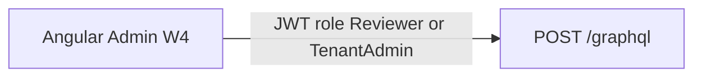

# Study: `apps/angular-admin`

Study tour of this folder. Distinct from the official README. Official stub: [README.md](README.md).

**Aligned with:** `main` after Week 2. **No Angular workspace exists yet** — only this README.

## Purpose

This folder is the **future Tenant Admin / Reviewer product** (ADR-004): the UI you are strongest at. Week 4 (KYC-060–064) is when it should become a real `ng` app. Until then, treat it as a named slot in the architecture diagram, not a code review target.

## Why the folder exists empty

The monorepo reserved the path so apps never collide (`angular-admin` vs `react-customer`). Scaffolding too early would rot `package.json` against an API that was still gaining mutations. Week 2 closed the GraphQL case lifecycle — **this is now the right moment to think about the client**, even though code is still ahead.

## What it will consume (so you design from the contract)

Same API as the other two UIs. You will not get a private BFF.

| Need | GraphQL / auth |
|---|---|
| Login | `login` mutation → JWT (`sub`, `tenant_id`, `role`, `email`) |
| Review queue | `cases` with `status` filter; Reviewer sees **all tenant** cases |
| Detail | `case(id)` — FormData, comments; `documents` empty until KYC-040 |
| Start review | `startCaseReview` |
| Decide | `approveCase` / `rejectCase` (reject requires comment) |
| Tenant admin extras | User/role management is **not** in the API yet — do not invent REST for it |

Auth header: `Authorization: Bearer <accessToken>`. Tenant id is **not** a query param (ADR-007). An Angular interceptor should attach the JWT; it must **not** attach a client-chosen `tenantId`.

Role: this app is for `Reviewer` and `TenantAdmin`. A Customer JWT hitting reviewer mutations gets `AUTH_NOT_AUTHORIZED`. Route guards should match that, but **guards are UX**, not security.

## Module Federation (do not block on it)

ADR-005: MVP is **three independent apps**. A shell loading React/Vue remotes is a Week 7 spike. Do not design Week 4 admin as a federation host unless that spike is explicitly in progress.

Expected local URL when scaffolded: `http://localhost:4200` (README). CORS is KYC-091 — not implemented until a UI exists. First `ng serve` against `localhost:5295` will fail CORS until that story; use the GraphQL IDE until then, or expect a dedicated story.

## Today vs target

| Target | Today |
|---|---|
| Case list, review, documents, tenant users | Folder + README |
| Angular shell composing remotes | Not required for MVP |

## What to skip

- Creating `package.json` from this study file — wait for the Week 4 story.
- Copying domain types by hand forever — prefer codegen from schema once the app exists.

## Links

- [README.md](README.md)
- [ADR-004 Angular admin](../../docs/architecture-decision-records.md)
- [ADR-005 Module Federation deferred](../../docs/architecture-decision-records.md)
- [API GraphQL STUDY](../api/Kyc.Api/GraphQL/README.STUDY.md)
- [Case visibility](../api/Kyc.Api/Application/Cases/README.STUDY.md)
- [Angular docs](https://angular.dev/)
- [Apollo Angular](https://the-guild.dev/graphql/apollo-angular/docs) (likely client; not chosen in-repo yet)
