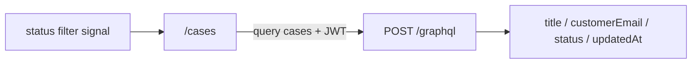
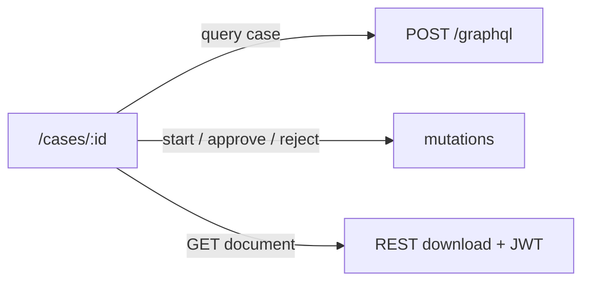
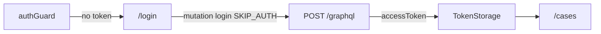

# Study: `apps/angular-admin`

Study tour of this folder. Distinct from the official README. Official runbook: [README.md](README.md).

**Aligned with:** `feat/kyc-063-angular-case-review` / KYC-063 (+ KYC-062 list, KYC-061 login).

## Purpose

Tenant Admin / Reviewer product (ADR-004). KYC-063 adds **case review** (form data, documents + download, start / approve / reject) on top of the case list.

## Why these folders exist

| Path | Role |
|---|---|
| `src/app/auth/` | `auth.models`, `auth.mappers` (pure), `TokenStorage`, interceptor, `LoginService`, guards, login page |
| `src/app/cases/` | `cases.models`, `cases.mappers` (pure), `CasesService`, case list + case review UI |
| `src/app/config/` | `config.models` (`AppConfig`), `APP_CONFIG` token |
| `src/app/shared/` | Cross-feature models (e.g. `graphql.models`) |
| `src/environments/` | Dev/prod API + GraphQL URLs (file replacement) |
| `src/material-theme.scss` | Material M3 `mat.theme` + `$overrides` → `--kyc-*` |

Feature folders, not `components/` / `services/` type buckets ([frontend code standards](../../docs/frontend-code-standards.md) / [angular.dev](https://angular.dev/style-guide) / [Angular Architects slice we use](../../docs/frontend-code-standards.md#angular-architects-practices-filtered-for-this-app)).

**Change detection:** Angular 22 defaults to **OnPush**. See the [component tree diagram](../../docs/frontend-code-standards.md#onpush-and-the-component-tree) — signal updates on `CaseList` do not imply checking `Login` / the whole app.

## Case list (KYC-062)

- Columns: title, **customer email**, status, updated date
- Filter: GraphQL `cases(status:)` (`DRAFT` … `REJECTED`); “All” sends `null`
- States: loading spinner, empty copy, error + retry (`role="alert"`)
- UI state: component **signals** (not SignalStore — see [standards](../../docs/frontend-code-standards.md#signals-and-client-state))
- Row click / title link → `/cases/:caseId` (KYC-063)

## Case review (KYC-063)

- Form fields from `formData` JSON (`fullName`, `dateOfBirth`, `nationality`, `address`, …)
- Documents: metadata + download via `GET /api/cases/{caseId}/documents/{documentId}`
- Actions: Start (`SUBMITTED`), Approve / Reject (`IN_REVIEW`); reject comment required
- Status rules: pure `resolveReviewActions` in `cases.mappers`

## Auth flow (KYC-061)

Guards are **UX only**; JWT on the API is the real gate. Do not invent tenant user management.

## What it consumes

| Need | GraphQL / auth |
|---|---|
| Login | `login` mutation → JWT — **KYC-061** |
| Review queue | `cases` with `status` filter; `customerEmail` — **KYC-062** |
| Detail | `case(id)` — FormData, comments, `customerEmail`, document metadata |
| Download | REST `GET /api/cases/{caseId}/documents/{documentId}` (same JWT) |
| Start / decide | `startCaseReview`, `approveCase` / `rejectCase` |

Auth header: `Authorization: Bearer <accessToken>` via interceptor. Tenant id is **not** a query param (ADR-007).

## Module Federation

ADR-005: MVP is **three independent apps**. Do not design this app as a federation host in W4.

Local URL: `http://localhost:4200`. CORS: KYC-091.

## Today vs target

| Target | Today (KYC-064) |
|---|---|
| Runnable Angular 22+ app | Yes |
| Env GraphQL + auth interceptor | Yes |
| Material + `@kyc/design-tokens` theme | Yes |
| Login + guards | Yes |
| Case list + status filter | Yes |
| Case review | Yes (063) |
| Shell chrome (tenant/user, Cases nav, logout) | Yes (064) |
| Angular shell composing remotes | Not required for MVP |

## What to skip

- Inventing user-management screens
- Calling MinIO / Postgres from the browser
- NgModules for features
- Bootstrap CSS next to Material
- Apollo until a story chooses a GraphQL client (HttpClient POST to `/graphql` is enough)
- NgRx SignalStore during MVP — prefer plain signals / feature services. **After MVP**, use the checklist under [Signals and client state → After MVP](../../docs/frontend-code-standards.md#after-mvp--when-to-extend-with-signalstore) before adding `@ngrx/signals`
- Mixing side effects into “pure” paths — keep [functional style at every app level](../../docs/frontend-code-standards.md#functional-style--purity-all-frontends) (pure functions; `filter`/`map`; **no** `.push` / in-place mutation; I/O at edges)
- Component `constructor()` logic / subscriptions — wire in `ngOnInit` (see [Dependency injection](../../docs/frontend-code-standards.md#dependency-injection))

## Links

- [README.md](README.md)
- [Frontend code standards](../../docs/frontend-code-standards.md)
- [UX design tokens](../../docs/ux-design-tokens.md)
- [ADR-004 / ADR-005 / ADR-007](../../docs/architecture-decision-records.md)
- [API GraphQL STUDY](../api/Kyc.Api/GraphQL/README.STUDY.md)
- [angular.dev](https://angular.dev/)
- [Material theming](https://material.angular.dev/guide/theming)
