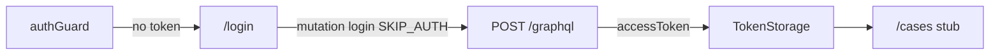

# Study: `apps/angular-admin`

Study tour of this folder. Distinct from the official README. Official runbook: [README.md](README.md).

**Aligned with:** `feat/kyc-061-angular-login` / KYC-061 (+ KYC-060 foundation, shared `@kyc/design-tokens`).

## Purpose

Tenant Admin / Reviewer product (ADR-004). KYC-061 adds **login + Material themed to design tokens + route guards**. Case list/detail remain later stories.

## Why these folders exist

| Path | Role |
|---|---|
| `src/app/auth/` | `TokenStorage`, interceptor, `SKIP_AUTH`, `LoginService`, guards, login page |
| `src/app/cases/case-list/` | Post-login stub (KYC-062 fills the list) |
| `src/app/config/` | `APP_CONFIG` injection token |
| `src/environments/` | Dev/prod API + GraphQL URLs (file replacement) |
| `src/material-theme.scss` | Material M3 `mat.theme` + `$overrides` → `--kyc-*` |

Feature folders, not `components/` / `services/` type buckets ([frontend code standards](../../docs/frontend-code-standards.md) / [angular.dev style guide](https://angular.dev/style-guide)).

## Auth flow (KYC-061)

- Fields: tenant slug, email, password (same as API `LoginRequest`)
- Errors: field `mat-error` + form `role="alert"` / `aria-live="polite"` for AUTH_FAILED / network
- Guards are **UX only**; JWT on the API is the real gate
- Do not invent tenant user management

## What it consumes

| Need | GraphQL / auth |
|---|---|
| Login | `login` mutation → JWT (`sub`, `tenant_id`, `role`, `email`) — **KYC-061** |
| Review queue | `cases` with `status` filter; `customerEmail`; Reviewer sees **all tenant** cases |
| Detail | `case(id)` — FormData, comments, `customerEmail`, document metadata |
| Download | REST `GET /api/cases/{caseId}/documents/{documentId}` (same JWT) |
| Start / decide | `startCaseReview`, `approveCase` / `rejectCase` |

Auth header: `Authorization: Bearer <accessToken>` via interceptor. Tenant id is **not** a query param (ADR-007).

## Module Federation

ADR-005: MVP is **three independent apps**. Do not design this app as a federation host in W4.

Local URL: `http://localhost:4200`. CORS: KYC-091.

## Today vs target

| Target | Today (KYC-061) |
|---|---|
| Runnable Angular 22+ app | Yes |
| Env GraphQL + auth interceptor | Yes |
| Material + `@kyc/design-tokens` theme | Yes |
| Login + guards + redirect to cases | Yes |
| Case list / review | Later (062–063) |
| Angular shell composing remotes | Not required for MVP |

## What to skip

- Inventing user-management screens
- Calling MinIO / Postgres from the browser
- NgModules for features
- Bootstrap next to Material
- Apollo until a story chooses a GraphQL client (HttpClient POST to `/graphql` is enough)
- NgRx SignalStore during MVP — prefer plain signals / feature services. **After MVP**, use the checklist under [Signals and client state → After MVP](../../docs/frontend-code-standards.md#after-mvp--when-to-extend-with-signalstore) before adding `@ngrx/signals`

## Links

- [README.md](README.md)
- [Frontend code standards](../../docs/frontend-code-standards.md)
- [UX design tokens](../../docs/ux-design-tokens.md)
- [ADR-004 / ADR-005 / ADR-007](../../docs/architecture-decision-records.md)
- [API GraphQL STUDY](../api/Kyc.Api/GraphQL/README.STUDY.md)
- [angular.dev](https://angular.dev/)
- [Material theming](https://material.angular.dev/guide/theming)
