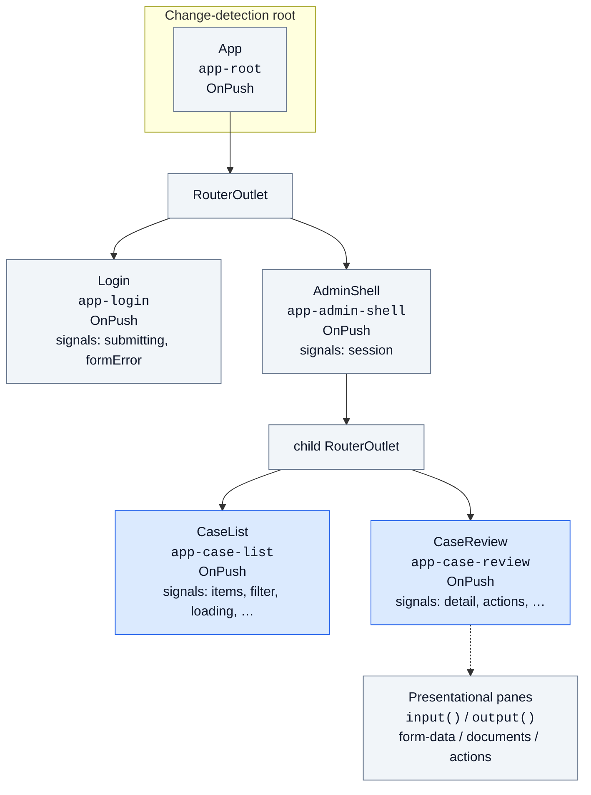

# Angular Admin

Angular **22+** admin / reviewer portal (`apps/angular-admin`). Foundation: KYC-060. Login: KYC-061. Case list: KYC-062. Case review: KYC-063. Shell layout: KYC-064. Review structure (Signal Form / `rxResource` / panes): KYC-065.

**How to write this app:** [Frontend code standards](../../docs/frontend-code-standards.md) (angular.dev + [Angular Architects practices we adopted](../../docs/frontend-code-standards.md#angular-architects-practices-filtered-for-this-app)). Shared colors/spacing: [UX design tokens](../../docs/ux-design-tokens.md) / `@kyc/design-tokens`. Material theme maps to those tokens (`src/material-theme.scss`) — do not add Bootstrap. Client state: prefer signals in MVP; [SignalStore only after MVP when list↔detail share state](../../docs/frontend-code-standards.md#after-mvp--when-to-extend-with-signalstore). Prefer [functional style at every app level](../../docs/frontend-code-standards.md#functional-style--purity-all-frontends) via pure functions (`*.mappers.ts`, thin `computed`, I/O at edges).

## Prerequisites

- Node.js **20.19+** (22 recommended; see `.nvmrc`)
- API running locally at `http://localhost:5295` (see [apps/api/README.md](../api/README.md))
- CORS already allows `http://localhost:4200`

## Run

```bash
cd apps/angular-admin
npm install
npm start
```

App: `http://localhost:4200` (unauthenticated → `/login`)  
GraphQL (dev env): `http://localhost:5295/graphql`

## Demo login

Development seed (KYC-101) creates **TenantAdmin** and **Reviewer** for `acme` / `globex`. **Customer sessions are rejected** (use the React portal).

Colleague copy-paste (Docker, API, accounts, all three UIs): [root README runbook](../../README.md#colleague-runbook).

```json
{ "tenantSlug": "acme", "email": "admin@acme.example", "password": "ChangeMe1234" }
```

```bash
npm test       # unit tests (Vitest via Angular CLI)
npm run test:ci
npm run test:e2e   # Playwright Chromium smoke (API must already be running)
npm run build
```

Playwright is **not** part of `test:ci`. With the API up on `http://localhost:5295` (Development seed from KYC-101):

```bash
npx playwright install chromium   # once per machine
npm run test:e2e
```

`ng serve` (dev file replacement) is required — a production `ng build` preview has empty API URLs. The smoke logs in as Reviewer, opens a freshly submitted case, starts review, expects empty-reject validation, downloads the document (authenticated GET), then approves. It does not fold tenant isolation into the browser (that stays in `api-ci`).

Production `ng build` uses `src/environments/environment.ts`, which has **empty** `apiBaseUrl` / `graphqlUrl`. Bootstrap throws if those stay empty or point at `localhost`. Set explicit HTTPS origins in that file (or a deploy-time replacement) before shipping. `ng serve` keeps `environment.development.ts` (`http://localhost:5295`).

PRs that touch `apps/angular-admin` (or `.github/workflows/angular-ci.yml`) run GitHub Actions `angular-ci` (`npm ci`, build, `test:ci`). The same paths, plus `apps/api/**`, also run `angular-e2e` (Postgres → API + seed → `ng serve` → Playwright).

## What KYC-065 delivers

| Piece | Location |
|---|---|
| Case detail `rxResource` | `case-review.ts` → `CasesService.getById` (not `httpResource`) |
| Reject **Signal Form** | `cases.reject-schema.ts` + `@angular/forms/signals` (`form` + schema) |
| Presentational panes | `case-form-data-pane/`, `case-documents-pane/`, `case-review-actions-pane/` (`input`/`output` only) |
| Login unchanged | Still Reactive Forms (KYC-061) |

## Component tree

Living render tree for this app (update when routes change). Smart vs presentational **rules:** [frontend-code-standards](../../docs/frontend-code-standards.md#component-tree-all-frontends). System composition: [architecture.md §3](../../docs/architecture.md#3-frontend-composition).



OnPush isolation notes stay in [frontend-code-standards — OnPush](../../docs/frontend-code-standards.md#onpush-and-the-angular-component-tree).

## What KYC-064 delivers

| Piece | Location |
|---|---|
| Authenticated shell | `src/app/layout/admin-shell/` — brand, Cases nav, tenant/user, Sign out |
| Nested routes | `/` → shell; children `/cases`, `/cases/:caseId` (login stays outside) |
| Session display | JWT claims (email, role, tenant id) + login tenant slug in `TokenStorage` |

## What KYC-063 delivers

| Piece | Location |
|---|---|
| Case review route | `/cases/:caseId` → `src/app/cases/case-review/` |
| Form data + documents with download | GraphQL `case(id)` + REST document download |
| Start / Approve / Reject | Mutations; reject requires comment; status rules in mappers |
| List → detail | Row click / title link from case list |

## What KYC-062 delivers

| Piece | Location |
|---|---|
| Case list (title, customer email, status, updated) | `src/app/cases/case-list/` |
| Status filter + loading / empty / error | signals on `CaseList` + Material table / select |
| GraphQL `cases` client | `src/app/cases/cases.service.ts` |

Still from KYC-061 / 060: login, guards, Material + tokens theme, `TokenStorage`, auth interceptor, `APP_CONFIG`.

## Intended responsibilities (W4)

- Shell chrome for the reviewer / Tenant Admin experience (**KYC-064** — done)
- Login (tenant slug + email + password) against GraphQL `login` (**KYC-061** — done). HTTP 429 and optional login captcha (**KYC-094**).
- Case list: title, **customer email**, status, updated date, status filter (**KYC-062** — done)
- Case review: form data, documents **with download**, start / approve / reject (**KYC-063** — done)
- Review page structure: `rxResource` + Signal Form reject + presentational panes (**KYC-065** — done)

Tenant user and role management is **not** in the API and **not** in KYC-060–065. Do not invent it in this app.

React and Vue stay separate apps for MVP (ADR-005). Auth and cases use the shared GraphQL API; document download is REST `GET /api/cases/{caseId}/documents/{documentId}` with the same JWT.
