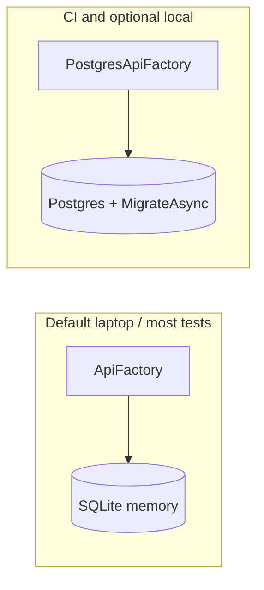

# Study: `Kyc.Api.Tests`

Study tour of this folder. Distinct from the official README.

**Aligned with:** `main` after KYC-040.

## Purpose

This project is the **proof** you should cite in architecture conversations: tenant A cannot read tenant B; wrong roles get `AUTH_NOT_AUTHORIZED`; non-owners get `NOT_FOUND`; login timing is not a cheap oracle; `/ready` fails when Postgres is down.

It is not a second implementation. It boots the real `Program` (or a slim EF context) with substitutes for Postgres/JWT where needed.

## Why a separate project (not `*.spec.ts` beside `Program.cs`)

.NET convention: test assemblies reference the production project and never get published. Packages like xUnit and SQLite stay off the API’s `.csproj`. Angular colocates specs; here colocation would drag test SDKs into `dotnet publish`.

## Angular / Java analog

| You already know | Here |
|---|---|
| Spectator / TestBed | `WebApplicationFactory<Program>` — in-process HTTP server |
| `HttpClientTestingModule` | `factory.CreateClient()` against that server |
| Jest + in-memory sqlite | `ApiFactory`: SQLite **shared connection** (`DataSource=:memory:`) so schema survives |
| Testcontainers in CI | GitHub `services.postgres` + `KYC_TEST_POSTGRES` |
| `jasmine.createSpyObj` | `FakeCurrentTenant` for tests that hit `AppDbContext` **without** HTTP |

## Two hosts (do not mix them up)

| Helper | When | Schema |
|---|---|---|
| `ApiFactory` | Almost all GraphQL/HTTP tests | `EnsureCreated` on SQLite. **No** jsonb, no migration history. Fast. |
| `PostgresApiFactory` + `[PostgresFact]` | `PostgresIntegrationTests` | Real migrations. Skips unless env `KYC_TEST_POSTGRES` is set. CI always sets it. |

`ApiFactory` still **configures** a dummy Postgres connection string because `Program.cs` throws if it is missing — then **replaces** `DbContext` with SQLite in `ConfigureTestServices`. Factories also set `ObjectStorage:Provider=InMemory` so MinIO is not required for CI/laptop tests. That swap is the ASP.NET equivalent of overriding a provider in TestBed.

## What the test files prove (conversation index)

| File | Sentence you can use |
|---|---|
| `TenantIsolationTests` | Fail-closed EF filters: tenant A queries do not return tenant B users or cases. Uses `FakeCurrentTenant` + raw `AppDbContext` (not GraphQL). |
| `GraphQlAuthTests` | Deny-by-default; anonymous login/register; invalid token rejected. |
| `RoleAuthorizationTests` | Customer cannot call reviewer mutations (and vice versa) → `AUTH_NOT_AUTHORIZED`. |
| `CreateDraftCaseTests` / `UpdateDraftCaseTests` / `SubmitCaseTests` | JWT-owned drafts; NOT_FOUND vs DOMAIN; FormData rules. |
| `StartCaseReviewTests` / `CompleteCaseReviewTests` | Lifecycle + reject comment. |
| `ListCasesTests` / `GetCaseDetailTests` | Shared visibility; list has no FormData; detail can include documents. |
| `UploadDocumentTests` | Customer multipart upload; Draft/Submitted; peer `NOT_FOUND`; reviewer 403; magic/size `VALIDATION`; InMemory object store via `ObjectStorage:Provider=InMemory` on factories. |
| `GraphQlHostHardeningTests` | Introspection/depth in Development vs not. |
| `HostResilienceTests` | Timeouts / ready vs health behavior. |
| `ObservabilityTests` | JSON logs, request id, no secret leakage. |
| `LoginTimingTests` | Dummy hash verify on miss paths (KYC-107). |
| `PostgresIntegrationTests` | jsonb + migrate on real Postgres. |
| `CapturingLoggerProvider` | Test sink for log assertions. |

xUnit `[Fact]` is one test method. `[PostgresFact]` is a custom Fact that **skips** when the env var is absent so `dotnet test` on a laptop without Compose still goes green.

## How a GraphQL test feels vs Cypress

You send `POST /graphql` with a query string and optional `Authorization` header, then assert JSON `data` / `errors[].extensions.code`. There is no browser. Think **API integration test**, not e2e.

## Today vs target

No Playwright against Angular yet (no UI). When UIs exist, keep **these** tests as the isolation backbone; UI tests should not be the only tenant proof.

## What to skip

- Assert-by-assert reading of every case test — pick `TenantIsolationTests` + one mutation + `GetCaseDetailTests`.
- `bin/` / `obj/` / `TestResults/`.

## Links

- [xUnit](https://xunit.net/)
- [WebApplicationFactory](https://learn.microsoft.com/aspnet/core/test/integration-tests)
- [EF SQLite testing](https://learn.microsoft.com/ef/core/testing/testing-without-the-database)
- [api-ci workflow](../../../.github/workflows/README.STUDY.md)
- [ADR-007](../../../docs/architecture-decision-records.md)
- [DoD: tenant isolation tested](../../../docs/DoD.md)
