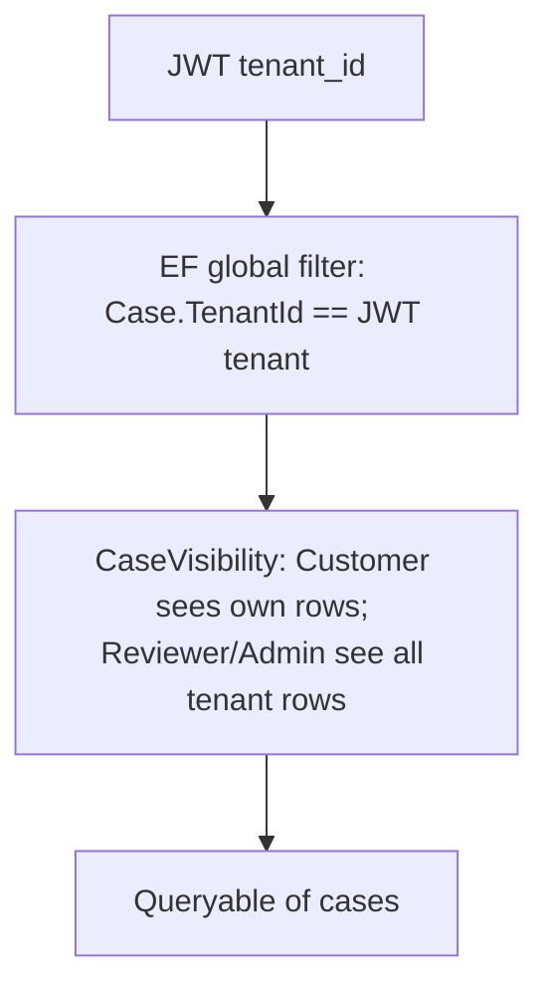

# Study: `Application/Cases`

Study tour of this folder. Distinct from the official README. Parent layer: [../README.STUDY.md](../README.STUDY.md).

**Aligned with:** `main` after KYC-041. Cases are Week 2; document **metadata** list/detail is Week 3.

## Purpose

Every case use-case lives here: Customer write path, Reviewer write path, and shared read visibility. GraphQL `Mutation` / `Query` methods are thin; **if a rule is wrong, it is wrong in this folder.**

## Why these files exist (not one “CaseService”)

One class per action keeps PRs and tests aligned with stories (KYC-031, 032, …). Shared rules are extracted, not copy-pasted forever:

| File | Story | Who | What it does |
|---|---|---|---|
| `CreateDraftCaseService` + `CreateDraftCaseModels` | KYC-031 | Customer | New row, status `Draft`. `TenantId` / `CustomerUserId` from JWT. Empty FormData → `"{}"`. |
| `UpdateDraftCaseService` | KYC-032 / 106 / 109 | Customer | Own draft only. **DOMAIN (not draft) before FormData validation** so a submitted case with huge JSON does not get a misleading VALIDATION error. |
| `SubmitCaseService` | KYC-033 / 106 | Customer | Draft → Submitted. Required FormData fields. **Atomic** `ExecuteUpdate` so two tabs cannot double-submit. |
| `StartCaseReviewService` | KYC-034 | Reviewer / TenantAdmin | Submitted → InReview. Sets `ReviewedBy`. |
| `CompleteCaseReviewService` | KYC-035 | Reviewer / TenantAdmin | Approve (comment optional) or reject (comment required). InReview only. |
| `ListCasesService` | KYC-036 | Any authenticated role | Paginated list **without** FormData. |
| `GetCaseDetailService` | KYC-037 / 040 / 041 | Same visibility as list | FormData + comments + **real** `documents[]` via `ListDocumentsService.LoadMetadataAsync`. |
| `CaseVisibility` | KYC-036/037/041 | Shared | Caller resolution + role filter. |
| `CaseDraftValidation` (in create service file) | 031–033 / 106 | Shared | Title length, JSON size/depth, submit required fields. |

## Angular analog: why this is not “the API service”

On the client you will have `CaseApi.createDraft(input)`. That client must **not** send `tenantId`. This folder is why: the server already knows.

Think **NgRx command handlers** without the store: each service is “handle this intent, return DTO or error code.”

Java analog: one Spring `@Service` per use-case, or a single `CaseApplicationService` with methods — they chose the former for story-sized PRs.

## Two visibility layers (say this in reviews)

1. **Tenant** — automatic on `ITenantScoped`. Tenant A cannot read Tenant B even if they guess GUIDs.
2. **Role** — `CaseVisibility.ApplyRoleFilter`. A Customer cannot list a colleague’s cases in the same tenant.

List and detail **must** use the same helper so the list cannot show an id that detail would `NOT_FOUND`. That is the KYC-037 “shared visibility” idea.

Create/update/submit do **not** use `CaseVisibility`; they use “JWT user must exist” + “row owner == JWT subject or NOT_FOUND.” Reviewer mutations load by id under the tenant filter only (any case in the tenant that matches status).

## Error design you should be able to defend

| Situation | Code | Why |
|---|---|---|
| Title missing | `VALIDATION` | Client can fix the payload. |
| Customer updates someone else’s draft | `NOT_FOUND` | Existence leak would help attackers map GUIDs. |
| Customer submits an already submitted case | `DOMAIN` | They are allowed to know it is theirs; the **state** is wrong. |
| Reviewer approves a Draft | `DOMAIN` | Role is allowed; lifecycle is not. |
| Reviewer from tenant B uses tenant A’s case id | `NOT_FOUND` | Filter hides the row. Same code as missing. Good. |

## FormData (MVP honesty)

FormData is a **JSON string** on the entity, `jsonb` in Postgres, `text` in SQLite tests. Caps: 64 KiB UTF-8, depth 8. Submit requires `fullName`, `dateOfBirth` (YYYY-MM-DD), `nationality`, `address`. There is no JSON Schema document in the repo — the rules are C# in `CaseDraftValidation`. When you build Angular forms, mirror those names or submit will `VALIDATION`.

Detail returns document **metadata** from `documents` (KYC-040/041). Dedicated GraphQL `documents(caseId)` uses the same visibility + metadata shape. Upload is REST (`POST /api/cases/{id}/documents`), not GraphQL multipart. `StorageKey` never leaves the Application/Data boundary.

## Atomic status updates

`SubmitCaseService` (and start-review similarly) uses `ExecuteUpdate` with a `WHERE` that includes **current status**. If `rows == 0`, another request won the race → treat as DOMAIN/NOT_FOUND rather than assuming in-memory `entity.Status` is still true. That is the production-minded bit of KYC-106.

## How to read this folder (90 minutes)

1. `CreateDraftCaseService` — JWT assignment, validation.
2. `UpdateDraftCaseService` — NOT_FOUND vs DOMAIN order.
3. `SubmitCaseService` — FormData required fields + ExecuteUpdate.
4. `CompleteCaseReviewService` — reject comment required.
5. `CaseVisibility` + `ListCasesService` + `GetCaseDetailService` — same filter, list omits FormData.

## Today vs target

Approve/reject/list/detail/upload/download + audit write/read are **done**. Missing: richer comments. Do not invent a second visibility mechanism in the Angular app that contradicts `CaseVisibility`.

## Links

- GraphQL field table: [../../../README.md](../../../README.md)
- [Domain Case + status](../../Domain/README.STUDY.md)
- [Documents upload](../Documents/README.STUDY.md)
- [architecture case lifecycle](../../../../../docs/architecture.md)
- [EF ExecuteUpdate](https://learn.microsoft.com/ef/core/what-is-new/ef-core-7.0/whatsnew#executeupdate-and-executedelete)
- [JSON in Postgres jsonb](https://www.postgresql.org/docs/current/datatype-json.html)
