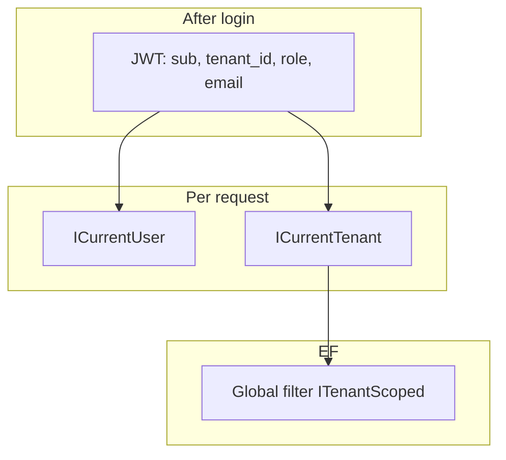

# Study: `Application`

Study tour of this folder. Distinct from the official README.

**Aligned with:** `feat/kyc-042-download-document`.

## Purpose

Application is the **use-case layer**: one class (or small cluster) per action the product allows. GraphQL and temporary REST are delivery adapters that call these services. Services talk to `AppDbContext` directly — there is no `ICaseRepository` yet.

This is the folder to study if you want to argue behavior: validation, status transitions, tenant/user from JWT, error codes.

## Why these folders exist

| Folder | Why it is separate |
|---|---|
| [Cases/](Cases/README.STUDY.md) | Week 2 product: create/update/submit/review/list/detail. Detail now loads real documents. |
| [Documents/](Documents/README.STUDY.md) | Week 3 KYC-040–042: upload, list metadata, download stream via `IObjectStorage`. |
| [Audit/](Audit/README.STUDY.md) | Week 3 KYC-050: append-only `AuditRecorder` for key actions. |
| `Identity/` | Register tenant, login, JWT issuance, password policy, `ICurrentUser`. |
| `Tenancy/` | `ICurrentTenant` + HTTP implementation. Tiny on purpose: **one place** that reads `tenant_id`. |

Splitting Identity vs Tenancy matches the conversation “authn vs tenant context.” Both are request-scoped and JWT-derived.

## Angular / Java analog

| You already know | Here |
|---|---|
| Facade used by a smart component (`CaseApiService.submit()`) | `SubmitCaseService` — but it contains **business rules**, not just HTTP. |
| NgRx effect | Not used. A service method *is* the command handler. |
| NestJS / Spring `@Service` | Same idea. Injected into GraphQL resolvers like you’d inject a service into a controller. |
| Angular `CanActivate` + `CanMatch` | Role checks happen **twice**: Hot Chocolate `[Authorize(Roles=…)]` then the service still reads `ICurrentUser`. Defense in depth. |
| `HttpInterceptor` attaching `Authorization` | Backend equivalent of “who is calling?” is `IHttpContextAccessor` → claims → `HttpCurrentUser` / `HttpCurrentTenant`. |

**CQRS vocabulary (use carefully):** list/detail are queries; mutations are commands. There is **no MediatR**, no separate read model. Architecture.md’s CQRS box is the **target**. Today: “application services with command-like and query-like methods.”

## What is inside (Identity & Tenancy)

### Tenancy

| File | Role |
|---|---|
| `ICurrentTenant` | `Guid? TenantId`. Null if unauthenticated → EF filter matches **nothing** (fail closed). |
| `HttpCurrentTenant` | Reads claim `tenant_id`. Tests swap this for `FakeCurrentTenant`. |

### Identity

| File | Role |
|---|---|
| `ICurrentUser` / `HttpCurrentUser` | `sub` → `UserId`, `role` → `UserRole`. Rejects numeric enum parse tricks. |
| `AuthRoles` | String constants for `[Authorize(Roles = …)]`, kept in sync with enum **names**. |
| `JwtOptions` / `JwtTokenService` | Issues HMAC-SHA256 access tokens: `sub`, `tenant_id`, `role`, `email`, `jti`. |
| `LoginService` | Lookup tenant by **slug**, user by email; **`IgnoreQueryFilters()`** because login is not yet in a tenant JWT context. Dummy password verify on miss (KYC-107) so timing is less of an oracle. Generic error always. |
| `RegisterTenantService` | Tenant + first TenantAdmin in **one transaction**, with EF execution strategy (retries). Password hashed via ASP.NET `PasswordHasher<User>`. |
| `PasswordPolicy` | Length bounds shared with login (max 128, KYC-109). |
| `*Models.cs` | Request/response records used by GraphQL **and** REST so both adapters stay identical. |

**Login vs everything else:** login *must* bypass tenant filters (`IgnoreQueryFilters`). If you forget that when adding a “find user by email” helper, you will create a footgun. If you *use* `IgnoreQueryFilters` on a case query, you have probably broken ADR-007.

## How GraphQL errors map to HTTP instincts

GraphQL usually returns **200** with an `errors[]` array. Codes are the contract:

| Code | Treat as | Typical cause |
|---|---|---|
| `VALIDATION` | 400 | Missing title, bad FormData, skip/take range |
| `AUTH_NOT_AUTHENTICATED` | 401 | No/invalid JWT on a `[Authorize]` field |
| `AUTH_NOT_AUTHORIZED` | 403 | Authenticated but wrong role (Customer hitting `approveCase`) |
| `AUTH_FAILED` | 401 generic | Bad login, or JWT subject no longer in tenant |
| `NOT_FOUND` | 404 | Missing **or not visible** (other tenant, not owner) |
| `DOMAIN` | 409 / 422 | Wrong status (submit a non-draft, approve a draft) |

Services return tuples `(result, validationErrors, unauthorized, errorCode, …)`. Mutation.cs maps those to `GraphQLException`. That mapping is **adapter** work; the rules live in the service.

## Today vs target

- Services + `DbContext` = transaction script / modest application layer. Fine.
- Documents **copied this pattern** (service + port/adapter for MinIO). Download (KYC-042) follows the same; audit (KYC-050) should keep mirroring — not introduce MediatR unless CQRS is an explicit decision.

## What to skip until you need it

- Record shapes in `*Models.cs` — read one (e.g. `LoginModels`) then skim.
- Password hashing internals — know “PBKDF2 via Identity PasswordHasher,” not the iteration count.

## Links

- [Cases use-cases](Cases/README.STUDY.md)
- [Documents upload](Documents/README.STUDY.md)
- [GraphQL adapters](../GraphQL/README.STUDY.md)
- [Domain](../Domain/README.STUDY.md)
- [JWT RFC 7519](https://datatracker.ietf.org/doc/html/rfc7519)
- [ASP.NET Identity password hashing](https://learn.microsoft.com/aspnet/core/security/data-protection/consumer-apis/password-hashing)
- [EF IgnoreQueryFilters](https://learn.microsoft.com/ef/core/querying/filters#disabling-filters)
- [ADR-007](../../../../docs/architecture-decision-records.md)
