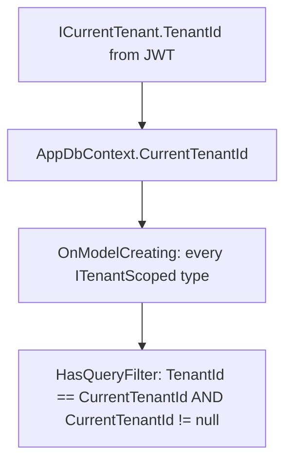

# Study: `Data`

Study tour of this folder. Distinct from the official README.

**Aligned with:** `main` after KYC-040.

## Purpose

Data is **how Domain types become Postgres** (and SQLite in tests). It is the only folder that should mention tables, indexes, `jsonb`, and migrations.

`AppDbContext` is the Unit of Work + identity map for one scoped request: one instance per HTTP request, tracks changes, `SaveChanges` writes a transaction.

## Why these folders exist

| Path | Why |
|---|---|
| `AppDbContext.cs` | EF session. `DbSet`s, tenant **global query filters**, provider-specific `jsonb`. |
| `Configurations/` | Fluent mapping: table names, lengths, unique indexes, FKs. One class per entity. |
| [Migrations/](Migrations/README.STUDY.md) | Versioned schema diffs. Generated; you review `Up()`, you do not hand-edit Designer files. |

Configurations are separate from Domain so entities stay free of `[Table]` / `[MaxLength]` clutter (optional style; some Java teams put annotations on the entity instead).

## Angular / Java analog

| You already know | Here |
|---|---|
| Prisma `schema.prisma` + `prisma migrate` | Configurations + `dotnet ef migrations` |
| TypeORM `@Entity()` + `DataSource` | `IEntityTypeConfiguration` + `AppDbContext` |
| Hibernate `Session` / JPA `EntityManager` | `DbContext` |
| `repository.find({ where: { tenantId }})` in every query | **Global query filter** so you cannot forget tenant on a query (you can still forget on **insert** — services must set `TenantId` from JWT) |

**Critical distinction:** filters apply to **queries**. Inserts/updates of tracked entities are not “filtered out”; you can insert a row with any `TenantId` if a bug sets it. Isolation tests prove reads; create services prove writes use JWT.

## What `AppDbContext` actually does

`CurrentTenantId` must be an **instance property** so EF re-evaluates per context (not a static). Fail closed: `CurrentTenantId == null` → predicate is false → **zero rows**. That is why unauthenticated code cannot dump `Users` even if someone adds a leaky query.

**Login exception:** `LoginService` calls `IgnoreQueryFilters()` because the user is not authenticated yet. That API is a loaded gun — grep it if you ever see unexpected cross-tenant data.

**Postgres vs SQLite:** `FormData` is `jsonb` only when `Database.IsNpgsql()`. Tests use SQLite `EnsureCreated` (no migrations) so JSON is text. That is why `PostgresIntegrationTests` exist (KYC-108): prove jsonb + migrations on the real engine.

## Configurations (what to notice, not memorize)

| Config | Design choices worth citing |
|---|---|
| `TenantConfiguration` | Unique `Slug`. Table `tenants`. |
| `UserConfiguration` | Unique `(TenantId, Email)`. Role stored as **string**. FK Restrict (do not cascade-delete users if a tenant row were deleted). |
| `CaseConfiguration` | Indexes `(TenantId, CustomerUserId)` and `(TenantId, Status)` — list/filter shaped. `ReviewComment` max 2000. FKs Restrict. Status as string. |
| `DocumentConfiguration` | Table `documents`. Unique `StorageKey`. Index `(TenantId, CaseId)`. FKs to case/tenant/uploader Restrict. |

`ApplyConfigurationsFromAssembly` loads all `IEntityTypeConfiguration<>` in this project automatically — like Angular `import.meta.glob`, but compile-time.

## How a request touches this folder

Every authenticated GraphQL field that loads cases goes: service → `db.Cases` → filter appended by EF → SQL `WHERE tenant_id = @jwt`. You will not see that predicate in the C# LINQ for list/detail; it is implicit. **That is the point.** When reading LINQ, always ask: “is this entity `ITenantScoped`?” If yes, tenant is already applied.

## Today vs target

One `AppDbContext` for all modules (including `Documents`). Redis will not appear here. MinIO is **not** EF — only `StorageKey` strings live in Postgres.

## What to skip

- `Configurations/` line-by-line after you have seen one file.
- SQL generated at runtime unless you are debugging; EF command logs are **Warning** in committed `appsettings.json` (KYC-105) so production stdout is not a SQL dump.

## Links

- [Migrations](Migrations/README.STUDY.md)
- [Domain ITenantScoped](../Domain/README.STUDY.md)
- [EF Core](https://learn.microsoft.com/ef/core/)
- [Global query filters](https://learn.microsoft.com/ef/core/querying/filters)
- [Npgsql EF provider](https://www.npgsql.org/efcore/)
- [Fluent API](https://learn.microsoft.com/ef/core/modeling/)
- Unit of Work explanation: [DbContext lifetime](https://learn.microsoft.com/ef/core/dbcontext-configuration/#dbcontext-in-dependency-injection-for-aspnet-core)
