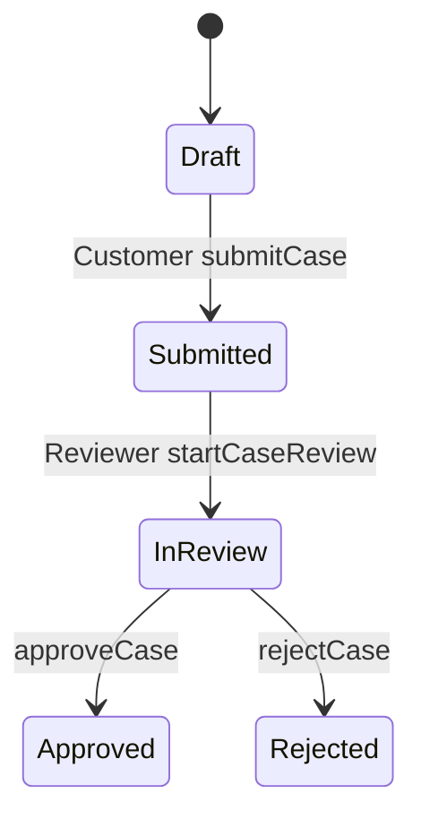

# Study: `Domain`

Study tour of this folder. Distinct from the official README.

**Aligned with:** `main` after KYC-037.

## Purpose

Domain is the **language of the product**: Tenant, User, Case, statuses, roles. It does not know GraphQL, JWT, or HTTP. It barely knows persistence (`ITenantScoped` exists so EF can filter — a pragmatic leak, not a pure DDD fortress).

If Application is “what the system *does*,” Domain is “what the system *is*.”

## Why these folders exist

| Path | Why |
|---|---|
| `ITenantScoped.cs` | Marker: “this row belongs to one tenant.” EF applies a global filter to every implementing type. New tenant-owned entities **must** implement it or they skip isolation. |
| `Identity/` | `Tenant`, `User`, `UserRole`. Identity bounded context (still a folder, not a project). |
| `Cases/` | `Case`, `CaseStatus`. Case bounded context. |

No `Documents/` or `Audit/` types yet (Week 3).

**Tenant is not `ITenantScoped`.** A tenant *is* the isolation boundary; it does not have a `TenantId` pointing at itself. Users and cases do.

## Angular / Java analog

| You already know | Here |
|---|---|
| TypeScript `interface Case { }` in the UI | C# `class Case` that **is** persisted. The UI type should follow this, not invent a parallel status string. |
| Angular enum for status badges | `CaseStatus` / `UserRole` — stored as **strings** in Postgres (`HasConversion<string>()` in Data configs), not magic numbers. GraphQL will expose the enum names. |
| JPA `@Entity` with fields | POCOs (plain classes). Table names and indexes live in `Data/Configurations`, not on the entity. That split is “persistence ignorance.” |
| Spring `enum Role` | `UserRole { TenantAdmin, Reviewer, Customer }` — names must match JWT `role` claim and `AuthRoles` constants. |

**Do not treat Domain as DTOs.** GraphQL responses (`CaseResponse`, `CaseDetailResponse`) live under Application. Domain `Case` can have navigation properties (`Tenant`, `CustomerUser`) that you would not send to the browser.

## What is inside

### Identity

| Type | Meaning you can use in conversation |
|---|---|
| `Tenant` | A customer organisation. `Slug` is the login key (unique). `IsActive` false → login fails with the **same** generic error as bad password (no user enumeration). |
| `User` | Belongs to exactly one tenant (`TenantId` + `ITenantScoped`). Email unique **per tenant**, not globally. Password is a **hash**, never stored plain. |
| `UserRole` | Three values. TenantAdmin and Reviewer share review mutations; only Customer owns drafts. |

### Cases

| Type | Meaning |
|---|---|
| `Case` | One KYC file for one customer in one tenant. `FormData` is a JSON **string** (MVP document), not a typed form model. `ReviewComment` is a single optional/required string on approve/reject — not a comment thread yet. |
| `CaseStatus` | `Draft → Submitted → InReview → Approved \| Rejected`. Invalid jumps are Application `DOMAIN` errors, not enum magic. |

Lifecycle (same as [architecture.md](../../../../docs/architecture.md) §6):

`ReviewedBy` / `ReviewedAt` / `ReviewComment` are columns on `Case`, not a child table. Detail query maps the one comment into a `comments[]` array so the UI contract can grow later.

## How a request touches this folder

Domain types are **constructed and mutated in Application services**, then tracked by EF. GraphQL never new-s up a `Case` itself.

Invariant that is easy to miss: **ownership is data**, not a GraphQL argument. `CustomerUserId` is set from `ICurrentUser.UserId` on create. Update/submit compare that column to the JWT subject; mismatch → `NOT_FOUND` (KYC-106), not `AUTH_NOT_AUTHORIZED`. That is deliberate: do not teach an attacker that the case exists in another user’s account.

## Today vs target

- **Today:** anemic-ish entities (public setters, services hold the rules). Fine for MVP; do not oversell “rich domain model.”
- **Target:** Documents entity + object storage keys; Audit entries; possibly more comment history. CQRS does not require Domain to split into two models yet.

## What to skip

Nothing large here — it is a small, high-signal folder. Read `ITenantScoped`, `Case`, `User` in that order (15 minutes).

## Links

- [Application](../Application/README.STUDY.md) (rules and use-cases)
- [Data](../Data/README.STUDY.md) (how these types become tables)
- [ADR-007](../../../../docs/architecture-decision-records.md)
- [EF Core entity types](https://learn.microsoft.com/ef/core/modeling/entity-types)
- [DDD “entity” vs “value object”](https://learn.microsoft.com/dotnet/architecture/microservices/microservice-ddd-cqrs-patterns/microservice-domain-model) — useful vocabulary; this codebase is lighter than that guide.
