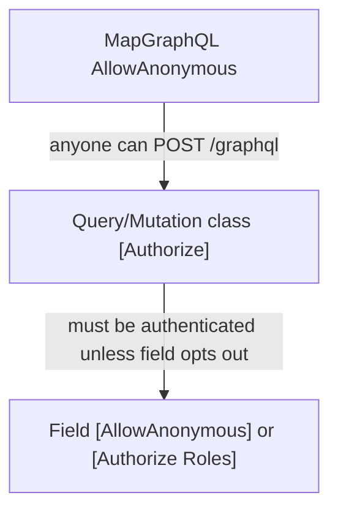

# Study: `GraphQL`

Study tour of this folder. Distinct from the official README.

**Aligned with:** `main` after KYC-037.

## Purpose

This folder **is the public API** for the three frontends (ADR-002). Two types: `Query` (reads) and `Mutation` (writes). Hot Chocolate turns these C# classes into a schema at `/graphql`.

Keep this layer **thin**: authorize, call an Application service, map tuple errors to `GraphQLException` codes. If you see status-transition logic here, it is in the wrong place.

## Why only two files (no `Cases/` resolvers yet)

The schema is still small enough for one Query and one Mutation class. That is a **temporary** shape. When Documents land, expect either more types (`extend type Mutation`) or nested folders. Today, do not split for fashion.

| File | Role |
|---|---|
| `Query.cs` | `[Authorize]` on the type. `apiStatus`, `cases`, `case`. |
| `Mutation.cs` | `[Authorize]` on the type; `[AllowAnonymous]` only on `registerTenant` and `login`. Role attributes on each case field. |

## Angular analog

| You already know | Here |
|---|---|
| Apollo `Query` / `Mutation` documents | Field names: `cases`, `createDraftCase`, … |
| Route `canActivate: [authGuard]` | Type-level `[Authorize]` |
| `canActivate: [roleGuard('Customer')]` | `[Authorize(Roles = new[] { AuthRoles.Customer })]` |
| REST `HttpClient` + OpenAPI | Temporary `/api/login` still exists; **prefer GraphQL** for new UI work |
| GraphQL Code Generator | Not in this repo yet. Schema is the contract; introspection **Development only** (KYC-105). |

Java analog: a GraphQL `Resolver` class, or a Spring `@Controller` if this were REST. Hot Chocolate uses **method injection**: `CreateDraftCaseService service` is a parameter; the framework resolves it from DI like NestJS resolver params.

## Auth model (easy to mis-state)

- **HTTP anonymous** is required so login can run.
- **Type deny-by-default** means a new field is authenticated unless you add `[AllowAnonymous]`.
- **Roles** are extra gates on write fields. `cases` / `case` are any authenticated role; visibility is Application-layer (`CaseVisibility`), not a missing `[Authorize(Roles)]`.

Wrong role → GraphQL `AUTH_NOT_AUTHORIZED`, **not** HTTP 500 (KYC-022). That is a host-hardening success criterion.

Introspection, Banana Cake Pop IDE, and `?sdl` are **Development only**. Production schema probing is off (KYC-105). Execution depth cap is 10.

## Field map (learn names, not the README table)

Queries: `apiStatus`, `cases` (list, no formData), `case(id)` (detail).

Mutations: `registerTenant`, `login`, `createDraftCase`, `updateDraftCase`, `submitCase`, `startCaseReview`, `approveCase`, `rejectCase`.

Exact arguments and return shapes: GraphQL IDE or [apps/api/README.md](../../../README.md). This file will rot if it copies the table.

## How a request touches this folder

Hot Chocolate binds JSON GraphQL `{ query, variables }` to a C# method. `CancellationToken` is the Angular `abortSignal` equivalent — honor it for EF calls (services already take it).

Error mapping is repetitive on purpose (copy-paste of VALIDATION / AUTH_FAILED / errorCode). `MapCaseMutationResult` on approve/reject is the DRY start; older methods still inline the same pattern. When talking to BE, “we should share the mapper” is a style comment, not a security comment.

## Today vs target

REST login/register still mapped in `Program.cs`, not in this folder. DoD: UIs should consume GraphQL identity; REST is allow-listed until then.

DataLoaders (N+1) are called out in ADR-002 as a future need. List/detail today are simple queries; do not over-claim batching.

## What to skip

- Regenerating the schema by memory — use the IDE at `http://localhost:5295/graphql` in Development.
- Treating OpenAPI as the product contract.

## Links

- [Application](../Application/README.STUDY.md) (real rules)
- [Infrastructure GraphQL error log filter](../Infrastructure/README.STUDY.md)
- [Hot Chocolate](https://chillicream.com/docs/hotchocolate)
- [Hot Chocolate authorization](https://chillicream.com/docs/hotchocolate/v15/security/authorization)
- [GraphQL spec](https://spec.graphql.org/)
- [ADR-002](../../../../docs/architecture-decision-records.md)
- [KYC-105 introspection](https://learn.microsoft.com/dotnet/api/) — prefer HC docs: [disable introspection](https://chillicream.com/docs/hotchocolate/v13/security)
