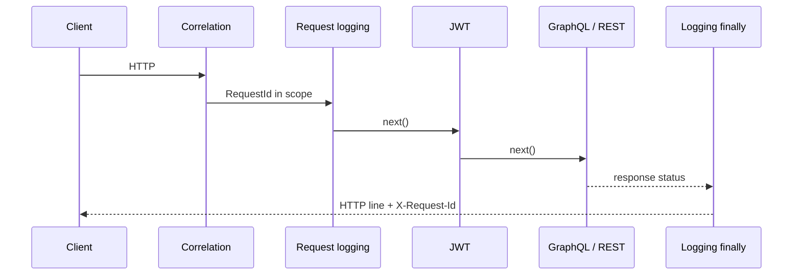

# Study: `Infrastructure`

Study tour of this folder. Distinct from the official README.

**Aligned with:** `main` after KYC-104 / 103 / 105.

## Purpose

Infrastructure is **host plumbing**: concerns that are true for every request regardless of Case vs Login. If Domain is the product and Application is the use-case, this folder is airport security, signs, and the fire alarm — not the flight.

Angular analog: HTTP interceptors + `ErrorHandler` + a health endpoint you would never put in a feature module.

## Why these files exist

| File | Job | Why not in Application |
|---|---|---|
| `RequestCorrelationMiddleware` | Resolve `X-Request-Id` (safe token or Kestrel `TraceIdentifier`), echo header, logger scope `RequestId` | Cross-cutting; must wrap everything |
| `RequestLoggingMiddleware` | One JSON line: method, path, status, ms. **No** bodies, query, headers | Security: login passwords and FormData must never appear |
| `RequestLogContext` | Holds `ILoggerFactory` for the current request so GraphQL filters can log | HC schema DI does not get host `ILogger<T>` the naive way |
| `GraphQlAuthErrorLoggingFilter` | Logs `AUTH_*` codes only | Observability without query/variable leakage |
| `PostgresReadyHealthCheck` | `SELECT 1` with 2s timeout | Readiness ≠ liveness |
| `ResilienceOptions` | Binds `Resilience` section: command timeout, EF retries, request timeout | Config object used from `Program.cs` |

No email sender, no Redis client, no MinIO client yet. Empty-looking folder is honest.

## Middleware vs Angular interceptors

Interceptors on the client attach the JWT **outgoing**. This middleware **reads** the JWT after `UseAuthentication`. Correlation is the sibling of “attach `x-correlation-id` in an interceptor” — gateways can pass `X-Request-Id` in; unsafe values are ignored (regex, max 128 chars) so log injection is harder.

`/health` is skipped at Information level so Kubernetes-style probes do not flood stdout. `/ready` **is** logged (it should be rare).

## Health vs ready (operations sentence)

| Probe | URL | Means | Fail |
|---|---|---|---|
| Liveness | `GET /health` | Process is up | Almost never (tagged `live` only) |
| Readiness | `GET /ready` | Can talk to Postgres | 503; log type name only, **no connection string** |

If you point liveness at `/ready`, a brief Postgres blip restarts the process forever. [Health checks in ASP.NET](https://learn.microsoft.com/aspnet/core/host-and-deploy/health-checks)

Resilience: EF `EnableRetryOnFailure` (transient Postgres), Npgsql command timeout 30s, ASP.NET request timeout 60s (longer than one command so a retry can still win). Probes disable request timeout so a hung ready check uses its **own** 2s Npgsql timeout.

## How a request touches this folder

Every HTTP call, including GraphQL. Application services do not reference these types (except indirectly via logging). That dependency direction is Clean Architecture-ish: Infrastructure depends on the host; Domain depends on nothing here.

## Today vs target

No OpenTelemetry exporters, no Prometheus scrape, no APM (KYC-104: logs + `/ready` are the MVP signals). CORS for local UIs is registered in `Program.cs` from `Cors:AllowedOrigins` (KYC-091 W4). Security headers / HSTS and rate limits (KYC-093) stay W6.

## What to skip

- Regex in correlation — know “allow-list the header,” not the pattern.
- `ResilienceOptions.Validate()` — startup guard; obvious.

## Links

- [Kyc.Api Program.cs pipeline](../README.STUDY.md)
- [API README observability](../../../README.md)
- [ASP.NET middleware](https://learn.microsoft.com/aspnet/core/fundamentals/middleware/)
- [Logging](https://learn.microsoft.com/aspnet/core/fundamentals/logging/)
- [Hot Chocolate error filters](https://chillicream.com/docs/hotchocolate/v13/errors)
- [Npgsql](https://www.npgsql.org/doc/index.html)
- [EF retry on failure](https://learn.microsoft.com/ef/core/miscellaneous/connection-resiliency)
