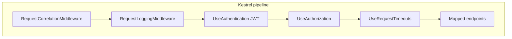
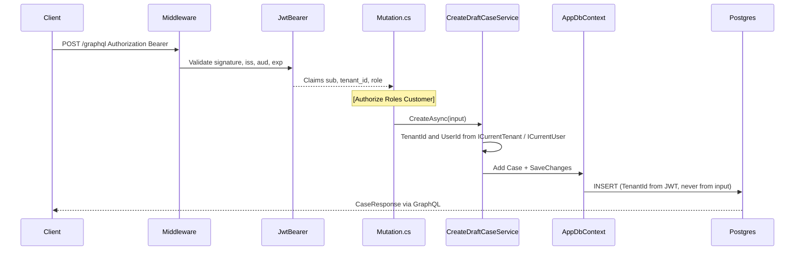

# Study: `Kyc.Api` (the host)

Study tour of this folder. Distinct from the official README. Runbook: [../README.md](../README.md).

**Aligned with:** `main` after KYC-040.

## Purpose

This project is the **composition root**: it wires configuration, DI, middleware, GraphQL, temporary REST, health probes, and EF Core. Folders under it are layers, not separate deployables.

If you only remember one file, remember **`Program.cs`**. It is `main.ts` + `app.config.ts` + `provideHttpClient()` + route guards, in one top-level script (top-level statements; there is no `Main` method you write yourself).

## Why this folder has layers (not feature modules yet)

ADR-003 wants a modular monolith. **Today** the code is grouped by *technical layer*, which is how a Spring Boot app often starts (`domain` / `application` / `web` / `persistence`) before you split JARs:

| Folder | Job | Angular analog |
|---|---|---|
| [Domain/](Domain/README.STUDY.md) | Entities and enums. No HTTP, no EF attributes required. | `models/` + status enums — but these types are the **source of truth**, not a DTO copy. |
| [Application/](Application/README.STUDY.md) | Use-cases (login, create draft, approve…). Orchestrates domain + `AppDbContext`. | Facades / application services. **Not** NgRx. Not GraphQL. |
| [Data/](Data/README.STUDY.md) | EF `DbContext`, table configs, migrations. | Prisma schema + client, or a repository module. |
| [GraphQL/](GraphQL/README.STUDY.md) | Public contract: Query + Mutation types. Thin adapters. | API service + route-level `canActivate`. |
| [Infrastructure/](Infrastructure/README.STUDY.md) | Host concerns: middleware, logs, `/ready`. | HTTP interceptors, `ErrorHandler`, app initializer. |
| `Properties/` | `launchSettings.json` — ports and `ASPNETCORE_ENVIRONMENT`. | `angular.json` serve options. **No secrets here** (file is committed). |

Root files that are not folders:

| File | Job |
|---|---|
| `Program.cs` | Register services, build pipeline, map endpoints. |
| `Kyc.Api.csproj` | Target `net10.0`, NuGet packages (Hot Chocolate, EF, JWT, Npgsql, **AWSSDK.S3** for MinIO). |
| `appsettings.json` | Committed **shape** of config. Postgres, JWT, and `ObjectStorage` secrets are **empty**. |
| `appsettings.Development.json.example` | Copy to gitignored `appsettings.Development.json` (includes MinIO Compose defaults). |
| `Kyc.Api.http` | VS Code / Rider HTTP scratch file (includes multipart upload curl). |

`public partial class Program;` at the bottom of `Program.cs` exists so tests can use `WebApplicationFactory<Program>` (the compiler generates the rest of `Program`).

## Angular / Java analog for `Program.cs`

Read `Program.cs` top to bottom as **two phases**:

1. **`builder`** — register DI (Angular `providers: []`). Fail fast if Postgres or JWT signing key is missing. Wire `IObjectStorage` (InMemory vs MinIO). Raise multipart/Kestrel body limits for KYC-040.
2. **`app`** — middleware order, then `Map*` endpoints (the Angular `bootstrapApplication` + interceptor order).

**Middleware order is a design decision**, like interceptor order:

Correlation must run first so every log line can carry `RequestId`. Auth must run before authorization. Timeouts wrap the endpoint work.

**Deny by default:** `FallbackPolicy` requires an authenticated user for ASP.NET endpoints. GraphQL’s **HTTP** endpoint is `.AllowAnonymous()` because anonymous `login` / `registerTenant` must reach Hot Chocolate; **field** `[Authorize]` on `Query` / `Mutation` is the real gate (KYC-021). Saying “GraphQL is anonymous” is wrong; saying “the transport is anonymous, the schema is deny-by-default” is right.

## How a mutation actually runs

Example: Customer `createDraftCase`.

**What you must be able to say:** tenant id and customer id are **not** GraphQL arguments for create. They come from the JWT (ADR-007). A malicious `tenantId` in the body would be ignored because it is not even on the input type.

## Config mental model

| Angular / Node | Here |
|---|---|
| `.env` gitignored, `.env.example` committed | `appsettings.Development.json` gitignored, `.example` committed |
| `environment.ts` | `appsettings.json` + environment name `Development` / `Production` |
| Nested env `FOO_BAR` | Nested JSON via `__`: `ConnectionStrings__Postgres` |

[Configuration in ASP.NET Core](https://learn.microsoft.com/aspnet/core/fundamentals/configuration/)

## Today vs target

`Program.cs` maps **REST** login/register (temporary twins of GraphQL) **and** `POST /api/cases/{caseId}/documents` (permanent dedicated upload — ADR-001). Do not describe login REST as the long-term API; do describe document upload as REST-on-purpose.

Health: `/health` = process (liveness). `/ready` = Postgres reachable. Orchestrators restart on liveness failure and stop traffic on readiness failure. [Health checks](https://learn.microsoft.com/aspnet/core/host-and-deploy/health-checks)

## What to skip

- `Properties/launchSettings.json` — ports only; do not put passwords there.
- `bin/`, `obj/` — generated.
- OpenAPI (`/openapi/v1.json`) — Development only, leftover of the empty-host story; GraphQL is the contract.

## Links

- [Domain](Domain/README.STUDY.md) · [Application](Application/README.STUDY.md) · [Documents](Application/Documents/README.STUDY.md) · [Data](Data/README.STUDY.md) · [GraphQL](GraphQL/README.STUDY.md) · [Infrastructure](Infrastructure/README.STUDY.md)
- [Minimal APIs / top-level statements](https://learn.microsoft.com/aspnet/core/fundamentals/minimal-apis)
- [Dependency injection](https://learn.microsoft.com/aspnet/core/fundamentals/dependency-injection) (Scoped vs Singleton vs Transient)
- [JWT Bearer](https://learn.microsoft.com/aspnet/core/security/authentication/jwt-authn)
- [Hot Chocolate ASP.NET](https://chillicream.com/docs/hotchocolate)
- [ADR-007](../../../docs/architecture-decision-records.md)
- [Request flow diagram](../../../docs/architecture.md)
