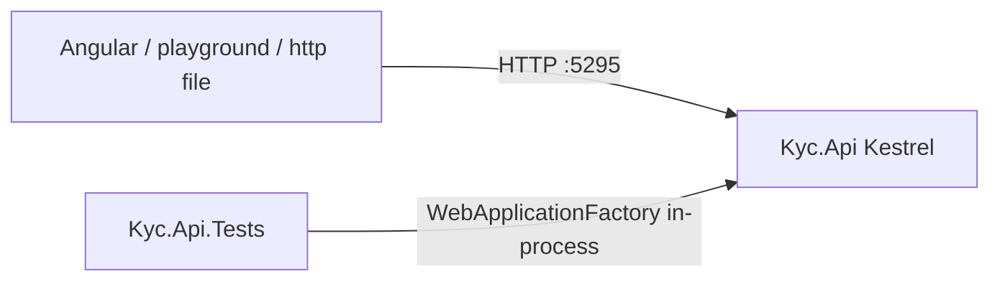

# Study: `apps/api`

Study tour of this folder. Distinct from the official README. The official runbook is [README.md](README.md).

**Aligned with:** `main` after KYC-040.

## Purpose

This folder is the **entire backend product**: one .NET solution with the web host and its tests. Nothing under `apps/angular-admin` (etc.) talks to Postgres; only this API does.

## Why these folders and files exist

| Item | Role |
|---|---|
| `Kyc.Api.sln` | Visual Studio / `dotnet` solution. Groups the two projects so `dotnet test` runs both. Like an Angular workspace `angular.json` that lists projects. |
| `Kyc.Api/` | The running host (`Program.cs`, GraphQL, EF, domain). |
| `Kyc.Api.Tests/` | xUnit tests. Separate project so test packages never ship in the API image. |
| `README.md` | Restore, migrate, run, GraphQL index, story done-checks. **Use this to operate.** Use `README.STUDY.md` files to **understand.** |

There is no `libs/` or shared kernel project. ADR-003 (modular monolith) is still **folders inside `Kyc.Api`**, not separate .csproj modules.

## Angular / Java analog

| You already know | Here |
|---|---|
| `ng new` app + `*.spec.ts` beside sources | Two **projects**: production host vs test host |
| `package.json` + lockfile | `Kyc.Api.csproj` + NuGet (restore writes to a global cache, not a local `node_modules` tree you commit) |
| `npm test` in the app | `dotnet test Kyc.Api.sln` from repo root or this folder |
| Spring `src/main` + `src/test` | `Kyc.Api` + `Kyc.Api.Tests` as sibling projects |

**DI lifetimes (say this in reviews):**

- **Scoped** (one per HTTP request): `AppDbContext`, case/identity services, `ICurrentTenant`, `ICurrentUser`. Same idea as “this service is created per request” — Angular does not have HTTP-request scope on the client; the closest is an interceptor reading the current `HttpRequest`.
- **Singleton** (one for the process): `JwtTokenService`, `IPasswordHasher<User>`, `PostgresReadyHealthCheck`. Like `providedIn: 'root'`.

## What is inside (tour)

```
apps/api/
├── Kyc.Api.sln
├── README.md                 ← committed runbook
├── README.STUDY.md                  ← this file
├── Kyc.Api/                  ← [open that README.STUDY.md]
└── Kyc.Api.Tests/            ← [open that README.STUDY.md]
```

Start at [Kyc.Api/README.STUDY.md](Kyc.Api/README.STUDY.md) (`Program.cs` is the composition root). Then follow a mutation: GraphQL → Application → Domain → Data. For uploads, follow REST → [Documents](Kyc.Api/Application/Documents/README.STUDY.md) → MinIO + `documents` table.

## How a request enters this folder

The process is `dotnet run` in `Kyc.Api` (not Compose). Kestrel listens on **HTTP** `http://localhost:5295` in Development ([launchSettings.json](Kyc.Api/Properties/launchSettings.json)). GraphQL is `POST /graphql`. Temporary REST: `POST /api/login`, `POST /api/register-tenant`.



Tests do **not** need the real port: `WebApplicationFactory<Program>` boots the same `Program.cs` in memory (SQLite) or against CI Postgres.

## Today vs target

- **Today:** one deployable, layered folders, GraphQL + two REST identity endpoints.
- **Target:** still one deployable (not microservices), but **module** folders (Identity / Cases / Documents / Audit) and CQRS. Documents + Audit are Week 3.

## What to skip

- `Kyc.Api/bin`, `Kyc.Api/obj` — compiled output (gitignored).
- `Kyc.Api.http` — handy request snippets; not architecture. Pair with the README GraphQL table.

## Links

- [README.md](README.md) — commands, health vs ready, GraphQL field index
- [Frontend .NET guide](../../docs/guides/dotnet-api-for-frontend-engineers.md)
- [Architecture](../../docs/architecture.md)
- [ADR-002 GraphQL](../../docs/architecture-decision-records.md) · [ADR-003 modular monolith](../../docs/architecture-decision-records.md)
- [dotnet CLI](https://learn.microsoft.com/dotnet/core/tools/)
- [Solutions and projects](https://learn.microsoft.com/dotnet/core/tools/dotnet-sln)
- [ASP.NET Core overview](https://learn.microsoft.com/aspnet/core/introduction-to-aspnet-core)
