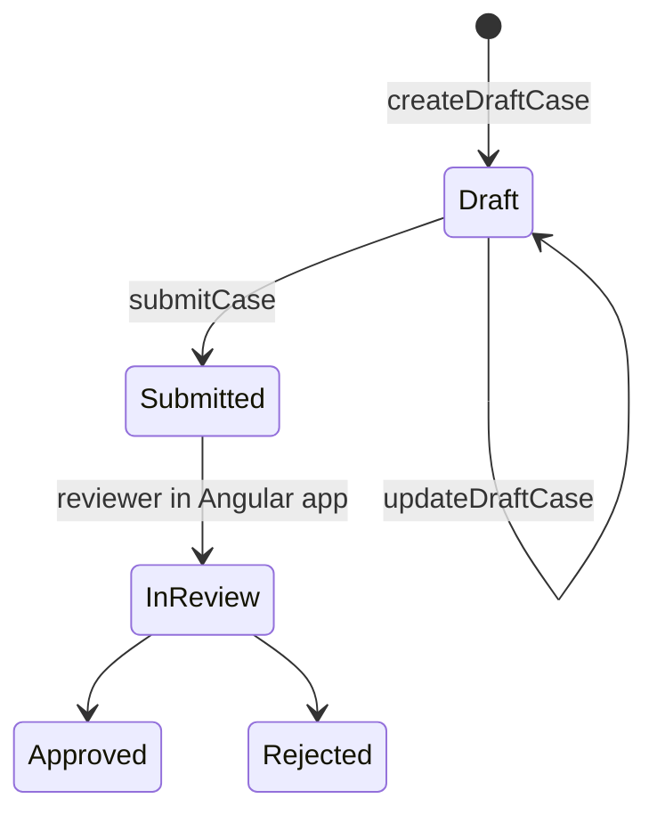

# Study: `apps/react-customer`

Study tour of this folder. Distinct from the official README. Official stub: [README.md](README.md).

**Aligned with:** `main` after KYC-040. **No React app exists yet.**

## Purpose

This folder is the **future Customer portal** (Week 5, KYC-070–074): create a KYC case, fill FormData, upload documents, submit, watch status. Different framework on purpose (portfolio + GraphQL-as-shared-contract). Same JWT and schema as Angular admin.

## Why a separate app, not an Angular customer module

ADR-004/005: three stacks, one API. A Customer route inside Angular admin would be faster to build and weaker as an architecture story. Isolation of **tenants** is a backend property; isolation of **apps** is a product/portfolio property.

## What it will consume

| Need | GraphQL |
|---|---|
| Register (first tenant admin is GraphQL `registerTenant` — customers may be invited later; do not assume this app calls register) | Product still TBD for “how a Customer user is created” |
| Login | `login` with tenant **slug** + email + password |
| Create / edit draft | `createDraftCase` / `updateDraftCase` — **Customer role only** |
| Submit | `submitCase` — required FormData fields (see Cases STUDY) |
| List own cases | `cases` — server already filters to `CustomerUserId == JWT sub` |
| Detail | `case(id)` — `NOT_FOUND` if not owner (even in-tenant); includes `documents` metadata |
| Upload | REST `POST /api/cases/{id}/documents` multipart field `file` (Customer; Draft\|Submitted; PDF/PNG/JPG ≤10 MB) — not GraphQL |

Do not send `customerUserId` or `tenantId` on create. If a React form includes them, you are fighting ADR-007.

Documents: metadata on GraphQL detail / `documents(caseId)`; bytes via REST upload + download (ADR-001 / ADR-002). Never expect `StorageKey` in the API response. Download: `GET /api/cases/{caseId}/documents/{documentId}` (blob).

The customer app is **read-only** after submit except whatever Week 5 stories allow. Reviewer actions live in Angular.

## Angular-expert trap

You will be tempted to share a TypeScript library of GraphQL documents across Angular and React. ADR-005 accepts **duplicated login/token handling** for MVP. A shared `packages/graphql` folder would be a later cleanup, not a Week 5 requirement.

Expected URL: `http://localhost:3000` (README). CORS: KYC-091.

## Today vs target

Placeholder only. Case **API** is ready for a Customer client; user-provisioning of the Customer role (who creates that user?) is still an identity product question — register today creates a **TenantAdmin**. Worth asking before coding a public signup screen.

## What to skip

- Scaffolding Vite/CRA from this file.
- Implementing approve/reject here.

## Links

- [README.md](README.md)
- [Cases STUDY](../api/Kyc.Api/Application/Cases/README.STUDY.md)
- [ADR-002 GraphQL](../../docs/architecture-decision-records.md)
- [ADR-005](../../docs/architecture-decision-records.md)
- [React](https://react.dev/)
- [Apollo Client](https://www.apollographql.com/docs/react) (likely; not chosen in-repo)
