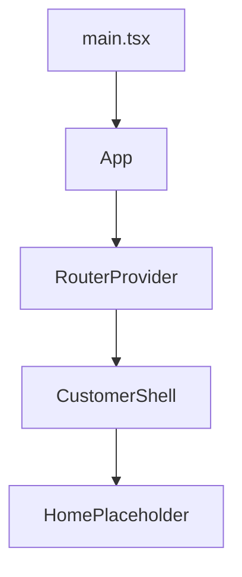

# React Customer

React **19+** customer portal (`apps/react-customer`). Foundation: KYC-070.

**How to write this app:** [Frontend code standards](../../docs/frontend-code-standards.md) (shared rules + [React section](../../docs/frontend-code-standards.md#react-appsreact-customer) aligned with [react.dev](https://react.dev)). Shared colors/spacing: [UX design tokens](../../docs/ux-design-tokens.md) / `@kyc/design-tokens`. Prefer [functional style](../../docs/frontend-code-standards.md#functional-style--purity-all-frontends); keep an explicit [component tree](../../docs/frontend-code-standards.md#component-tree-all-frontends).

## Prerequisites

- Node.js **20.19+** (22 recommended; see `.nvmrc`)
- API running locally at `http://localhost:5295` (see [apps/api/README.md](../api/README.md))
- CORS already allows `http://localhost:5173`

## Run

```bash
cd apps/react-customer
npm install
npm start
```

App: `http://localhost:5173`  
GraphQL (dev): `http://localhost:5295/graphql` (override via `.env` from `.env.example`)

```bash
npm test       # Vitest
npm run test:ci
npm run build
```

PRs that touch `apps/react-customer` (or `.github/workflows/react-ci.yml`) run GitHub Actions `react-ci`.

## What KYC-070 delivers

| Piece | Location |
|---|---|
| Vite + React 19 + hard TypeScript | `package.json`, `tsconfig.app.json` |
| Routing | `src/app-router.tsx` (`createBrowserRouter`) |
| GraphQL / REST helpers with JWT | `src/shared/http.ts` |
| Token / session storage | `src/auth/token-storage.ts` |
| Env config | `src/config/`, `.env.example` |
| Design tokens | `src/styles.css` imports `@kyc/design-tokens/tokens.css` |
| Shell + home placeholder | `src/layout/`, `src/routes/` |

## Intended responsibilities (W5)

- Customer login (KYC-071)
- My cases / draft create-edit (KYC-072–073)
- Document upload + submit (KYC-074)

Reviewer approve/reject stays in Angular admin.

## Component tree (foundation)



Login and case screens mount under the shell in later stories.
