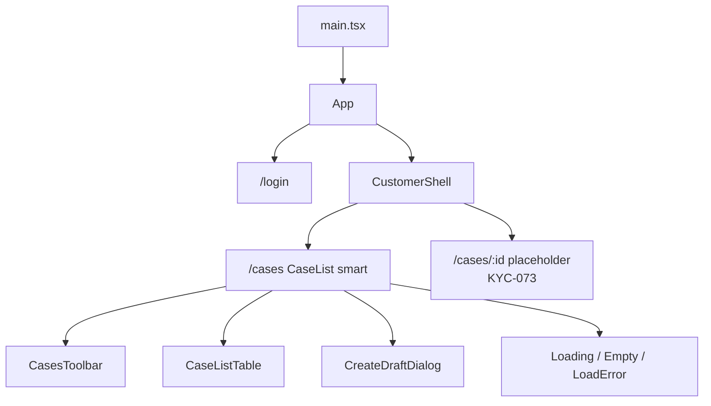

# React Customer

React **19+** customer portal (`apps/react-customer`). KYC-070 foundation · KYC-071 login · KYC-072 my cases.

**How to write this app:** [Frontend code standards](../../docs/frontend-code-standards.md) (shared rules + [React section](../../docs/frontend-code-standards.md#react-appsreact-customer)). Shared `--kyc-*` tokens match Angular admin ([ux-design-tokens.md](../../docs/ux-design-tokens.md)).

## Prerequisites

- Node.js **20.19+** (22 recommended; see `.nvmrc`)
- API at `http://localhost:5295`
- CORS allows `http://localhost:5173`

## Run

```bash
cd apps/react-customer
npm install
npm start
```

App: `http://localhost:5173` → `/login` (guests) or `/cases` (signed in)

## Demo login

`registerTenant` creates **TenantAdmin**. Sign in works for any role; **`createDraftCase` requires Customer**.

```json
{ "tenantSlug": "acme", "adminEmail": "admin@acme.example", "adminPassword": "ChangeMe1", "tenantName": "Acme" }
```

Provision a Customer user in the DB for create-draft E2E (no public signup yet).

## Security notes

- List/create use JWT `Authorization` — never `skipAuth`
- Own-cases filter is **API-side**; client never sends `customerUserId` / `tenantId`
- Create input is **title only** (ADR-007)

## Component tree (KYC-072)



| Piece | Location |
|---|---|
| Login | `src/auth/login-page/` |
| My cases smart screen | `src/cases/case-list/case-list.tsx` |
| Presentational list UI | `cases-toolbar`, `case-list-table`, `create-draft-dialog`, loading/empty/error |
| Cases API / mappers | `src/cases/cases-api.ts`, `cases.mappers.ts` |
| Draft placeholder | `src/cases/case-draft-placeholder/` |
