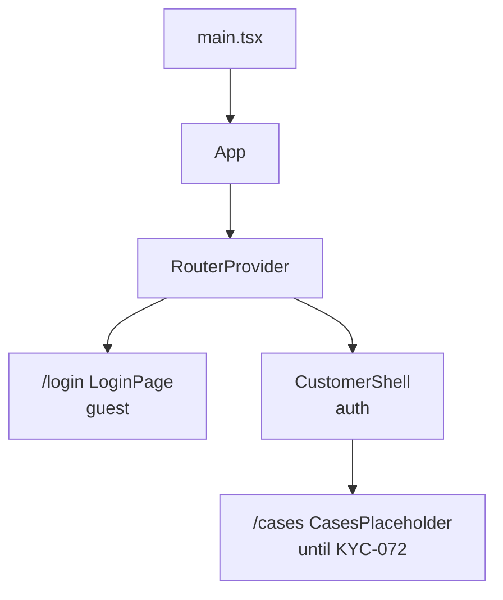

# React Customer

React **19+** customer portal (`apps/react-customer`). Foundation: KYC-070. Login: KYC-071.

**How to write this app:** [Frontend code standards](../../docs/frontend-code-standards.md) (shared rules + [React section](../../docs/frontend-code-standards.md#react-appsreact-customer) aligned with [react.dev](https://react.dev)). Shared colors/spacing: [UX design tokens](../../docs/ux-design-tokens.md) / `@kyc/design-tokens` — same `--kyc-*` tokens as Angular admin. Prefer [functional style](../../docs/frontend-code-standards.md#functional-style--purity-all-frontends); keep an explicit [component tree](../../docs/frontend-code-standards.md#component-tree-all-frontends).

## Prerequisites

- Node.js **20.19+** (22 recommended; see `.nvmrc`)
- API running locally at `http://localhost:5295` (see [apps/api/README.md](../api/README.md))
- CORS already allows `http://localhost:5173`

## Run

```bash
cd apps/react-customer
npm install
npm start
```

App: `http://localhost:5173` → redirects guests to `/login`  
GraphQL (dev): `http://localhost:5295/graphql` (override via `.env` from `.env.example`)

```bash
npm test       # Vitest
npm run test:ci
npm run build
```

## Demo login

Same GraphQL `login` contract as Angular. Register a tenant first (creates **TenantAdmin**):

```json
{ "tenantSlug": "acme", "adminEmail": "admin@acme.example", "adminPassword": "ChangeMe1", "tenantName": "Acme" }
```

Then sign in with `acme` / `admin@acme.example` / `ChangeMe1`.  
There is no public Customer signup yet — Customer-role users need a manual DB provision for Customer-only mutations (KYC-072+).

## Component tree (KYC-071)



## What this app delivers so far

| Piece | Location |
|---|---|
| Login (Angular-parity layout + tokens) | `src/auth/login-page/` |
| Auth models / mappers / messages | `src/auth/` |
| Guards | `src/auth/route-guards.tsx` |
| Shell + sign out | `src/layout/` |
| My cases stub | `src/cases/cases-placeholder/` |
