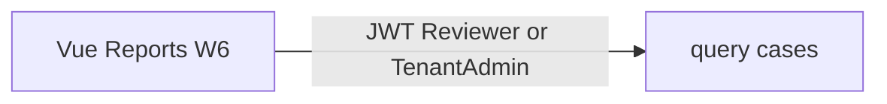

# Study: `apps/vue-reports`

Study tour of this folder. Distinct from the official README. Official stub: [README.md](README.md).

**Aligned with:** `main` after Week 2. **No Vue app exists yet.**

## Purpose

This folder is the **future read-only reports portal** (Week 6, KYC-080–081): tenant-relevant cases, filter by status, keep v1 to a **single page** if time is tight (roadmap time-control rule). Same GraphQL API; Vue is the third client that justifies “one schema, three consumers.”

## Why it exists if Angular can show a table

Portfolio + ADR-004: reports are the simple surface, Vue is enough. If Vue is late, the roadmap allows a single read-only page — even that page should still be this app, not a hidden Angular route, unless you explicitly cut the Vue story.

## What it will consume

| Need | GraphQL |
|---|---|
| Login | Same `login` mutation; roles **Reviewer / TenantAdmin** (customer reports would be a different product) |
| List | `cases` with optional `status`, `skip`/`take` |
| Maybe detail | `case(id)` — optional for v1; list may be enough |

No mutations required for a reports MVP. If you add approve from Vue, you have expanded scope.

`cases` already omits `formData` — good for a table. Pagination: default take 20, max 100 (`ListCasesService`). Do not request 10k rows in one query.

Expected URL: `http://localhost:5173` (Vite default in README). CORS: KYC-091.

## Federation

Not a remote in MVP (ADR-005). Week 7 might load this from an Angular shell; until then it is a standalone Vite app.

## Today vs target

API list/detail exist — a Vue table could be built tomorrow against the playground token. The folder is empty because Week 6 is the scheduled UI. Local CORS already includes `http://localhost:5173`. Security headers stay W6.

## What to skip

- Chart libraries, CSV export, billing dashboards — out of scope (roadmap).
- Vuex vs Pinia debates before there is a second page.

## Links

- [README.md](README.md)
- [ListCasesService](../api/Kyc.Api/Application/Cases/README.STUDY.md)
- [roadmap time-control](../../docs/roadmap.md)
- [Vue](https://vuejs.org/)
- [Vite](https://vite.dev/)
- [ADR-005](../../docs/architecture-decision-records.md)
