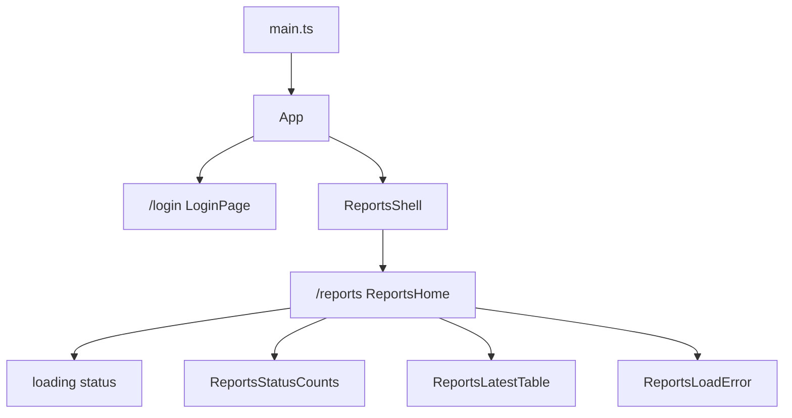

# Vue Reports

Vue **3.5+** reports portal (`apps/vue-reports`). KYC-080 login/shell + **KYC-081** read-only status counts and latest-10 cases.

**How to write this app:** [Frontend code standards](../../docs/frontend-code-standards.md) (shared rules + [Vue section](../../docs/frontend-code-standards.md#vue-appsvue-reports)). Shared `--kyc-*` tokens match Angular admin and React customer ([ux-design-tokens.md](../../docs/ux-design-tokens.md)).

## Prerequisites

- Node.js **20.19+** (22 recommended; see `.nvmrc`)
- API at `http://localhost:5295`
- CORS allows `http://localhost:5174`

## Run

```bash
cd apps/vue-reports
npm install
npm start
```

App: `http://localhost:5174` → `/login` (guests) or `/reports` (Reviewer / TenantAdmin)

```bash
npm test
npm run test:ci
npm run test:e2e   # Playwright Chromium smoke (API must already be running)
npm run build
```

Playwright is **not** part of `test:ci`. With the API up on `http://localhost:5295` (Development seed from KYC-101):

```bash
npx playwright install chromium   # once per machine
npm run test:e2e
```

The smoke logs in as Reviewer and checks status counts plus the latest-10 table. A second case logs in as Customer and expects the reports app to refuse that role. PRs that touch `apps/vue-reports` (or `.github/workflows/vue-ci.yml`) run GitHub Actions `vue-ci` (`npm ci`, lint, `vue-tsc` + Vite build, `test:ci`). The same paths, plus `apps/api/**`, also run `vue-e2e`.

## Demo login

Development seed (KYC-101) creates **TenantAdmin** and **Reviewer** for `acme` / `globex`. **Customer sessions are rejected** (use the React portal).

Colleague copy-paste (Docker, API, accounts, all three UIs): [root README runbook](../../README.md#colleague-runbook).

```json
{ "tenantSlug": "acme", "email": "admin@acme.example", "password": "ChangeMe1234" }
```

## Security notes

- GraphQL `login` is anonymous (`skipAuth`). All other calls attach JWT `Authorization` — never send `tenantId` / role in bodies (ADR-007)
- Session lives in `sessionStorage` (tab close clears it)
- HTTP 401 and GraphQL `AUTH_NOT_AUTHENTICATED` clear the session
- HTTP 429 on login is a rate-limit message (KYC-094); it does not clear the session or look like `AUTH_FAILED`
- Login captcha is off unless `VITE_CAPTCHA_REQUIRED_FOR_LOGIN=true` (pair with API `Captcha:RequiredForLogin`)
- `returnUrl` must be an in-app path (`/` but not `//`) — open redirects are blocked
- Route guards are UX only; the API still enforces JWT
- `/reports` is **read-only** (counts + table). No case mutations
- Templates never use `v-html`

## Component tree (KYC-081)

Living render tree for this app (update when routes change). Smart vs presentational **rules:** [frontend-code-standards](../../docs/frontend-code-standards.md#component-tree-all-frontends). System composition: [architecture.md §3](../../docs/architecture.md#3-frontend-composition).



| Piece | Location |
|---|---|
| Login | `src/auth/login-page/LoginPage.vue` |
| Authenticated shell | `src/layout/ReportsShell.vue` |
| Reports home (smart) | `src/reports/ReportsHome.vue` |
| Status counts | `src/reports/ReportsStatusCounts.vue` |
| Latest-10 table | `src/reports/ReportsLatestTable.vue` |
| Load error | `src/reports/ReportsLoadError.vue` |
| Reports API / mappers | `src/reports/reports-api.ts`, `reports.mappers.ts` |
| Auth API / mappers | `src/auth/login-api.ts`, `auth.mappers.ts` |
| GraphQL helper | `src/shared/http.ts` |
