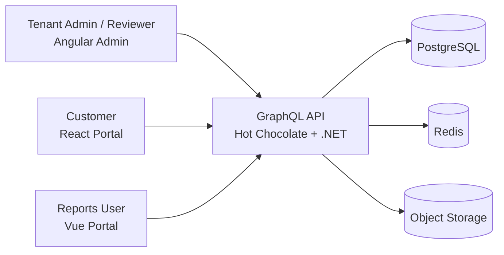
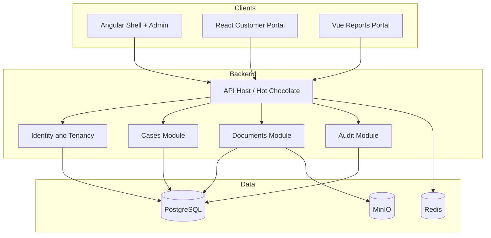
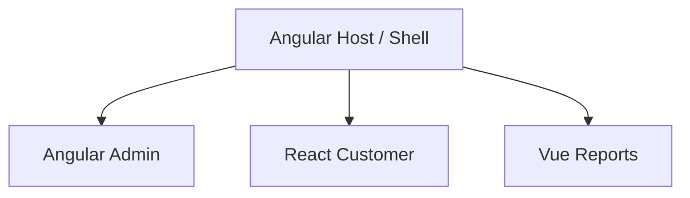
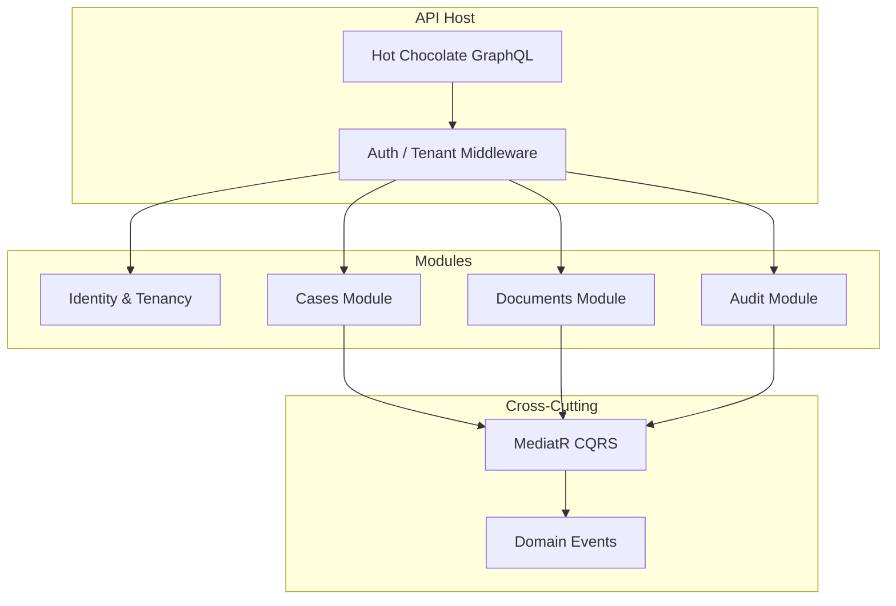
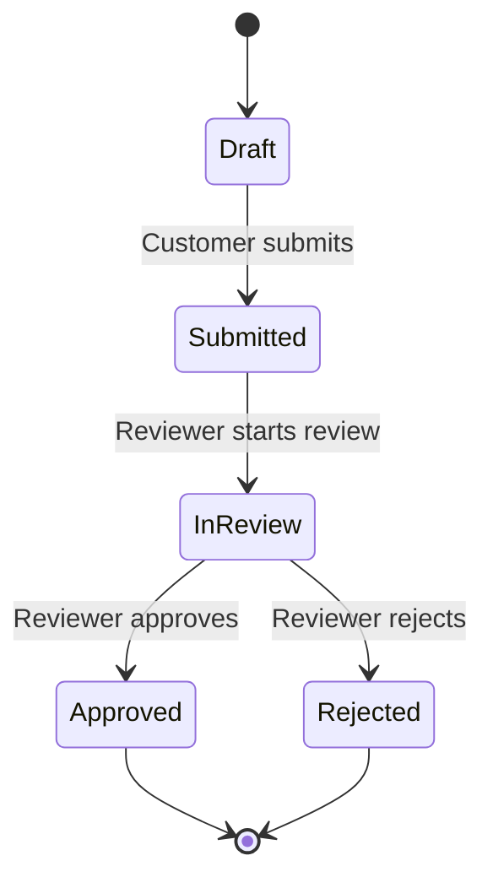

# Architecture – KYC Multi-Frontend (MVP)

## 1. System Context

```mermaid
flowchart LR
    Admin["Tenant Admin / Reviewer<br/>Angular Admin"]
    Customer["Customer<br/>React Portal"]
    Reports["Reports User<br/>Vue Portal"]
    GQL["GraphQL API<br/>Hot Chocolate + .NET"]
    DB[(PostgreSQL)]
    Cache[(Redis)]
    Files[(Object Storage)]

    Admin --> GQL
    Customer --> GQL
    Reports --> GQL
    GQL --> DB
    GQL --> Cache
    GQL --> Files
```

## 2. Container View

```mermaid
flowchart TB
    subgraph Clients
        Shell["Angular Shell + Admin"]
        ReactApp["React Customer Portal"]
        VueApp["Vue Reports Portal"]
    end

    subgraph Backend
        API["API Host / Hot Chocolate"]
        Identity["Identity and Tenancy"]
        Cases["Cases Module"]
        DocsMod["Documents Module"]
        Audit["Audit Module"]
    end

    subgraph Data
        PG[(PostgreSQL)]
        Redis[(Redis)]
        Minio[(MinIO)]
    end

    Shell --> API
    ReactApp --> API
    VueApp --> API
    API --> Identity
    API --> Cases
    API --> DocsMod
    API --> Audit
    Identity --> PG
    Cases --> PG
    DocsMod --> PG
    DocsMod --> Minio
    Audit --> PG
    API --> Redis
```

## 3. Frontend Composition

```mermaid
flowchart TB
    Shell["Angular Host / Shell"]
    Admin["Angular Admin"]
    Customer["React Customer"]
    Reports["Vue Reports"]

    Shell --> Admin
    Shell --> Customer
    Shell --> Reports
```

## 4. Backend Module Structure

```mermaid
flowchart TB
    subgraph API["API Host"]
        GQL["Hot Chocolate GraphQL"]
        Middleware["Auth / Tenant Middleware"]
    end

    subgraph Modules
        Identity["Identity & Tenancy"]
        Cases["Cases Module"]
        Documents["Documents Module"]
        Audit["Audit Module"]
    end

    subgraph CrossCutting["Cross-Cutting"]
        CQRS["MediatR CQRS"]
        Events["Domain Events"]
    end

    GQL --> Middleware
    Middleware --> Identity
    Middleware --> Cases
    Middleware --> Documents
    Middleware --> Audit
    Cases --> CQRS
    Documents --> CQRS
    Audit --> CQRS
    CQRS --> Events
```

## 5. Request Flow

```mermaid
sequenceDiagram
    participant UI as Frontend
    participant GQL as GraphQL
    participant Auth as Auth and Tenant
    participant App as Application
    participant DB as PostgreSQL

    UI->>GQL: Query or Mutation + JWT
    GQL->>Auth: Validate token and tenant
    Auth-->>GQL: User and Tenant context
    GQL->>App: Command or Query
    App->>DB: Persist or Read
    DB-->>App: Data
    App-->>GQL: Result
    GQL-->>UI: Typed payload
```

## 6. Case Lifecycle

```mermaid
stateDiagram-v2
    [*] --> Draft
    Draft --> Submitted: Customer submits
    Submitted --> InReview: Reviewer starts review
    InReview --> Approved: Reviewer approves
    InReview --> Rejected: Reviewer rejects
    Approved --> [*]
    Rejected --> [*]
```