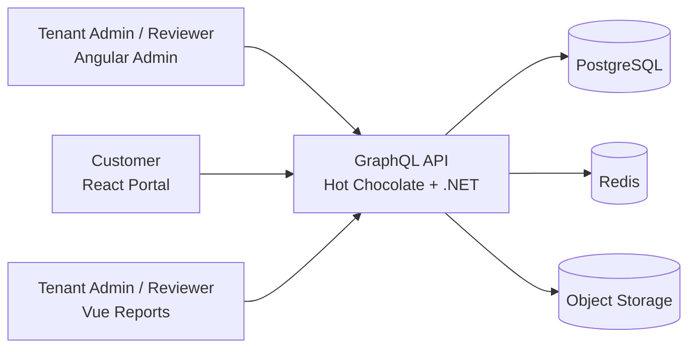
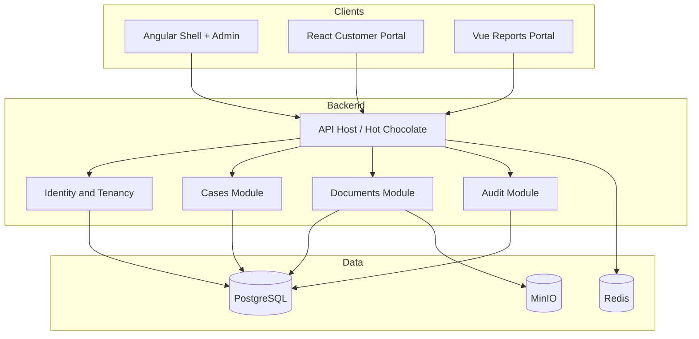
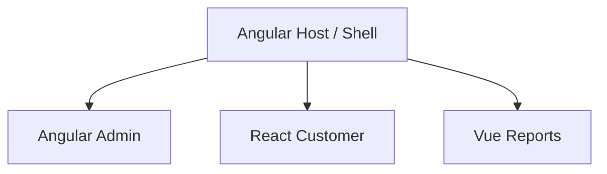
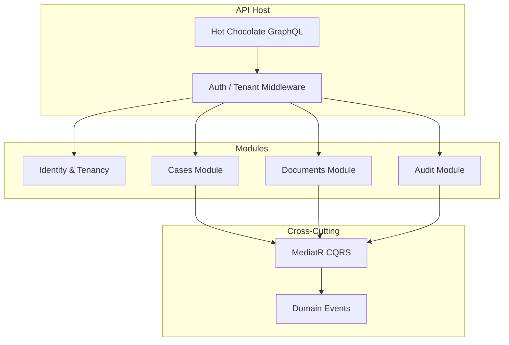
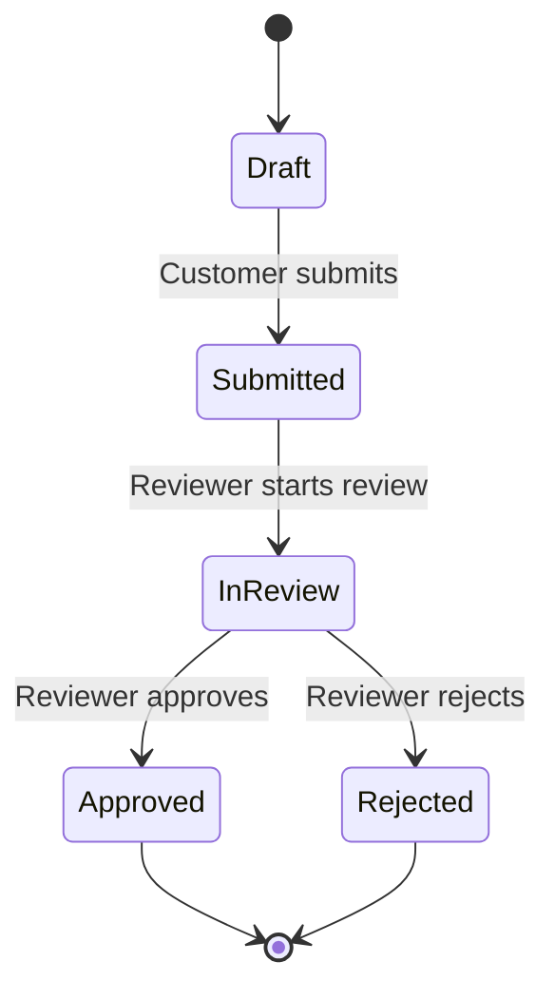

# Architecture – KYC Multi-Frontend (MVP)

This document describes the **target architecture** for the MVP. Implementation follows the [roadmap](roadmap.md): identity and infrastructure first, then GraphQL, cases, documents, and the three frontends.

**Today on `main`:** Compose (Postgres / Redis / MinIO); .NET API with EF Core, Tenant/User/Case/Document/AuditEntry, JWT login, fail-closed `ICurrentTenant` / `ICurrentUser` + `ITenantScoped` EF filters; Hot Chocolate `/graphql` + `/health` (GraphQL IDE, introspection, and SDL in Development; depth limit 10 — KYC-105); GraphQL deny-by-default JWT auth with anonymous `login` / `registerTenant` (KYC-021; login password max 128 — KYC-109); Customer create/update/submit + Reviewer/TenantAdmin review lifecycle + authenticated `cases` / `case` detail (incl. `customerEmail`) + `documents(caseId)` metadata list + Customer document upload to MinIO + authenticated document download stream + append-only audit writes + Reviewer/TenantAdmin `caseAuditEntries` (KYC-022 / KYC-031–037 / KYC-040–042 / KYC-050–051; non-owner update/submit → `NOT_FOUND`, FormData 64 KiB / depth 8, atomic status — KYC-106); temporary REST register/login on the same anonymous allow-list; CORS allow-list for `http://localhost:4200` and `http://localhost:5173` (KYC-091 W4 slice); API readiness/liveness + EF retries (KYC-103); dummy password verify on login miss paths (KYC-107); `apps/api/Kyc.Api.sln` + tests; GitHub Actions `api-ci` with SHA-pinned actions and a Postgres test slice (KYC-102 / KYC-108). UI apps are not built yet. Object-store failures on upload and download return `STORAGE` (HTTP 502), not `VALIDATION`.

**Health vs ready (KYC-103):** `GET /health` stays a process check. `GET /ready` returns 503 when Postgres is unreachable. EF Core uses `EnableRetryOnFailure`; Npgsql command timeout is 30s and the ASP.NET request timeout is 60s.

**Observability (KYC-104):** JSON stdout logs include a `RequestId` (`X-Request-Id`). Auth and readiness failures are logged without secrets. MVP signals are those logs plus `/ready`; no APM vendor.

**MVP frontends (ADR-005):** three independent apps against the same GraphQL API. Section 3 is the **Week 7 target** (Angular shell composing remotes); it is not required for the first release.

## 1. System Context

## 2. Container View

## 3. Frontend Composition (target after Module Federation spike)

MVP ships three separate apps. The diagram below is the intended shell composition if the Week 7 federation spike succeeds (ADR-005).

## 4. Backend Module Structure

## 5. Request Flow

## 6. Case Lifecycle

