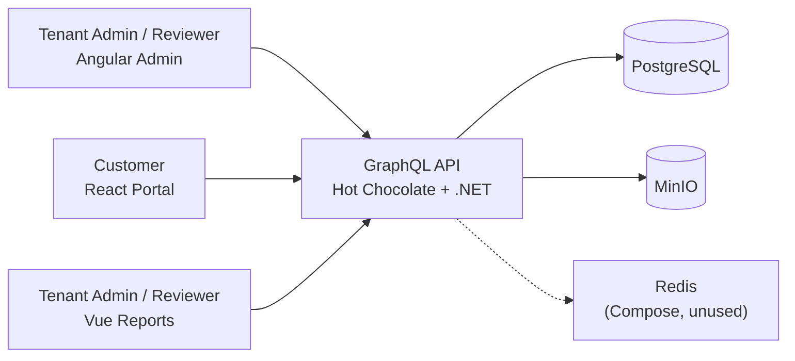
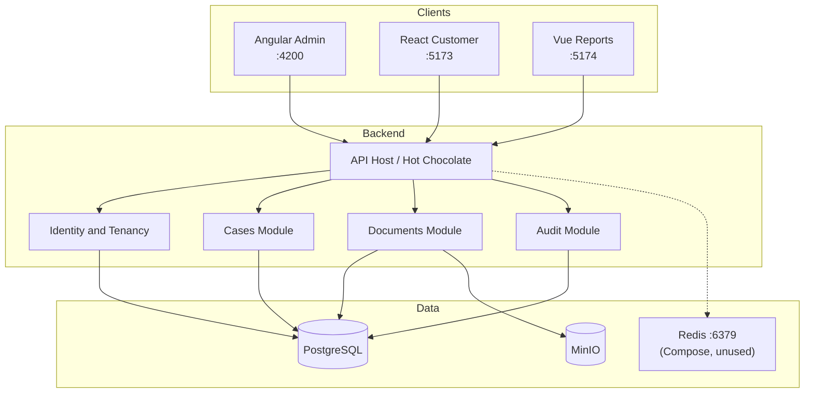
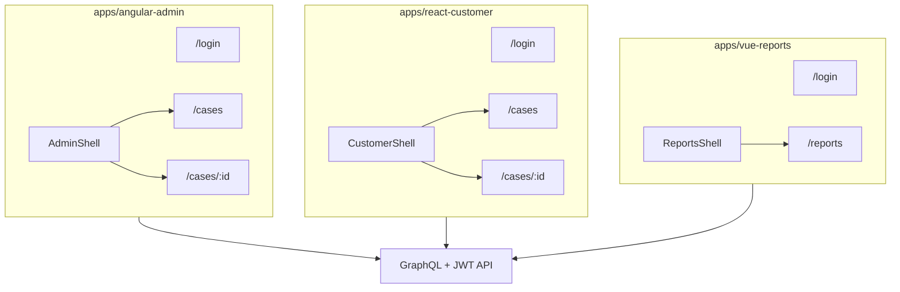
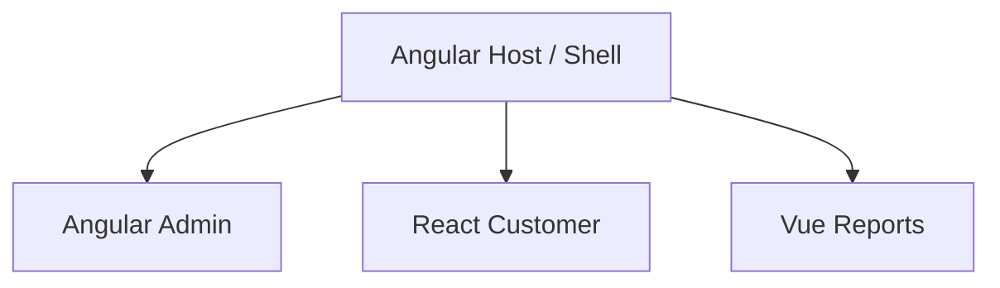
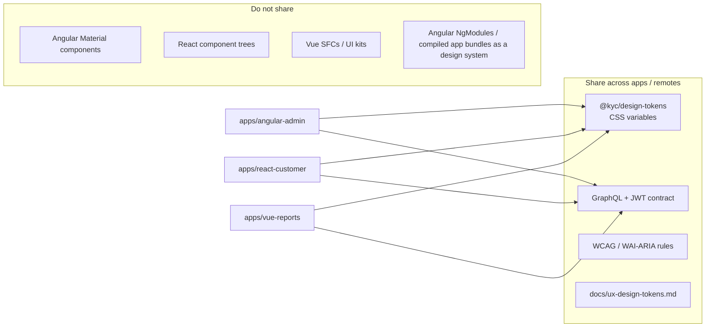
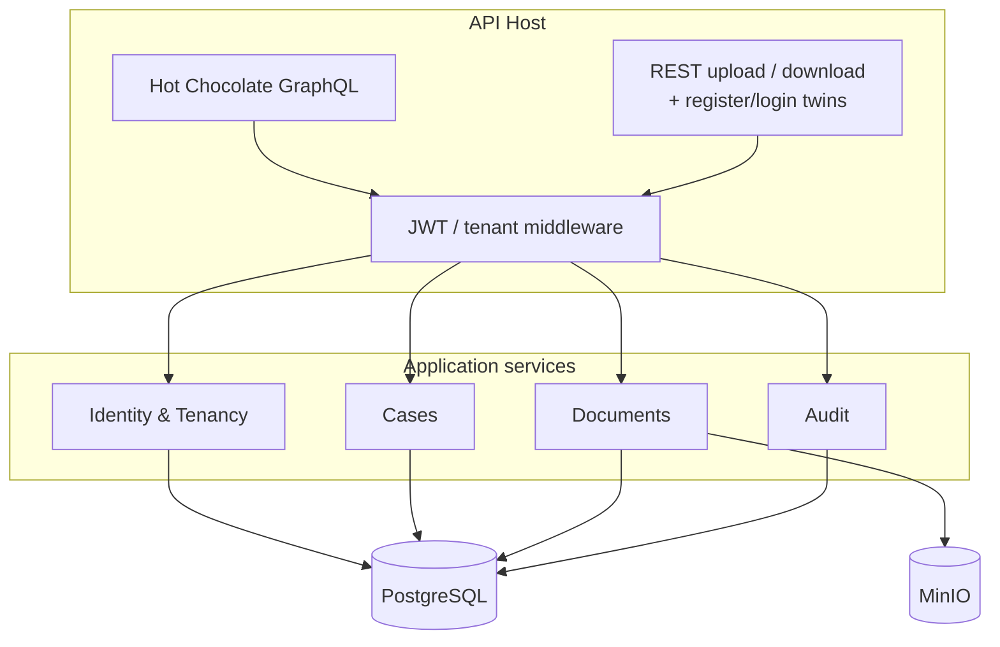
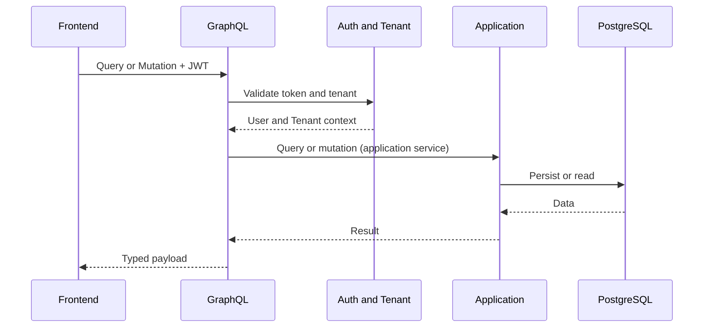
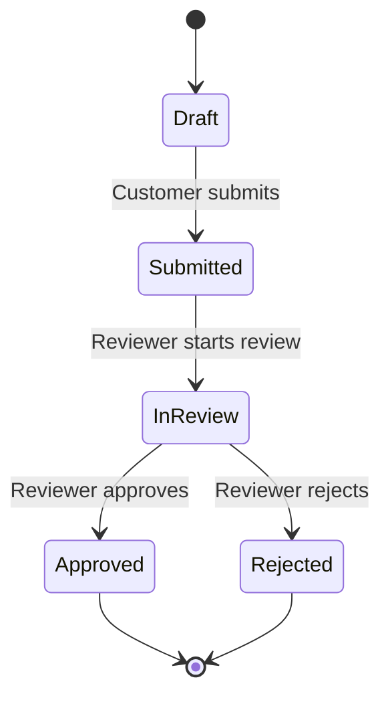

# Architecture – KYC Multi-Frontend (MVP)

This document describes **what runs today** and labels anything that is not wired. Week sequencing: [roadmap.md](roadmap.md). Production-shaped follow-ups (Redis client, MF host, invites, TLS): [beyond-mvp.md](beyond-mvp.md). Decisions: [ADRs](architecture-decision-records.md).

**How to read diagrams:** solid arrows are live. Dotted Redis means Compose is up and the API does **not** connect. There is no MediatR / domain-events box. Module Federation appears only as a labeled W7 spike (§3).

**Today on `main`:** Compose (Postgres / Redis / MinIO — Redis is Compose-only; the API does not connect yet); .NET API with EF Core, Tenant/User/Case/Document/AuditEntry, JWT login, fail-closed `ICurrentTenant` / `ICurrentUser` + `ITenantScoped` EF filters; Hot Chocolate `/graphql` + `/health` (GraphQL IDE, introspection, and SDL in Development; depth limit 10 — KYC-105); GraphQL deny-by-default JWT auth with anonymous `login` / `registerTenant` (KYC-021; login password max 128 — KYC-109); Customer create/update/submit + Reviewer/TenantAdmin review lifecycle + authenticated `cases` / `case` detail (incl. `customerEmail`) + `documents(caseId)` metadata list + Customer document upload to MinIO + authenticated document download stream + append-only audit writes + Reviewer/TenantAdmin `caseAuditEntries` (KYC-022 / KYC-031–037 / KYC-040–042 / KYC-050–051; non-owner update/submit → `NOT_FOUND`, FormData 64 KiB / depth 8, atomic status — KYC-106); temporary REST register/login on the same anonymous allow-list; CORS allow-list for `http://localhost:4200`, `http://localhost:5173`, and `http://localhost:5174` (KYC-091); API readiness/liveness + EF retries (KYC-103); dummy password verify on login miss paths (KYC-107); public-auth abuse controls — env-specific IP rate limits, lockout, captcha, invites (KYC-093); frontend login HTTP 429 + optional captcha (KYC-094); `apps/api/Kyc.Api.sln` + tests; GitHub Actions `api-ci` with SHA-pinned actions and a Postgres test slice (KYC-102 / KYC-108). **Angular admin** (KYC-060–065), **React customer** (KYC-070–074), and **Vue reports** (KYC-080–081: login, shell, status counts, latest-10 table) against the same API; shared UX tokens in `packages/design-tokens`. Object-store failures on upload and download return `STORAGE` (HTTP 502), not `VALIDATION`. ObjectStorage provider is fail-closed (empty → startup throw; explicit `InMemory` / `Minio` only).

**Health vs ready (KYC-103):** `GET /health` stays a process check. `GET /ready` returns 503 when Postgres is unreachable. EF Core uses `EnableRetryOnFailure`; Npgsql command timeout is 30s and the ASP.NET request timeout is 60s.

**Observability (KYC-104):** JSON stdout logs include a `RequestId` (`X-Request-Id`). Auth and readiness failures are logged without secrets. MVP signals are those logs plus `/ready`; no APM vendor.

**MVP frontends (ADR-005):** three independent apps against the same GraphQL API. Share `@kyc/design-tokens` + auth/GraphQL contract + a11y rules — not cross-framework UI components (see §3). Section 3’s host/remotes diagram is a **W7 spike**, not DoD. Redis on the context diagram is **dotted / unused**. When to wire Redis, a real MF host, invites, or TLS: [beyond-mvp.md](beyond-mvp.md).

## 1. System Context

Redis is a Compose service only ([ADR-006](architecture-decision-records.md)). Wire it only when [beyond-mvp.md](beyond-mvp.md) §4 triggers apply.

## 2. Container View

The API host is **not** a Compose service. Redis has no client. Adding either is [beyond-mvp.md](beyond-mvp.md) (API-in-Compose / Redis triggers).

## 3. Frontend Composition

MVP ships three **independent** apps against the same API (ADR-005). Living per-app render trees (panes, dialogs) stay in each app README — this section is system shape only.

### MVP — independent apps

Each app is its own SPA. Coarse shape only — **not** per-pane leaf inventories:

| Layer | Owns | Documented where |
|---|---|---|
| System (this diagram) | Apps, shells, feature routes, API edge | **This file** |
| Smart vs presentational rules | Screens wire I/O; leaves take props only | [frontend-code-standards.md](frontend-code-standards.md) |
| Living render tree per app | Exact nodes (panes, dialogs, tables) | Each app README — update when routes land |

- [angular-admin README](../apps/angular-admin/README.md#component-tree) — component tree  
- [react-customer README](../apps/react-customer/README.md#component-tree-kyc-074) — component tree  
- [vue-reports README](../apps/vue-reports/README.md#component-tree-kyc-081) — component tree  

### Week 7 spike — Module Federation (not required)

The diagram below is composition **if** the W7 spike succeeds ([ADR-005](architecture-decision-records.md)). MVP and DoD are three independent apps. A real one-URL host after a stable spike is [beyond-mvp.md](beyond-mvp.md) §2.

### Frontend sharing boundary (MVP and MF-ready)

Three stacks must look and authenticate consistently without sharing framework UI code. That boundary stays the same if apps later load as Module Federation remotes.

| May share | Must not share (MVP; still true under MF) |
|---|---|
| `@kyc/design-tokens` (color, spacing, type, focus) | Angular Material / CDK widgets into React or Vue |
| GraphQL schema + auth semantics (JWT claims, roles) | React/Vue component libraries into Angular |
| UX/a11y rules in docs ([ux-design-tokens.md](ux-design-tokens.md)) | A single cross-framework component library |
| Small non-UI helpers later (e.g. date format constants) if framework-free | Compiled app bundles as the “design system” |

**Under Module Federation:** the host may load `tokens.css` once, or each remote may import the same file (identical `--kyc-*` names). Remotes still talk to the **API**, not to each other, for domain data. Token handling stays per-app (or host-owned session) but must follow the same JWT contract (ADR-007). UI toolkits stay local: Angular maps Material to tokens; React/Vue map their kits the same way.

Details: [ADR-005](architecture-decision-records.md), [frontend-code-standards.md](frontend-code-standards.md), [`packages/design-tokens`](../packages/design-tokens/).

## 4. Backend Module Structure

**Today:** one host, folder modules, **application services** as command/query handlers. There is no MediatR bus and no domain-events pipeline. Do not add them to match an old diagram ([dotnet-code-standards.md](dotnet-code-standards.md), [beyond-mvp.md](beyond-mvp.md) §6).

## 5. Request Flow

Document **bytes** use REST (`POST`/`GET /api/cases/.../documents`), not GraphQL. GraphQL carries metadata only. MinIO is on that REST path; Redis is not on any path.

## 6. Case Lifecycle

## 7. Related docs

- [Roadmap](roadmap.md) — W1–W7
- [Beyond MVP](beyond-mvp.md) — Redis, MF host, invites, TLS (triggers)
- [DoD](DoD.md)
- [ADRs](architecture-decision-records.md)
- [Frontend code standards](frontend-code-standards.md) · [.NET code standards](dotnet-code-standards.md)