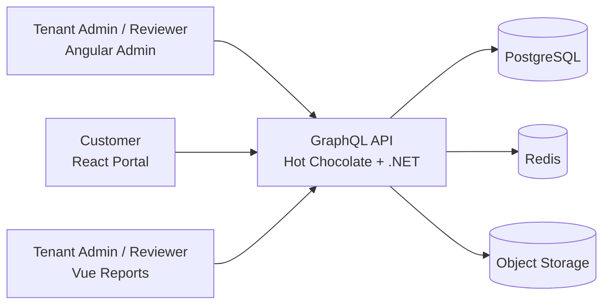
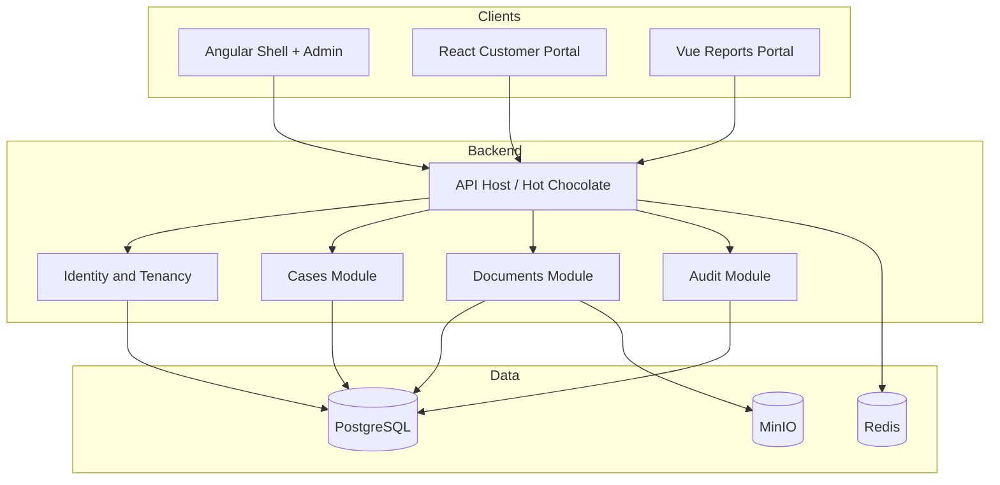
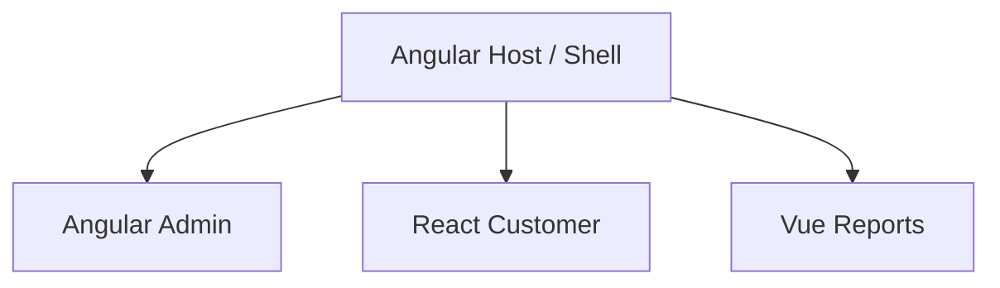
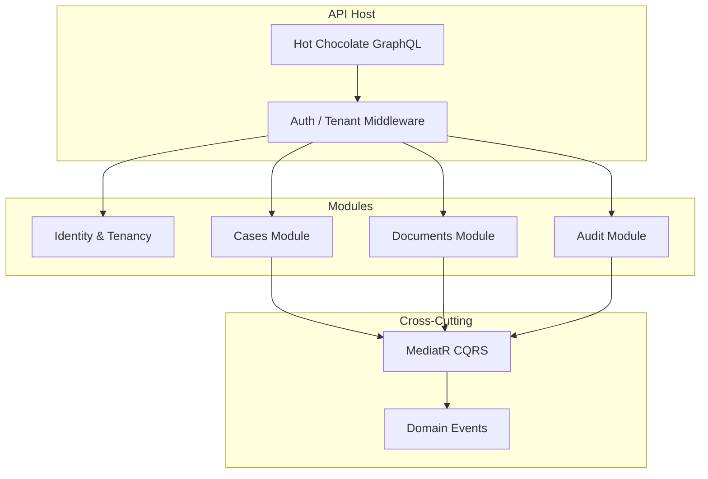
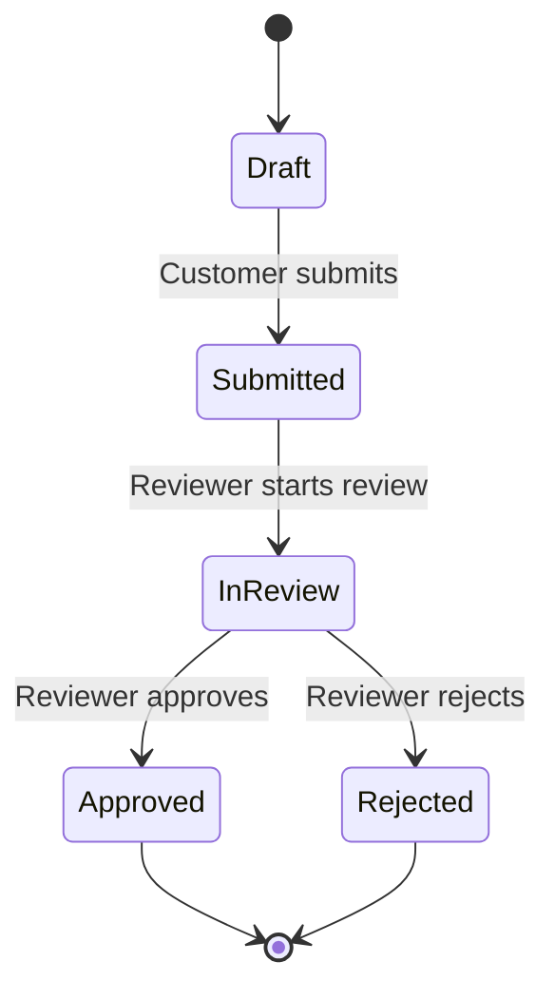

# Architecture – KYC Multi-Frontend (MVP)

This document describes the **target architecture** for the MVP. Implementation follows the [roadmap](roadmap.md): identity and infrastructure first, then GraphQL, cases, documents, and the three frontends.

**Today on `main`:** Compose (Postgres / Redis / MinIO); .NET API with EF Core, Tenant/User/Case, JWT login, fail-closed `ICurrentTenant` / `ICurrentUser` + `ITenantScoped` EF filters; Hot Chocolate `/graphql` + `/health` (GraphQL IDE in Development); GraphQL deny-by-default JWT auth with anonymous `login` / `registerTenant` (KYC-021); field-level Reviewer stub + Customer `createDraftCase` (KYC-022 / KYC-031); temporary REST register/login on the same allow-list; `apps/api/Kyc.Api.sln` + tests; GitHub Actions `api-ci` (KYC-102). Remaining case lifecycle GraphQL and UI apps are not built yet.

**MVP frontends (ADR-005):** three independent apps against the same GraphQL API. Section 3 is the **Week 7 target** (Angular shell composing remotes); it is not required for the first release.

## 1. System Context

## 2. Container View

## 3. Frontend Composition (target after Module Federation spike)

MVP ships three separate apps. The diagram below is the intended shell composition if the Week 7 federation spike succeeds (ADR-005).

## 4. Backend Module Structure

## 5. Request Flow

## 6. Case Lifecycle

