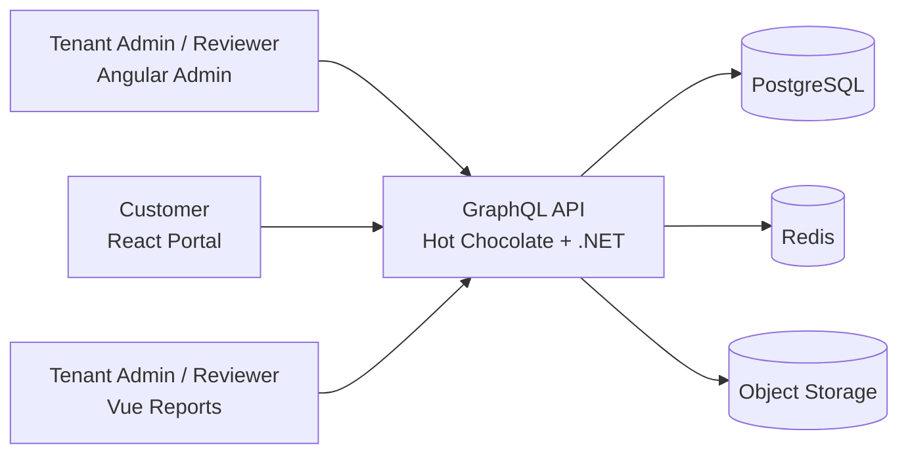
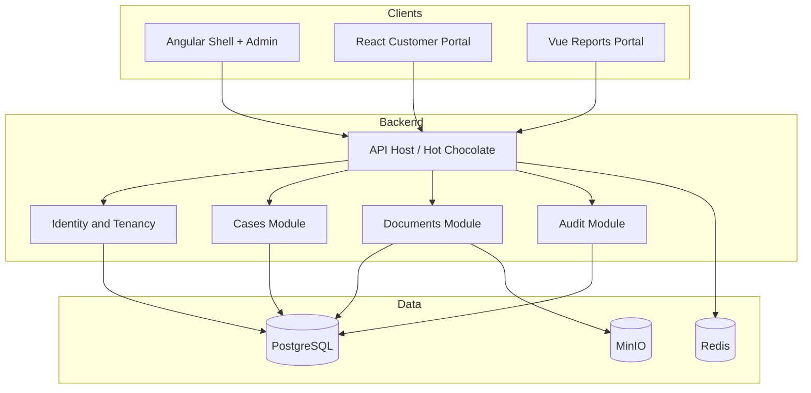
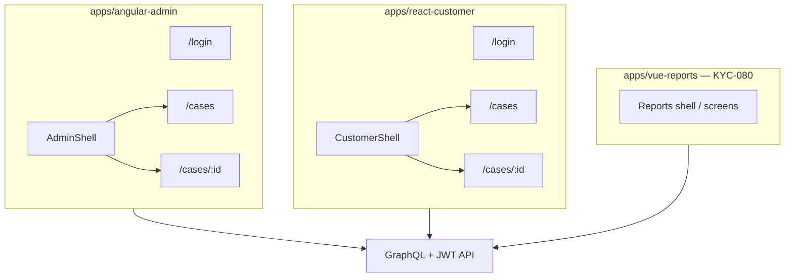
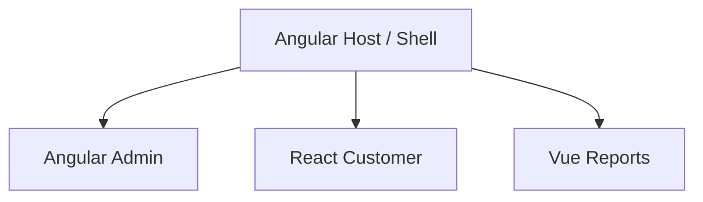
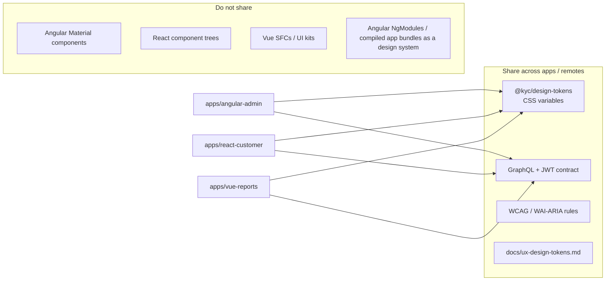
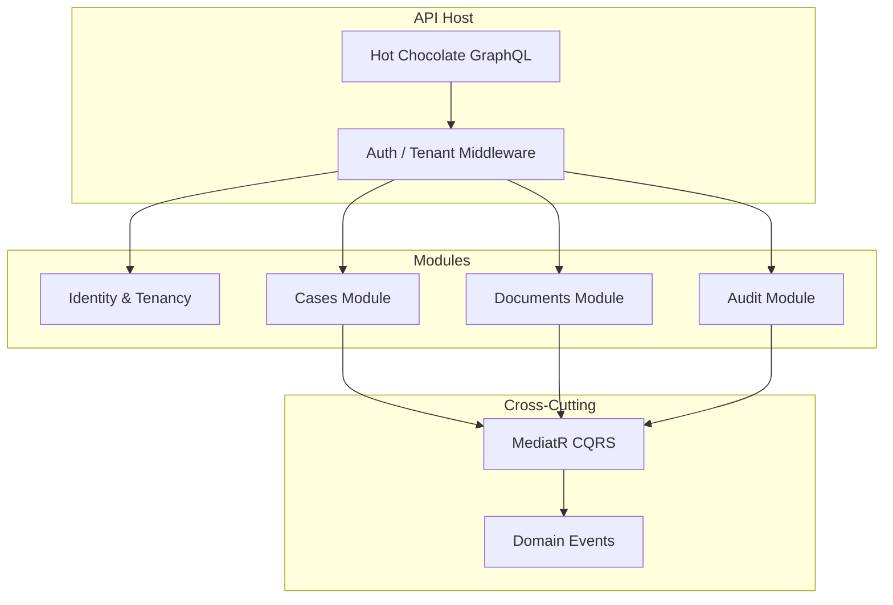
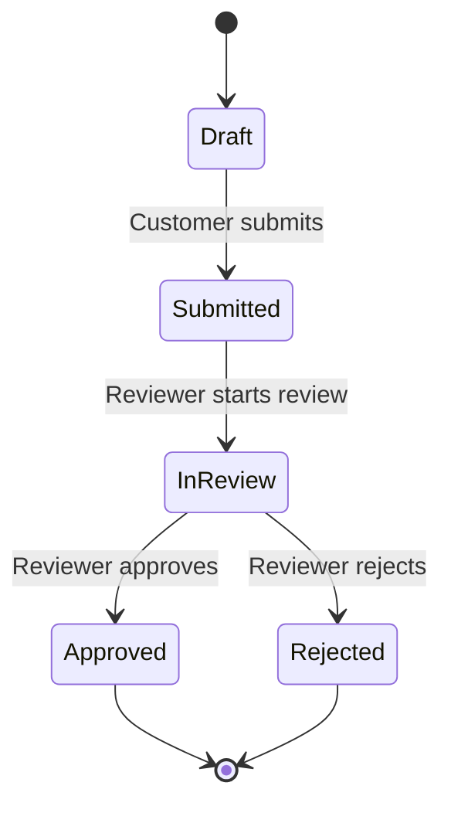

# Architecture – KYC Multi-Frontend (MVP)

This document describes the **target architecture** for the MVP. Implementation follows the [roadmap](roadmap.md): identity and infrastructure first, then GraphQL, cases, documents, and the three frontends.

**Today on `main`:** Compose (Postgres / Redis / MinIO); .NET API with EF Core, Tenant/User/Case/Document/AuditEntry, JWT login, fail-closed `ICurrentTenant` / `ICurrentUser` + `ITenantScoped` EF filters; Hot Chocolate `/graphql` + `/health` (GraphQL IDE, introspection, and SDL in Development; depth limit 10 — KYC-105); GraphQL deny-by-default JWT auth with anonymous `login` / `registerTenant` (KYC-021; login password max 128 — KYC-109); Customer create/update/submit + Reviewer/TenantAdmin review lifecycle + authenticated `cases` / `case` detail (incl. `customerEmail`) + `documents(caseId)` metadata list + Customer document upload to MinIO + authenticated document download stream + append-only audit writes + Reviewer/TenantAdmin `caseAuditEntries` (KYC-022 / KYC-031–037 / KYC-040–042 / KYC-050–051; non-owner update/submit → `NOT_FOUND`, FormData 64 KiB / depth 8, atomic status — KYC-106); temporary REST register/login on the same anonymous allow-list; CORS allow-list for `http://localhost:4200` and `http://localhost:5173` (KYC-091 W4 slice); API readiness/liveness + EF retries (KYC-103); dummy password verify on login miss paths (KYC-107); `apps/api/Kyc.Api.sln` + tests; GitHub Actions `api-ci` with SHA-pinned actions and a Postgres test slice (KYC-102 / KYC-108). **Angular admin foundation** (KYC-060: standalone Angular 22+, routing, GraphQL env, functional auth interceptor) in `apps/angular-admin`; shared UX tokens in `packages/design-tokens` (when merged); React/Vue still placeholders. Object-store failures on upload and download return `STORAGE` (HTTP 502), not `VALIDATION`.

**Health vs ready (KYC-103):** `GET /health` stays a process check. `GET /ready` returns 503 when Postgres is unreachable. EF Core uses `EnableRetryOnFailure`; Npgsql command timeout is 30s and the ASP.NET request timeout is 60s.

**Observability (KYC-104):** JSON stdout logs include a `RequestId` (`X-Request-Id`). Auth and readiness failures are logged without secrets. MVP signals are those logs plus `/ready`; no APM vendor.

**MVP frontends (ADR-005):** three independent apps against the same GraphQL API. Share `@kyc/design-tokens` + auth/GraphQL contract + a11y rules — not cross-framework UI components (see §3). Section 3’s shell diagram is the **Week 7 target** (Angular composing remotes); it is not required for the first release.

## 1. System Context

## 2. Container View

## 3. Frontend Composition

MVP ships three **independent** apps against the same API (ADR-005). Living per-app render trees (panes, dialogs) stay in each app README — this section is system shape only.

### MVP — independent apps

Each app is its own SPA. Coarse shape only — **not** per-pane leaf inventories:

| Layer | Owns | Documented where |
|---|---|---|
| System (this diagram) | Apps, shells, feature routes, API edge | **This file** |
| Smart vs presentational rules | Screens wire I/O; leaves take props only | [frontend-code-standards.md](frontend-code-standards.md) |
| Living render tree per app | Exact nodes (panes, dialogs, tables) | Each app README — update when routes land |

- [angular-admin README](../apps/angular-admin/README.md#component-tree) — component tree  
- [react-customer README](../apps/react-customer/README.md#component-tree-kyc-072) — component tree  
- [vue-reports README](../apps/vue-reports/README.md) — when KYC-080 lands  

### Target after Module Federation spike (Week 7)

The diagram below is the intended shell composition **if** the Week 7 federation spike succeeds (ADR-005). It is not required for the first release.

### Frontend sharing boundary (MVP and MF-ready)

Three stacks must look and authenticate consistently without sharing framework UI code. That boundary stays the same if apps later load as Module Federation remotes.

| May share | Must not share (MVP; still true under MF) |
|---|---|
| `@kyc/design-tokens` (color, spacing, type, focus) | Angular Material / CDK widgets into React or Vue |
| GraphQL schema + auth semantics (JWT claims, roles) | React/Vue component libraries into Angular |
| UX/a11y rules in docs ([ux-design-tokens.md](ux-design-tokens.md)) | A single cross-framework component library |
| Small non-UI helpers later (e.g. date format constants) if framework-free | Compiled app bundles as the “design system” |

**Under Module Federation:** the host may load `tokens.css` once, or each remote may import the same file (identical `--kyc-*` names). Remotes still talk to the **API**, not to each other, for domain data. Token handling stays per-app (or host-owned session) but must follow the same JWT contract (ADR-007). UI toolkits stay local: Angular maps Material to tokens; React/Vue map their kits the same way.

Details: [ADR-005](architecture-decision-records.md), [frontend-code-standards.md](frontend-code-standards.md), [`packages/design-tokens`](../packages/design-tokens/).

## 4. Backend Module Structure

## 5. Request Flow

## 6. Case Lifecycle

