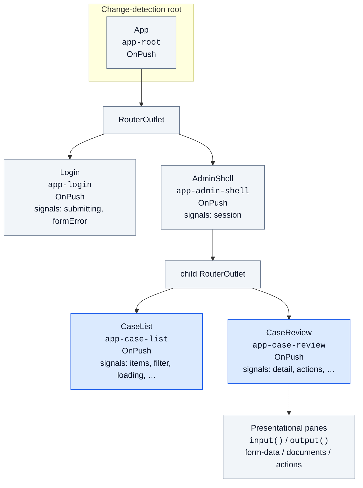
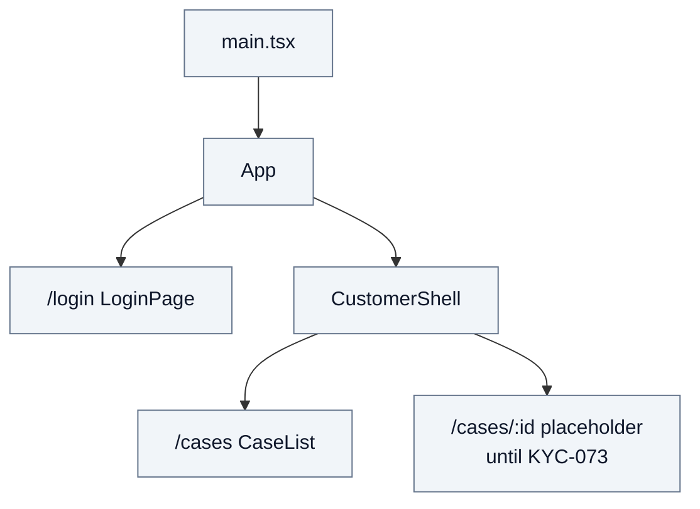

# Frontend code standards

Conventions for UI apps under `apps/` (Angular admin, React customer, Vue reports). These complement the ADRs and roadmap — write new frontend work to match them.

**Not this file:** API runbook ([apps/api/README.md](../apps/api/README.md)), .NET C# rules ([dotnet-code-standards.md](dotnet-code-standards.md)), or *why* three separate apps / GraphQL exist ([architecture-decision-records.md](architecture-decision-records.md)). If this file and an ADR disagree, the ADR wins.

**Authority (first match wins):**

1. **ADRs** — product decisions (separate apps, no MF for MVP, no AI context packs)
2. **Official framework docs** — [angular.dev](https://angular.dev), [react.dev](https://react.dev), [vuejs.org](https://vuejs.org) for that app’s APIs and Style Guide
3. **This file** — what we enforce in this repo (shared + per-framework sections)
4. **Optional pattern sources** (Angular only today) — [Angular Architects](https://www.angulararchitects.io/en/) filtered below; not their workshop stack

This file is not a copy of any framework’s documentation site.

## Shared (all frontends)

Rules in this section apply to **Angular, React, and Vue**. Framework sections only add stack-specific APIs (DI vs hooks vs Composition API, etc.).

**Portable practices (adopt once, express per stack):** Hard TypeScript; feature folders; `*.models.ts` / `*.mappers.ts` / `*.messages.ts`; functional purity with side effects at I/O edges; smart screens vs presentational leaves; an explicit **component tree**; design tokens + a11y; view bindings that do not recompute heavy work in the template/JSX; JWT attached in one HTTP helper; path-filtered CI per app. What differs is *how* (signals/`inject` vs hooks vs `setup()`), not *whether*.

| Topic | Rule |
|---|---|
| Apps | Three independent apps (ADR-005): `apps/angular-admin`, `apps/react-customer`, `apps/vue-reports` — no Module Federation for MVP |
| Versions | Each app tracks the **latest stable** major of its framework (Angular 22+, React 19+, Vue 3+) — do not pin an outdated major “because an old issue said X” |
| API contract | GraphQL for domain reads/writes; document **download** / **upload** are REST with the same JWT; do not invent extra BFF routes |
| Auth | Store the access token after login; send `Authorization: Bearer <token>` on authenticated API calls; never put `tenant_id` / role in client-supplied request bodies for authorized ops (ADR-007) |
| Config | GraphQL (and REST API) base URLs come from environment / build config — not hard-coded production hosts |
| Design tokens | Shared `@kyc/design-tokens` CSS variables for color, spacing, type, focus — see [ux-design-tokens.md](ux-design-tokens.md). Map each app’s UI kit to tokens; do not fork palettes per app. Import `tokens.css` at app start |
| UI kits | One kit per app, themed to tokens. Angular → Material. React / Vue → choose a single kit (or CSS modules + tokens) in the foundation story — **do not** add Bootstrap as a second spacing/color system |
| **Feature folders** | Organize by **feature area** (`auth/`, `cases/`, `shared/`, `config/`), not by type buckets (`components/`, `services/`, `hooks/` as top-level) |
| **Models / mappers / messages** | `*.models.ts` (shapes), `*.mappers.ts` (pure transforms), `*.messages.ts` (UI copy), `*.service.ts` / `*Api.ts` (I/O only) — same convention in every UI app |
| **Functional style** | Prefer FP **at every app level**, expressed as pure **functions**. Side effects only at I/O edges. See below |
| **Smart vs presentational** | Route / screen containers wire data and navigation. Presentational leaves take props / `input()` / props-only APIs — **no** HTTP, **no** feature API modules |
| **Component tree** | Document and respect the render tree — see [Component tree (all frontends)](#component-tree-all-frontends) |
| Accessibility | WCAG 2.2 AA intent + WAI-ARIA across Angular/React/Vue (same `aria-*` platform). Labels, focus visible (`--kyc-focus-ring`), errors not by color alone — details in [ux-design-tokens.md](ux-design-tokens.md) |
| **Hard TypeScript** | **Strict TS from the first file** in every UI app — see below. No “loose then tighten later.” |
| **View bindings** | Do **not** call expensive functions from templates / JSX for derived display — see [View bindings: no expensive calls](#view-bindings-no-expensive-calls) |
| **UI copy** | No hard-coded user-facing English in views — use `*.messages.ts` catalogs. See [UI copy and localization](#ui-copy-and-localization) |
| Secrets | No real passwords or JWT secrets in source; local demo credentials stay in README / `.env.example` only |
| Commits | [Conventional Commits](commits.md) with scopes like `angular`, `react`, `vue`, `docs` |
| CI | Path-filtered GitHub Actions per app (`angular-ci`, `react-ci`, later `vue-ci`): `npm ci`, build, `test:ci` |

Do not invent Tenant user-management UIs in W4–W6 — that API does not exist yet.

### Component tree (all frontends)

Every UI app **must** keep an explicit mental (and documented) **component / render tree**: who mounts whom, which nodes are smart vs presentational, and where state lives. Without that map, features grow into a dashboard of siblings that all fetch and mutate.

**Why it matters (cross-stack):**

| Concern | Practice |
|---|---|
| Isolation | State updates should re-render / check **the subtree that owns the data**, not the whole app |
| Boundaries | Shell / layout hosts outlets or `<Outlet />` / `<RouterView />`; feature screens mount under them |
| Data flow | Downward props / inputs; upward events / callbacks / outputs — not secret service calls from leaves |
| Lazy routes | Unmounted routes are **not** in the tree — do not assume global listeners for every screen |
| Documentation | Foundation READMEs / this file keep a current mermaid (or equivalent) tree; update it when routes land |

**Shared building-block access (no Sheriff required for MVP):**

```
smart route / screen
    → presentational UI (props / input+output only)
    → *.service.ts / *Api.ts (HTTP)
    → *.mappers.ts / *.models.ts / *.messages.ts
```

- Only the data module talks to the API.
- Presentational components do not import feature API modules or token storage.
- App root / shell may compose any feature (host exception).

Framework-specific trees (OnPush, React reconciliation, Vue reactivity) live under each framework section — the **obligation to draw and respect the tree** is shared.

### Hard TypeScript (all frontends)

Ship with a hard type-checker from day one. Scaffold and PRs must keep it that way.

| Do | Do not |
|---|---|
| `strict: true` (and framework template/DI / JSX strictness where it exists) | Turn off `strict` to unblock a feature |
| Explicit interfaces for GraphQL/HTTP bodies and domain models | `any`, untyped `object`, or “just cast it” |
| **Explicit types on locals / fields / constants** (`const x: string = …`) | Rely on inference alone for non-trivial values (harder to read; silent widen/drift) |
| `unknown` + narrow in `catch` / error callbacks | Empty `catch` or `catch (e: any)` |
| Extra flags when practical: `noUncheckedIndexedAccess`, `noUnusedLocals`, `noUnusedParameters` | `@ts-ignore` / `@ts-expect-error` without a short justification |
| Typed test fixtures | `as any` / `as never` to silence tests |

```typescript
const token: string | null = storage.getAccessToken();
const target: string = returnUrl ?? '/cases';
```

New apps copy this hard baseline — never scaffold with Vite/CRA soft defaults left on.

### Functional style / purity (all frontends)

Prefer a **functional style across every level of the app**. The unit of that style is the **pure function** (same inputs → same outputs; no hidden I/O): put transforms in named functions (often `*.mappers.ts`), keep views thin, and push side effects to the edges.

This is **not** a mandate for `fp-ts` or rewriting React/Angular as a functional framework — hooks, DI, RxJS, and signals stay first-class. It **is** a mandate to think functionally **everywhere**, not only inside mapper files.

| Level | Prefer | Avoid |
|---|---|---|
| **Shared / `*.mappers.ts`** | Pure functions: normalize, parse GraphQL → DTO, error map, labels | HTTP, router, storage inside “helpers” |
| **API / services** | Compose pure functions after fetch; I/O only via `fetch` / HttpClient / storage | Dense callbacks that parse **and** write tokens / navigate |
| **Screens / components** | Derived state via `computed` / `useMemo` sparingly / pure helpers; immutable updates | In-place mutation; business parsing copied into the UI |
| **Views (templates / JSX)** | Bind state / fields / message constants — **not** method calls that recompute display | Heavy branching, formatting helpers, or string assembly in the view |
| **Collections** | `filter` / `map` / `flatMap` / `reduce` that return new values | `for` / `forEach` that `.push` into an outer array |
| **Immutability** | New arrays/objects (`[...xs]`, `{ ...o }`, `toSorted`) | `.push` / `.splice` / in-place `.sort()` / mutating shared objects |

```typescript
// ✅ GOOD — pure at the transform; side effect at the edge
const detail: CaseDetail = parseCaseDetail(body);
storage.setAccessToken(login.accessToken);

// ❌ BAD — side effect buried inside a function that should stay pure
function parseAndStore(body: LoginBody): LoginResult {
  const login = …;
  storage.setAccessToken(login.accessToken);
  return login;
}
```

**Immutability (whole app):** treat data as replaceable, not editable in place. Prefer `filter`/`map`/`reduce` for “list in → list out.” Do **not** treat `forEach` as more functional than `for` when they mutate.

### View bindings: no expensive calls

Templates (Angular), JSX (React), and Vue templates re-evaluate when their owner re-renders / is checked. A **helper call** in the view for derived display runs again on every pass — including for every row in a list.

| Bind this | Not this |
|---|---|
| Derived state already computed: signals / `useMemo` only when needed / store selectors | `{{ formatSize(doc.sizeBytes) }}` / `{formatSize(doc.sizeBytes)}` as the default |
| Precomputed fields on the DTO / view model: `doc.sizeLabel`, `row.statusLabel` | Per-row formatters in the view |
| Message constants: `copy.pageTitle` | Inline English literals |
| Event handlers (run once per user action) | N/A |

**Do the work once, upstream** in `*.mappers.ts` (or a thin derived-state helper), then bind the field.

### UI copy and localization

**Why not hard-code English in views?** User-facing strings are a product surface. Literals scattered in JSX/HTML make localization (and copy edits) a hunt across every screen.

**Strategy for this repo (MVP tempo):**

1. **Now — message catalogs (`*.messages.ts`)** — feature + `shared/ui.messages.ts`; parameterized helpers are **pure** and called from mappers / event handlers, **never** from views  
2. **Not now — full i18n runtime** — do not add `$localize` / `react-i18next` / `vue-i18n` until a second locale is a product requirement  
3. **Later — swap catalogs** behind stable keys without rewriting screens  

**Rule:** no new user-facing English in views or as ad-hoc component string fields. Put it in `*.messages.ts`. Map API/GraphQL error codes → catalog text at the edge.

### Design practices (all frontends)

Shared UX rules — not framework chrome. Product screens should feel like one design system across Angular / React / Vue.

| Practice | Rule |
|---|---|
| Tokens first | Color, spacing, type, radius, focus from `--kyc-*` — see [ux-design-tokens.md](ux-design-tokens.md) |
| One composition per primary screen | First viewport reads as one job (login, list, review), not a widget dump |
| Brand / hierarchy | Product name is a clear header signal; do not bury brand under competing headlines on auth/home |
| Atmosphere without kits wars | Prefer subtle surface gradients / token-based backgrounds over flat `#fff` only; still **one** kit per app |
| Focus & errors | Visible focus ring (`--kyc-focus-ring`); errors associated with fields; not by color alone |
| Motion | Prefer intentional, sparse motion; do not decorate every control |
| Kit consistency | Do not mix Material + Bootstrap + ad-hoc CSS systems in one app |
| Cards | Use bordered/raised surfaces only when they group an interaction; prefer open layout for read-only review panes |

---

## Angular (`apps/angular-admin`)

Follow the official [Angular Style Guide](https://angular.dev/style-guide) and related guides. When in doubt, **prefer consistency with this file and with angular.dev**. Shared rules above still apply.

### Versions and scaffold

| Setting | Value | Do not |
|---|---|---|
| Angular | Latest stable major (22+ at KYC-060 writing) | Pin an outdated major “because the issue once said 19” |
| Components | **Standalone** only | Add NgModules for app features |
| App entry | `src/main.ts` (`bootstrapApplication`) | Alternate entry layouts without a reason |
| UI kit | Angular Material + `@kyc/design-tokens` (`material-theme.scss`) | Bootstrap CSS, competing CSS frameworks, or a second hard-coded palette |
| UI code | Under `src/` | Dump feature code at the app root |

### Naming and structure ([Style Guide](https://angular.dev/style-guide))

- Hyphenated file names matching the TypeScript symbol: `user-profile.ts` ↔ `UserProfile`
- Co-locate component `.ts` / `.html` / styles; tests as `*.spec.ts` beside the code
- Organize by **feature area**, not by type folders (`components/`, `services/`)
- One primary concept per file (one component / directive / service unless a small cohesive pair)
- **`*.models.ts` everywhere (app-wide):** every feature keeps DTOs, form control maps, domain errors, and feature GraphQL wire bodies in a models file — e.g. `auth/auth.models.ts`, `cases/cases.models.ts`, `config/config.models.ts`. Cross-feature wire bits (e.g. `GraphqlError`) live under `shared/*.models.ts`. Injectable services and components **import** models; they do **not** declare exported interfaces/types inline.
- **`*.messages.ts` for user-facing copy (app-wide):** English (and later locales) live in catalogs — e.g. `cases/cases.messages.ts`, `auth/auth.messages.ts`, `shared/ui.messages.ts`. Templates bind catalog fields; parameterized helpers stay pure and are called from mappers/`computed`, not from templates. See [UI copy and localization](#ui-copy-and-localization).
- **`*.mappers.ts` for pure functions (app-wide):** normalize, parse GraphQL → DTO, map errors, parse filters/URLs. FP is expected at **all** app levels (see table above); mappers are the main home for shared pure functions. Services own HTTP/`tap` side effects. See [Functional style / purity](#functional-style--purity-all-frontends).

### Angular Architects practices (filtered for this app)

Source: [angulararchitects.io](https://www.angulararchitects.io/en/) — [blog](https://www.angulararchitects.io/en/blog/), [presentations](https://www.angulararchitects.io/en/presentations/), and publications from Manfred Steyer (strategic design / Sheriff / signals) and team. Their public work in 2025–26 also covers **Agentic UI**, A2UI, AG-UI, CopilotKit, and AI-agent harnesses. **Those are out of scope** for this portfolio MVP (and conflict with [ADR-008](architecture-decision-records.md)).

Their useful thesis for us: **structure the app so illegal dependencies cannot be expressed**, then use Angular 22’s signal APIs for the reactive loop — without importing their airline-sized matrix, Nx, Sheriff, or tsarch.

#### What we adopt now

| Their idea | How it lands here |
|---|---|
| Strategic design / feature slices, not technical layer folders | Keep `auth/`, `cases/`, `config/`, `shared/` — do not add `components/` + `services/` buckets |
| Architecture matrix layers: feature → ui → data → util | Smart route components and feature services may use presentational UI, data services, and mappers. **UI (dumb) must not call HTTP or inject feature services.** Mappers stay pure (`util`). |
| Contexts talk only to themselves + shared | `cases` must not import `auth` login/form/mappers. Token, guards, and interceptor are **shared infrastructure** (treat `TokenStorage` / `authGuard` as allowed from any feature). New shared UI goes in `shared/`, not copied per feature. |
| Smart vs dumb (Steyer / Nrwl categories) | Route screens (`login`, `case-list`, later review) are smart: wiring, navigation, services. Extract **presentational** pieces (`-card`, empty/error panes) with `input()` / `output()` only — no `HttpClient`, no `CasesService`. |
| Data access is not in the template | GraphQL/REST stay in `*.service.ts` (their “client”). Do **not** rename existing services to `-client.ts`. Components do not `http.post` GraphQL. |
| No store-to-store; orchestrate instead | If two stores appear later, a feature service / coordinator composes them with `computed`. Stores must not inject each other. |
| Resource API is the signal-era load path ([Angular 22](https://www.angulararchitects.io/en/blog/angular-22-the-most-important-new-features-at-a-glance/)) | For **new** signal-driven reads, prefer `rxResource` (or `resource`) that calls the existing typed `*.service.ts`. We speak **GraphQL**, so do **not** use `httpResource` for `/graphql` (it is REST-shaped). Existing `switchMap` + signals on the case list is fine until that screen is touched. |
| Signal Forms are stable in Angular 22 | **New** forms (review reject reason, later customer drafts) use `@angular/forms/signals` (`form` + schema). Keep login on Reactive Forms until a story rewrites it — do not churn KYC-061 for fashion. Split large forms into subform components; put reusable schemas next to `*.models.ts`. |
| `OnPush` is the Angular 22 default | Do not set `ChangeDetectionStrategy.Eager` on new components. Rely on signals / inputs. See [OnPush and the Angular component tree](#onpush-and-the-angular-component-tree) and the shared [Component tree](#component-tree-all-frontends). |

| Deterministic client code owns structure | Same as [Functional style](#functional-style--purity-all-frontends): parse/order/label in mappers; the UI does not invent GraphQL codes or status order. |

#### OnPush and the Angular component tree

Angular 22 components default to **OnPush**. That means a component is checked when something it cares about changes (signal read, `input()` / bound `@Input`, template event, explicit mark) — **not** whenever any ancestor runs change detection. Pair that with **immutable signal updates** so OnPush actually sees the change. This is the Angular realization of the shared [Component tree](#component-tree-all-frontends) rule.

Current `angular-admin` tree (lazy routes; authenticated pages nest under `AdminShell`):



**Isolation example:** `CaseList` does `items.set(page.items)` after a GraphQL load.

| Component | Checked? | Why |
|---|---|---|
| `CaseList` | Yes | It read/wrote signals the template binds to |
| `AdminShell` | No (for list data) | Child signal writes do not dirty the shell |
| `CaseReview` | Only when mounted on `/cases/:id` and its signals / `rxResource` change | Lazy child route — separate subtree |
| Presentational panes | Only if their `input()` values changed | OnPush + new input references |
| `App` | No need to re-check the whole app for list data | Outlet host is not dirtied by the list’s signal write |
| `Login` | Not in the tree on `/cases` | Lazy route — not mounted |

```text
Eager (old default mental model): any event → walk large parts of the tree
OnPush + signals (this app):       signal/input dirtiness → check that subtree only
```

Rules that keep isolation real:

- Update signals with **new** values (`set` / `update`); do not mutate arrays/objects in place
- Presentational pieces take `input()` / `output()` — parents pass new object/array references when data changes
- Do **not** switch a screen to `ChangeDetectionStrategy.Eager` to “make CD work”; fix the signal/input update instead

#### Building-block access (lightweight, no Sheriff)

```
smart route / feature service
    → presentational UI (inputs/outputs only)
    → *.service.ts (HTTP)
    → *.mappers.ts / *.models.ts
```

- Only the data service talks to the API.
- Smart components may inject the data service **or** a small feature service that holds signals / `rxResource`. Either is OK at this size. Do not add a Store *and* let the component also call the service for the same read.
- Presentational components do not inject stores or HTTP.
- Shell / `app.config` may import any feature (their “root” exception).

#### What we explicitly defer

| Their tool / talk | Why not now |
|---|---|
| [Sheriff](https://www.angulararchitects.io/en/blog/modern-architectures-with-angular-part-1-strategic-design-with-sheriff-and-standalone-components/) lint rules | Needs ESLint; we declined ESLint for W4. Two features do not need a domain matrix. Revisit if `cases` + more domains start deep-importing each other. |
| [tsarch](https://www.angulararchitects.io/en/blog/architecture-beyond-layers-tsarch-for-ai-agents/) ArchUnit-style tests | Same: executable naming rules for `-store` / `-client` / `-coordinator`. Convention in this file is enough. |
| Nx + path aliases (`@demo/ticketing/data`) | One CLI app. Relative imports stay. |
| Multi-context DDD folders (`domains/booking/feature-*`) | Reviewer admin is one product. `auth` + `cases` is the map. |
| NgRx Toolkit Mutation API + full-cycle SignalStore | Same rule as [Signals and client state](#signals-and-client-state): after list↔detail sharing hurts. |
| `@Service()`, `injectAsync` / `onIdle` | Optional Angular 22 sugar. Use `injectAsync` only for a heavy optional library, not for `CasesService`. |
| Incremental hydration | Not an SSR app. |

#### What we never take from that site for MVP

- Module Federation / micro-frontend host (ADR-005 — W7 spike only)
- Agentic UI, A2UI, AG-UI, CopilotKit, MCP Apps, “AI coding agent” stop-hooks
- Formal `AGENTS.md` architecture packs as a second source of truth (ADR-008). **This file** stays the contract.
- Classic global NgRx Store “because enterprise”

If an Angular Architects article and an ADR disagree, the ADR wins. If it disagrees with angular.dev on an API, angular.dev wins.

### Dependency injection

- Prefer the [`inject()`](https://angular.dev/style-guide#prefer-the-inject-function-over-constructor-parameter-injection) function over constructor parameter injection for new code
- Keep components focused on presentation; move API / token / GraphQL orchestration into injectable services
- **No component constructor bodies for app logic.** Prefer `inject()` field initializers and lifecycle hooks (`ngOnInit`, …). Constructors run outside Angular’s usual DI/lifecycle ergonomics — do not subscribe, start HTTP, or wire RxJS pipelines there. If you need `takeUntilDestroyed` outside an injection context, pass an injected `DestroyRef`.

### Components and templates

- Prefer `input()` / `output()` (or documented modern equivalents) with `readonly` where Angular owns the binding
- Use `protected` for members only consumed by the template
- Prefer `[class]` / `[style]` bindings over `ngClass` / `ngStyle`
- Name event handlers for the **action** (`saveCase()`), not the DOM event (`handleClick()`)
- Keep lifecycle hooks thin; implement the lifecycle interfaces (`OnInit`, etc.) when used
- Avoid heavy logic in templates — move complexity into the class (e.g. `computed`) or mappers
- Do not call component methods from `{{ }}` / property bindings for derived display (see [View bindings: no expensive calls](#view-bindings-no-expensive-calls))
- Bind UI copy from `*.messages.ts`, not string literals (see [UI copy and localization](#ui-copy-and-localization))
- Wire RxJS / first-load requests in `ngOnInit` (or later hooks), not in `constructor()`
- Any long-lived or fire-and-forget HTTP `.subscribe` in a component must use `takeUntilDestroyed(this.destroyRef)` (or an equivalent `DestroyRef` teardown) so callbacks do not touch signals after destroy

```typescript
// ✅ GOOD — inject fields; subscribe in ngOnInit
private readonly destroyRef: DestroyRef = inject(DestroyRef);

ngOnInit(): void {
  this.reloadRequests.pipe(…, takeUntilDestroyed(this.destroyRef)).subscribe(…);
  this.reload();
}

// ❌ BAD — business / RxJS wiring in constructor
constructor() {
  this.reloadRequests.pipe(…).subscribe(…);
}
```

### Signals and client state

Prefer Angular **signals** (`signal` / `computed` / `WritableSignal`) for UI and feature state that should be explicit and readable (loading flags, form-level errors, list filter, items). Keep GraphQL/HTTP in injectable services; components (or a small feature service) own the signals that the template reads.

**Do not** add NgRx **SignalStore** (or classic NgRx store) for MVP by default. Shipped surface today: login (KYC-061) + case list (KYC-062). Case review (KYC-063+) should stay component/feature-service signals until list↔detail sharing actually hurts.

Practical rule (MVP):

- Use signals everywhere they clarify UI / feature state
- Introduce SignalStore **only if** KYC-063 / KYC-064 (or later) starts sharing **non-trivial** case state across list + detail + actions **and** a plain injectable service with signals gets messy
- Until then, SignalStore is premature architecture for this portfolio MVP

#### When SignalStore is *not* needed (MVP)

| Situation | Prefer |
|---|---|
| Login form flags (`submitting`, `formError`) | Component-local signals |
| KYC-062 case list alone (filter + items + loading / empty) | One feature service or component signals + HTTP service |
| “We might need a store later” with no shared state yet | Do nothing — revisit after MVP when list↔detail sharing appears |

#### After MVP — when to extend with SignalStore

Revisit this section when **several screens share one mutable domain model** with rules that do not belong in any single component. In `angular-admin`, that usually means list + detail + review actions owning the same case queue/detail.

Signals that you have outgrown a plain service:

- List filter / status must stay coherent after opening a case and approving or rejecting
- Detail updates should refresh or patch the list row without duplicating refetch/patch logic in two places
- Optimistic UI (e.g. approve disables row + detail, rolls back on GraphQL error)
- Multiple consumers of the same signals (shell badge “N in review”, list, detail)

**Rule of thumb:** if you can name one store (e.g. `CaseWorkspaceStore`) with clear methods (`setStatusFilter`, `loadList`, `loadDetail`, `approve`, `reject`) used by **two or more routes**, SignalStore starts earning its keep. One route → keep signals on the component or a thin feature service.

Suggested post-MVP shape (sketch only — implement when the pain is real):

1. Keep GraphQL HTTP in a thin `CasesApi` / `CasesService` (no UI state there)
2. Add `@ngrx/signals` SignalStore as `CaseWorkspaceStore` (`providedIn` feature or route) holding list + selected detail + filter + pending action flags
3. List and detail components inject the store; shell may read a small derived signal (e.g. in-review count)
4. Do **not** migrate login or unrelated features into that store

### HTTP, auth, and config

- Provide HttpClient with **functional** interceptors: `provideHttpClient(withInterceptors([authInterceptor]))` ([official recommendation](https://angular.dev/guide/http/interceptors))
- Auth interceptor: read the token from a small token/auth service, `req.clone({ headers: … })`, attach `Authorization` when a token exists; skip public calls (login) via URL or `HttpContext` if needed
- Token storage: a dedicated service (MVP may use `localStorage` or `sessionStorage`); do not scatter `localStorage.getItem` across features
- GraphQL endpoint (and REST API origin for document download) live in Angular `environment` / `APP_CONFIG` (injected at app start)

### Routing

- Use the Angular Router with a clear `routes` config (`provideRouter`)
- Lazy-load feature routes (`login`, `cases`, later review) where it keeps the foundation bundle small
- Guard authenticated areas with `authGuard`; send guests to login with `guestGuard` (KYC-061+)

### TypeScript and formatting

- **Hard TypeScript from day one** (shared rule above): keep and extend strictness; do not weaken without cause
- Angular admin baseline includes `strict`, `noUncheckedIndexedAccess`, `noUnusedLocals`, `noUnusedParameters`, plus `strictTemplates` / `strictInjectionParameters` / `strictInputAccessModifiers`
- Match repo [`.editorconfig`](../.editorconfig) for the stack (Angular CLI defaults for the app are fine if consistent inside `apps/angular-admin`)

### What Angular must not do in MVP

- Call MinIO or Postgres directly — only the .NET API
- Trust client-supplied tenant id for authorization
- Reintroduce NgModule-based feature modules “for familiarity”
- Add the **Bootstrap CSS** framework alongside Material; hard-code a second color/spacing system instead of `@kyc/design-tokens`
- Add NgRx SignalStore / global store “for scale” before shared list↔detail case state actually needs it (see Signals and client state above)
- Declare exported DTOs / form maps / domain errors inside services or components instead of `*.models.ts`
- Bury storage / router / HTTP side effects inside pure mappers (see Functional style / purity)
- Prefer `for` / `forEach` + `.push` for list transforms when `filter` / `map` / `reduce` would do (see Functional style / purity → Collections)
- Mutate arrays/objects in place (`.push`, `.splice`, in-place `.sort`, assigning fields on shared DTOs) — prefer immutable copies (see Functional style / purity → Immutability)
- Put component business logic or RxJS subscriptions in `constructor()` — use `ngOnInit` / lifecycle + `inject()` fields instead
- Call component methods from templates for derived display (formatting, labels, pluralization) — use `computed`, mapper-enriched fields, or message helpers upstream
- Hard-code user-facing English in templates — use `*.messages.ts` catalogs
- Add Angular `$localize` / ngx-translate / locale switching during MVP unless a product story requires a second locale
- Import another feature’s internals (e.g. `cases` → `auth.mappers` / login form). Use `shared/` or the allowed auth infrastructure listed above
- Put GraphQL/`HttpClient` in presentational (`-card` / pane) components
- Use `httpResource` for GraphQL; use Sheriff, tsarch, Nx, or Module Federation “because Angular Architects”
- Rewrite working Reactive Forms to Signal Forms with no product story
- Set `ChangeDetectionStrategy.Eager` on new screens without a measured reason
- Add Agentic UI / CopilotKit / A2UI from the 2026 Angular Architects talks

## React (`apps/react-customer`)

Follow official [react.dev](https://react.dev) ([Learn](https://react.dev/learn), [API](https://react.dev/reference/react)). When in doubt, **prefer consistency with this file and react.dev**. Shared rules above still apply (Hard TypeScript, feature folders, mappers/messages, tokens, a11y, component tree).

### Versions and scaffold

| Setting | Value | Do not |
|---|---|---|
| React | **Latest stable** (19.2.x at KYC-070 writing) | Pin React 17/18 “for familiarity” |
| Bundler | **Vite** + `@vitejs/plugin-react` | CRA / eject legacy toolchains |
| Language | TypeScript with the shared hard baseline | `strict: false`, implicit `any` |
| App entry | `src/main.tsx` → `createRoot` | Alternate entry layouts without a reason |
| UI code | Under `src/` | Dump feature code at the app root |
| Design tokens | Import `@kyc/design-tokens/tokens.css` in `src/styles.css` (or `main.tsx`) | Fork a second palette |
| Dev origin | Vite default `http://localhost:5173` (API CORS already allows it) | Invent a port not on the API allow-list without updating CORS |

### Naming and structure

- Feature folders: `auth/`, `cases/`, `config/`, `shared/`, `layout/` — same idea as Angular
- Co-locate screen files: `login-page.tsx`, `login-page.module.css` (or CSS modules), tests beside code
- Prefer **named function components**; explicit prop types (`type LoginPageProps = …` or `interface`)
- `*.models.ts` / `*.mappers.ts` / `*.messages.ts` / `*Api.ts` (or `*.service.ts`) — API modules do not own UI state

### React component tree (required)

Foundation tree shipped through KYC-072:



| Node | Owns | Must not |
|---|---|---|
| `App` | Router, providers | Feature GraphQL calls |
| Shell / layout | Nav chrome, outlet | Parse GraphQL bodies |
| Screen (smart) | Load/mutate via `*Api`, local UI state | Duplicate token reads across leaves |
| Presentational | Props in / callbacks out | `fetch`, token storage, router side effects buried in leaves |

Keep the tree updated in the React README when routes ship. Prefer **immutable** props/state so React’s bail-out and future Compiler wins stay real. CSS modules under `noPropertyAccessFromIndexSignature`: access classes with `styles['name']` (or a typed module map).
### Data, auth, and config

- GraphQL: typed `fetch` (or thin wrapper) `POST` to `import.meta.env` / config `graphqlUrl` — **no Apollo required** for MVP (same as Angular)
- Attach `Authorization: Bearer <token>` in one place (fetch wrapper / interceptor helper); skip auth for `login` / `registerTenant`
- Token storage: dedicated module (`token-storage.ts`); MVP may use `sessionStorage`; do not scatter `sessionStorage.getItem` across features
- REST document upload/download uses the same JWT and `apiBaseUrl`

### Hooks and effects ([react.dev](https://react.dev/reference/react))

- Prefer small hooks for reusable wiring; keep screens readable
- `useEffect` for **synchronizing with external systems**, not for deriving state that can be calculated during render
- Prefer React 19 features already stable when they simplify the code; do not adopt experimental APIs for the portfolio MVP
- Follow [eslint-plugin-react-hooks](https://www.npmjs.com/package/eslint-plugin-react-hooks) rules when ESLint is enabled for this app
- Do **not** add `useMemo` / `useCallback` by default — add when profiling or stable identity is required; respect React Compiler guidance if the Compiler is enabled later

### Routing

- React Router (data APIs / `createBrowserRouter` preferred) with a clear route table
- Guard authenticated areas (loader / wrapper); send guests to login when KYC-071 lands
- Lazy-load heavy feature routes where it keeps the foundation small

### Testing and CI

- Unit tests with Vitest + Testing Library (align with Angular’s Vitest choice where practical)
- `react-ci`: `npm ci`, `npm run build`, `npm run test:ci` on `apps/react-customer/**`

### What React must not do in MVP

- Call MinIO or Postgres directly — only the .NET API
- Trust client-supplied tenant id for authorization
- Add Apollo / Relay / TanStack Query “for scale” before a story needs caching beyond fetch
- Add Redux / Zustand global store before shared customer case state actually hurts (prefer local state + small modules)
- Declare exported DTOs inside components instead of `*.models.ts`
- Hard-code English in JSX — use `*.messages.ts`
- Put `fetch` inside presentational leaves
- Scaffold with `strict: false` or disable `noUncheckedIndexedAccess` without an ADR-level reason

## Vue (`apps/vue-reports`) — stub until KYC-080

Apply the **Shared** section in full (Hard TypeScript, feature folders, mappers/messages, tokens, a11y, **component tree**, view-binding rules).

| Setting | Expectation at KYC-080 |
|---|---|
| Vue | **Latest stable** Vue 3.x |
| Docs authority | [vuejs.org](https://vuejs.org) |
| Scaffold | Vite + `vue-ts` (or current official equivalent) |
| Tree | Document `<RouterView>` / layout / report screens the same way React/Angular document theirs |
| Tokens | Import `@kyc/design-tokens/tokens.css` at app start |

Detailed Vue subsection lands with KYC-080 (mirror this React section’s depth).

## Links

- [UX design tokens & accessibility](ux-design-tokens.md)
- [angular.dev](https://angular.dev) / [Style Guide](https://angular.dev/style-guide)
- [react.dev](https://react.dev) / [Learn](https://react.dev/learn)
- [vuejs.org](https://vuejs.org)
- Angular Architects (patterns only): [site](https://www.angulararchitects.io/en/), [blog](https://www.angulararchitects.io/en/blog/)
- [ADR-004](architecture-decision-records.md) (Angular admin), [ADR-005](architecture-decision-records.md) (separate apps), [ADR-007](architecture-decision-records.md) (tenant in JWT)
- Apps: [angular-admin](../apps/angular-admin/README.md), [react-customer](../apps/react-customer/README.md), [vue-reports](../apps/vue-reports/README.md)
- Tokens package: [packages/design-tokens](../packages/design-tokens/)
