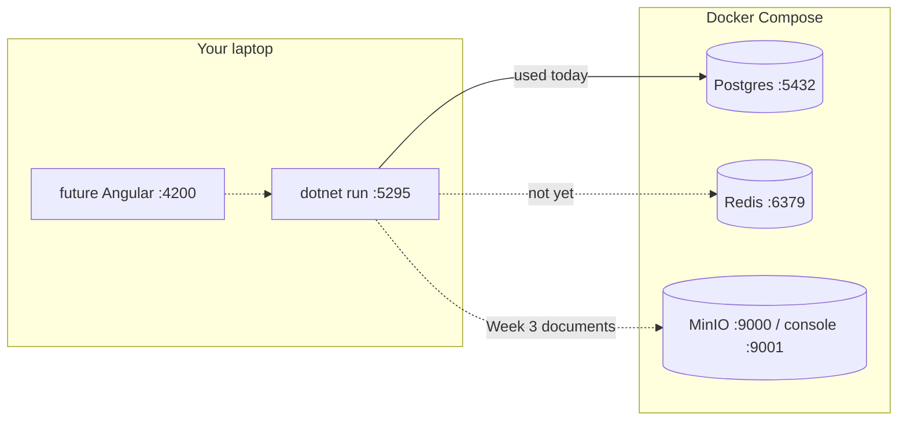

# Study: `infrastructure`

Study tour of this folder. Distinct from the official README. Runbook: [README.md](README.md).

**Aligned with:** `main` after KYC-105 (MinIO image pin).

## Purpose

This folder is **local production-shaped dependencies**, not the KYC application. Compose starts three containers. The .NET API and the future UIs run **on your machine** and connect in over localhost.

If you only remember one sentence: **from the API, Postgres is `127.0.0.1:5432`, not hostname `postgres`.** `postgres` is the DNS name *inside* the Compose network. Mixing those up is the usual “connection refused” after a working Docker Desktop install.

## Why these files exist

| File | Why |
|---|---|
| `docker-compose.yml` | Declares Postgres, Redis, MinIO, named volumes, healthchecks, **localhost-bound ports**. |
| `.env.example` | Committed credential *shape*. Copy to gitignored `.env`. |
| `.env` | Local secrets. Never commit. |

There is no `Dockerfile` for the API yet (comment in compose). Containerizing the API is a later ops step.

## Why three services if the API only uses one

ADR-006: Postgres for relational data, MinIO for KYC files, Redis optional for cache/tokens. **Week 2 uses Postgres only.** Redis and MinIO are running so Week 3 does not start with “install MinIO.” Saying “our stack is Redis” in a W2 review oversells.

## Angular analog

This is not `ng serve`’s proxy. It is the backend you would otherwise mock. Binding ports to `127.0.0.1` (not `0.0.0.0`) means other machines on the Wi-Fi cannot hit your DB — a small security habit for a portfolio laptop.

Volumes (`postgres_data`, …) survive `compose down` without `-v`. Data persists; `down -v` is the “wipe the database” hammer.

## What to notice in compose (without memorizing YAML)

- **Postgres 18** alpine; `PGDATA` parent mount (`/var/lib/postgresql`) because PG18 changed the data dir — the comment in the file is worth reading once.
- **Healthcheck** `pg_isready` — Compose `healthy` is what you wait for before `dotnet ef database update`.
- **MinIO tag is pinned** to a `RELEASE.*` digest-era tag (Hub froze `:latest` for community). KYC-105. Do not “fix” it to `:latest`.
- **Redis requirepass** — even locally a password so we do not get used to open Redis.

## Today vs target

Target architecture shows the API talking to all three. Today the API’s `appsettings` only has a Postgres connection string. No Redis connection multiplexer, no S3 client.

## What to skip

- MinIO console clicking until you have document upload stories.
- Installing native Postgres “to be simpler” — the project standard is Compose ([guide](../docs/guides/dotnet-api-for-frontend-engineers.md)).

## Links

- [README.md](README.md) — ports and default credentials
- [Docker Compose](https://docs.docker.com/compose/)
- [Compose file reference](https://docs.docker.com/reference/compose-file/)
- [Postgres Docker](https://hub.docker.com/_/postgres)
- [MinIO](https://min.io/docs/minio/linux/index.html)
- [Redis](https://redis.io/docs/latest/)
- [ADR-006](../docs/architecture-decision-records.md)
- [bind to localhost](https://docs.docker.com/engine/network/#published-ports) (published ports)
